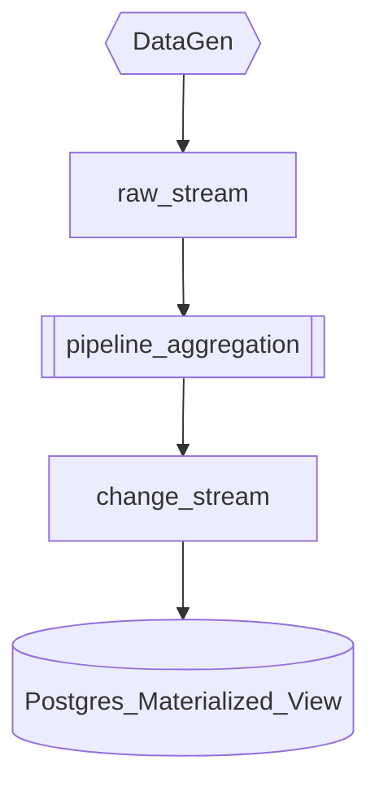

# Change stream
This is an early release feature supporting change streams. Change streams are streams that contain CDC data for materializing views in a database. Below is the e2e pipeline.




## Getting Started
This repo requires the decodable cli. Installation instructions can be found [here](https://docs.decodable.co/docs/setup#install-the-cli-command-line-interface).

### Environment
Create a `.env` file locally and provide values to the variables.

```properties
HOST={{ POSTGRES_HOST_NAME }}
DB={{ POSTGRES_DATABASE }}
USER={{ POSTGRES_USER }}
PWD={{ POSTGRES_PASSWORD }}

ACCOUNT={{ DECODABLE_ACCOUNT_NAME }}
```

### Postgres
Log into your Postgres and execute this [file](sql/postgres.sql).

```bash
psql -h $(HOST) -d $(DB) -U $(USER) -W -f sql/postgres.sql
```

### Startup
From the command line, execute this make command:

```bash
$ make pipeline
$ make active
```

### Clean up

```bash
$ make clean
```
