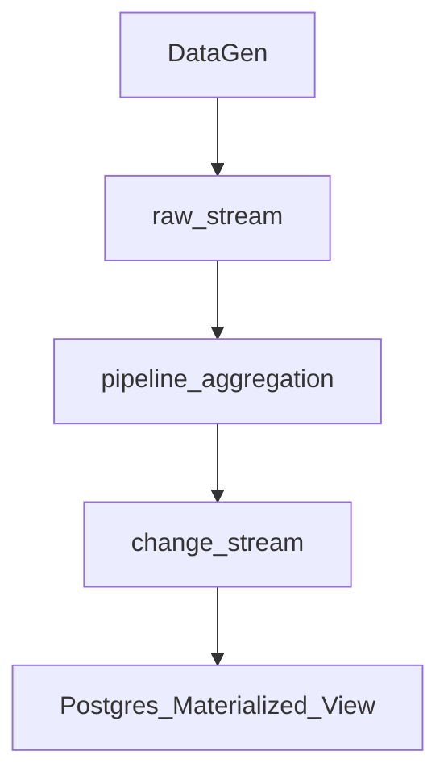

# Change stream
This is an early release feature supporting change streams. Change streams are streams that contain CDC data for materializing views in a database. Below is the e2e pipeline.




## Getting Started
This repo requires the decodable cli. Installation instructions can be found [here](https://docs.decodable.co/docs/setup#install-the-cli-command-line-interface).

From the command line, execute this make command:

```bash
$ make pipeline
```

## Clean up

```bash
$ make clean
```
