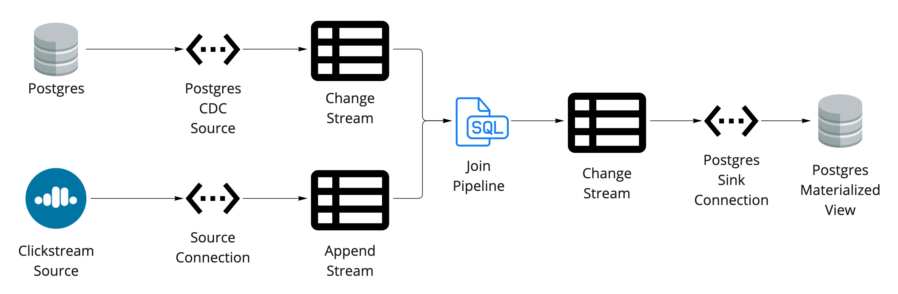

# Joining Clickstream data from Confluent Cloud with CDC Users

## .env file
```properties
CLUSTER_ID=
ENV=
ORG=
TOPIC=
API_ENDPOINT=
CONFLUENT_KEY=
CONFLUENT_SECRET=
SR_ENDPOINT=
SR_KEY=
SR_SECRET=

PGHOST=
DATABASE=
SCHEMA=
USER=
PASSWORD=
TABLE=users

```

```bash
$ make create.all
```



Creates a materialized view in Postgres

