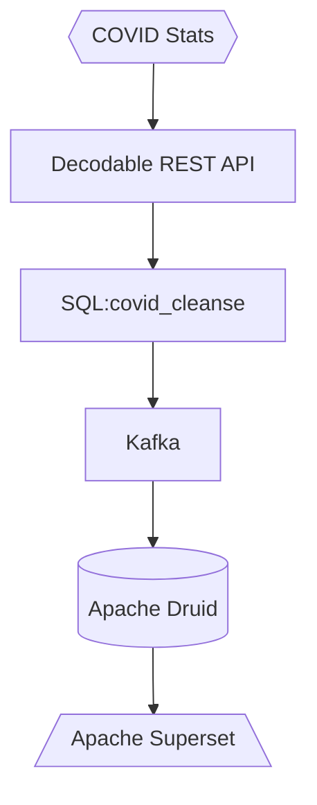

# COVID 19 Stats to Apache Druid and Imply Polaris

This example sends covid 19 data to Decodable using it's REST API. The data is then cleansed using Decodable SQL - from there, data can be sent to Apache Druid (via Kafka) or an Imply Polaris table. You must have Kafka available if you want to stream to Druid. This example uses Confluent cloud as its Kafka. You must also have an Apache Druid running. Follow the install instructions for Druid [here](https://druid.apache.org/docs/latest/tutorials/index.html).



This demo assumes you have a Kafka cluster to use or you have an Imply Polaris project and corresponding table created.

## Getting started
Follow the instructions under the header that applies to you.

### Druid (open source)

Create an `.env` file and populate your values using the following .env structure:

```
ACCOUNT={{ YOUR DECODABLE ACCOUNT }}

BOOTSTRAP={{ YOUR KAFKA BOOTSTRAP SERVERS }}
CONFLUENT_KEY={{ CONFLUENT KEY }}
CONFLUENT_SECRET={{ CONFLUENT SECRET }}
CLUSTER_ID={{ CONFLUENT CLUSTER ID }}
SCHEMA_REGISTRY={{ CONFLUENT SCHEMA REGISTRY }}
CONFLUENT_SR_KEY={{ CONFLUENT SCHEMA REGISTRY KEY }}
CONFLUENT_SR_SECRET={{ CONFLUENT SCHEMA REGISTRY SECRET }}

TOPIC={{ KAFKA TOPIC }}
```

### Imply Polaris

Create an `.env` file and populate your values using the following .env structure:
```
ACCOUNT={{ YOUR DECODABLE ACCOUNT }}
```

If you have not already, create a Polaris table with the following schema:
```markdown
name           | type
------------------------------------------
__time         | timestamp (auto created)
ID             | string
Country        | string
CountryCode    | string
Slug           | string
NewConfirmed   | long
TotalConfirmed | long
NewDeaths      | long
TotalDeaths    | long
NewRecovered   | long
TotalRecovered | long
```

## Start

Follow the instructions under the header that applies to you.

### Druid (open source)

```bash
make flow
```

Go into the Decodable UI and activate all the connections and pipelines. Then go to Apache Druid to configure your Kafka datasource. Use the configuration below and follow the wizard to create a dataset in Druid.

```json
{
	"bootstrap.servers": "{{ KAFKA BOOTSTRAP SERVER }}",
	"security.protocol": "SASL_SSL",
	"sasl.jaas.config": "org.apache.kafka.common.security.scram.ScramLoginModule required username=\"{{ CONFLUENT KEY }}\" password=\"{{ CONFLUENT SECRET }}\";",
	"sasl.mechanism": "PLAIN",
	"client.dns.lookup": "use_all_dns_ips",
	"session.timeout.ms": "45000",
	"acks": "all",
	"schema.registry.url": "{{ CONFLUENT SCHEMA REGISTRY URL }}",
	"basic.auth.credentials.source": "USER_INFO",
	"basic.auth.user.info": "{{ CONFLUENT SCHEMA REGISTRY KEY }}:{{ CONFLUENT SCHEMA REGISTRY SECRET }}"
}
```

### Imply Polaris

```bash
make polaris_flow
```

Go into the Decodable UI and activate all the connections and pipelines. Then, run:

```bash
make run
```

Then go to your Polaris table and ensure data is being populated as you expect.
