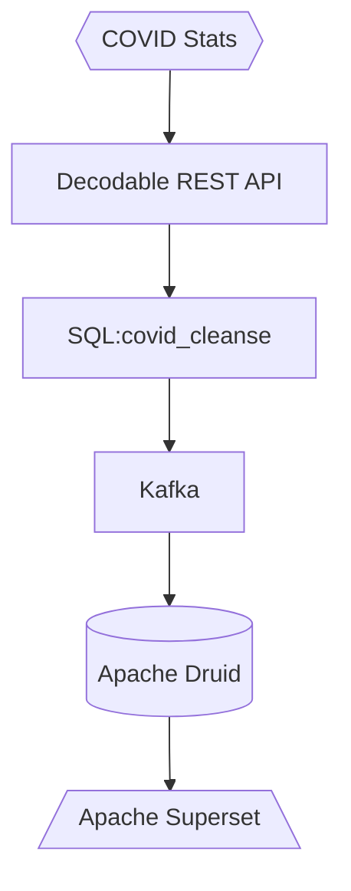

# COVID 19 Stats to Apache Druid

This example sends covid 19 data to Decodable using it's REST API. The data is then cleansed using Decodable SQL and send the data to a Kafka sink. You must have Kafka available. This one uses Confluent cloud as its Kafka. You must also have an Apache Druid running. Follow the install instructions for Druid [here](https://druid.apache.org/docs/latest/tutorials/index.html).



This demo assumes you have a Kafka cluster to use.

## Getting started

Create an `.env` file and populate your values

```
ACCOUNT={{ YOUR DECODABLE ACCOUNT }}

BOOTSTRAP={{ YOUR KAFKA BOOTSTRAP SERVERS }}
CONFLUENT_KEY={{ CONFLUENT KEY }}
CONFLUENT_SECRET={{ CONFLUENT SECRET }}
CLUSTER_ID={{ CONFLUENT CLUSTER ID }}
SCHEMA_REGISTRY={{ CONFLUENT SCHEMA REGISTRY }}
CONFLUENT_SR_KEY={{ CONFLUENT SCHEMA REGISTRY KEY }}
CONFLUENT_SR_SECRET={{ CONFLUENT SCHEMA REGISTRY SECRET }}

TOPIC={{ KAFKA TOPIC }}

```

## Start

```bash
make flow
```

Go into the Decodable UI and activate all the connections and pipelines. Then go to Apache Druid to configure your Kafka datasource. Use the configuration below and follow the wizard to create a dataset in Druid.

```json
{
	"bootstrap.servers": "{{ KAFKA BOOTSTRAP SERVER }}",
	"security.protocol": "SASL_SSL",
	"sasl.jaas.config": "org.apache.kafka.common.security.scram.ScramLoginModule required username=\"{{ CONFLUENT KEY }}\" password=\"{{ CONFLUENT SECRET }}\";",
	"sasl.mechanism": "PLAIN",
	"client.dns.lookup": "use_all_dns_ips",
	"session.timeout.ms": "45000",
	"acks": "all",
	"schema.registry.url": "{{ CONFLUENT SCHEMA REGISTRY URL }}",
	"basic.auth.credentials.source": "USER_INFO",
	"basic.auth.user.info": "{{ CONFLUENT SCHEMA REGISTRY KEY }}:{{ CONFLUENT SCHEMA REGISTRY SECRET }}"
}
```


