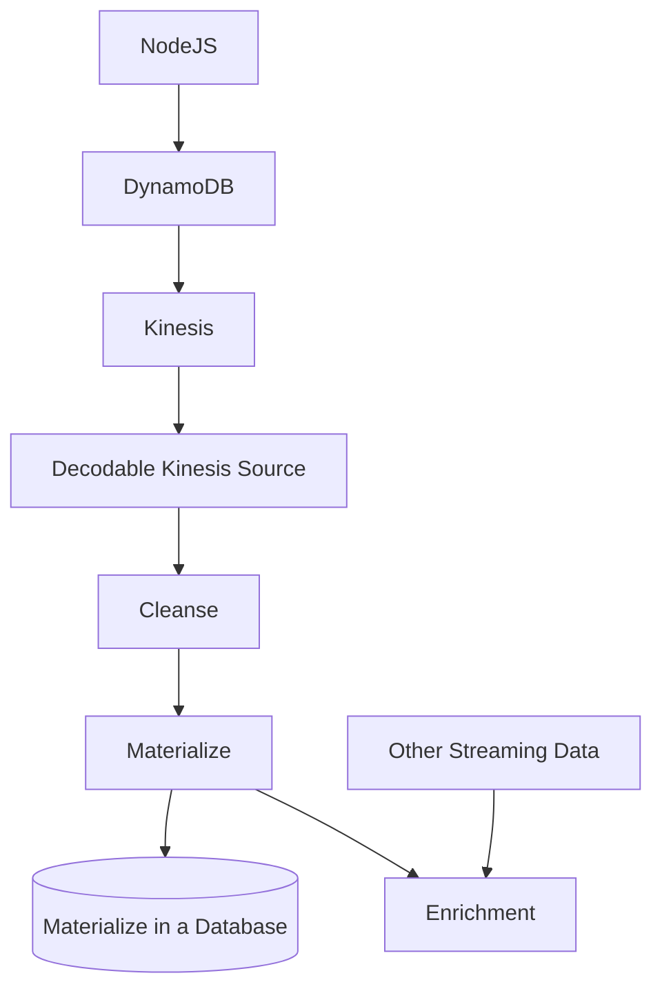
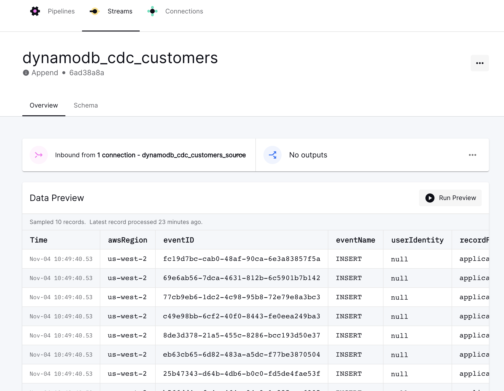

# DynamoDB CDC via Kinesis and Decodable Kinesis Source
DynamoDB provides CDC data to Kinesis following the instructions [here](https://docs.aws.amazon.com/amazondynamodb/latest/developerguide/kds.html). The steps are simple.

1. Create a Kinesis stream
2. Create a DynamoDB table
3. Go to the `Exports and streams` and enable `Amazon Kinesis data stream details`. 
4. Provide the Kinesis stream you created.

This example creates a Kinesis source connection to the stream you created. The data loader is implemented in NodeJS.

Below is a diagram of a use case. We will be implementing everything above `Cleanse`.



## Setup

Create a `.env` file to place your credentials. The Makefile will use this information to build the stream and Kinesis source connection.

```properties
AWS_REGION=us-west-2
AWS_ARN=
AWS_KINESIS_STREAM=hubert_dynamocdc

```

We will be using NodeJS to send data to DynamoDB. Install the modules below.

```
npm install aws-sdk
npm install randomstring
```

## Decodable
Set up the Decodable components using the Makefile

```bash
make raw # creates the stream
make kinesis # creates the Kinesis source connection
```

Load the data

```bash
make load
```

## DynamoDB CDC Format
The object we are sending to DynamoDB is a Customer record. Below is the change event DynamoDB sends to Kinesis. The Decodable stream schema was hand created to match this schema exactly.

Important fields
- The `eventName` property indicates the operation that occurred for this event.
- `tableName` indicates the table.
- The data exists in the `dynamodb` element which identifies the DynamoDB `Keys`
  - `NewImage` is the state of the record after the change
  - `OldImage` is the state of the record before the change.
  - `ApproximateCreationDateTime` is the timestamp to use.

```json
{
    "awsRegion": "us-west-2",
    "eventID": "d3ed405e-420b-4601-8aaf-bda773a16d86",
    "eventName": "MODIFY",
    "userIdentity": null,
    "recordFormat": "application/json",
    "tableName": "hubert_dynamocdc",
    "dynamodb": {
        "ApproximateCreationDateTime": 1667565639982,
        "Keys": {
            "userid": {
                "N": "8"
            }
        },
        "NewImage": {
            "last_name": {
                "S": "gX8fQ2n"
            },
            "phone": {
                "N": "8"
            },
            "userid": {
                "N": "8"
            },
            "first_name": {
                "S": "gX8fQ2n"
            }
        },
        "OldImage": {
            "last_name": {
                "S": "K2zqYSK"
            },
            "phone": {
                "N": "8"
            },
            "userid": {
                "N": "8"
            },
            "first_name": {
                "S": "K2zqYSK"
            }
        },
        "SizeBytes": 104
    },
    "eventSource": "aws:dynamodb"
}

```

Here is the data in the append stream in Decodable.

