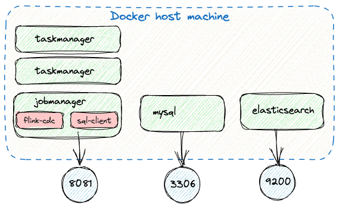

= Flink CDC

== Start up the environment

Get a CLI prompt on the jobmanager container, from where you can run both Flink CDC and FLink SQL:

[source,bash]
----
docker compose build && \
docker compose up -d && while ! nc -z localhost 8081; do sleep 1; done && \
docker compose exec -it jobmanager bash
----

== Try out Flink CDC

=== Run the Pipeline

[source,bash]
----
docker compose exec jobmanager bash -c "cd flink-cdc-3.2.1 && ./bin/flink-cdc.sh mysql-to-es.yaml"
----

[source,bash]
----
Pipeline has been submitted to cluster.
Job ID: 4f51c31b1a54e691a9aff7ebdf7fc7a1
Job Description: Sync MySQL inventory tables to Elasticsearch
----

Open http://localhost:8081 and observe job running

=== Explore the source tables

[source,bash]
----
docker-compose exec mysql mysql -uroot -phunter2 -e "show tables" inventory
----

----
mysql: [Warning] Using a password on the command line interface can be insecure.
+---------------------+
| Tables_in_inventory |
+---------------------+
| addresses           |
| customers           |
| geom                |
| orders              |
| products            |
| products_on_hand    |
+---------------------+
----

=== Observe the automagically created Elasticsearch indices

[source,bash]
----
❯ http -b localhost:9200/_cat/indices
green  open .geoip_databases           4O8idWTxT8qSYeZZTyw3aA 1 0 37 0 35.3mb 35.3mb
yellow open inventory.geom             cYGYvu2nQTSFmIiJu9Rftw 1 1  3 0  4.9kb  4.9kb
yellow open inventory.products_on_hand kDfMHBlqSYihxVWv4sryEQ 1 1  9 0  7.2kb  7.2kb
yellow open inventory.customers        TfN1fEJMTQKWzhqMvFVH_A 1 1  4 0   11kb   11kb
yellow open inventory.addresses        is197DbOSZSEawapueg8Bw 1 1  7 0 15.2kb 15.2kb
yellow open inventory.orders           WD3L8OPgQJqZuQYZEXhnEg 1 1  4 0 12.7kb 12.7kb
yellow open inventory.products         Cuvwp4M5Sz2IqY18DKqorw 1 1  9 0 16.4kb 16.4kb
----

Inspect data:

[source,bash]
----
❯ http -b localhost:9200/inventory.customers/_doc/1001
----

[source,javascript]
----
{
    "_id": "1001",
    "_index": "inventory.customers",
    "_primary_term": 1,
    "_seq_no": 0,
    "_source": {
        "email": "sally.thomas@acme.com",
        "first_name": "Sally",
        "id": 1001,
        "last_name": "Thomas"
    },
    "_type": "_doc",
    "_version": 1,
    "found": true
}
----

=== Marvel at CDC in action

Change the source data:

[source,bash]
----
docker-compose exec mysql mysql -uroot -phunter2 -e "INSERT INTO customers VALUES (42,'foo','bar','');" inventory
docker-compose exec mysql mysql -uroot -phunter2 -e "UPDATE CUSTOMERS SET last_name='foo' WHERE id=1001;" inventory
----

Look at the resulting changes in Elasticsearch:

[source,bash]
----
❯ http -b localhost:9200/inventory.customers/_doc/42
{
    "_id": "42",
    "_index": "inventory.customers",
    "_primary_term": 1,
    "_seq_no": 4,
    "_source": {
        "email": "",
        "first_name": "foo",
        "id": 42,
        "last_name": "bar"
    },
    "_type": "_doc",
    "_version": 1,
    "found": true
}

❯ http -b localhost:9200/inventory.customers/_doc/1001
{
    "_id": "1001",
    "_index": "inventory.customers",
    "_primary_term": 1,
    "_seq_no": 5,
    "_source": {
        "email": "sally.thomas@acme.com",
        "first_name": "Sally",
        "id": 1001,
        "last_name": "foo"
    },
    "_type": "_doc",
    "_version": 2,
    "found": true
}
----

== Let's do the same in Flink SQL

The first step is to manually configure an instance of the [MySQL CDC connector](https://nightlies.apache.org/flink/flink-cdc-docs-master/docs/connectors/flink-sources/mysql-cdc/) for each table.

=== Figure out source schema

To do this you'll need the DDL for each MySQL table, which you can dump using `mysqldump`:

[source,bash]
----
docker-compose exec mysql mysqldump -uroot -phunter2 --no-data inventory > inventory.sql
----

You need to strip out all the constraints and engine stuff (but not all of it). Some of this you can automate:

[source,bash]
----
docker-compose exec mysql mysqldump -uroot -phunter2 --no-data inventory | \
  grep -v -E "\/\*|ENGINE|CONSTRAINT|^  KEY|DROP" | \
  sed 's/ AUTO_INCREMENT//' \
  > inventory.sql
----

Manually:

* Add `NOT ENFORCED` to PK.
+
(if you miss PK you get `org.apache.flink.table.api.ValidationException: 'scan.incremental.snapshot.chunk.key-column' is required for table without primary key when 'scan.incremental.snapshot.enabled' enabled.`)

* `  `type` enum('SHIPPING','BILLING','LIVING') NOT NULL,` - use string instead

Handle data type conversions, e.g. `enum`, `geometry` and column characteristics e.g. `AUTO_INCREMENT`

=== Add in connector details, create Flink SQL tables

Launch Flink SQL:

[source,bash]
----
# From outside the Docker Compose container
# Run this from the same directory as the `docker-compose.yml` file
docker compose exec -it jobmanager bash -c "./bin/sql-client.sh"
# or if you're in the Docker Compose container already
# you can just run `./bin/sql-client.sh`
----

In Flink SQL, add the JARs manually to avoid watch out for https://issues.apache.org/jira/browse/FLINK-35783:

[source,sql]
----
ADD JAR '/opt/flink/jars/flink-sql-connector-mysql-cdc-3.2.1.jar';
ADD JAR '/opt/flink/jars/flink-sql-connector-elasticsearch7-3.0.1-1.17.jar';
----

Create one of the tables:

[source,sql]
----
CREATE TABLE `products_on_hand` (
  `product_id` int NOT NULL,
  `quantity` int NOT NULL, PRIMARY KEY (`product_id`) NOT ENFORCED) 
   WITH (
       'connector' = 'mysql-cdc',
       'hostname' = 'mysql',
       'port' = '3306',
       'username' = 'debezium',
       'password' = 'dbz',
       'database-name' = 'inventory',
       'table-name' = 'products_on_hand');
----

See `flink-sql-equivalent/src_mysql.sql` for complete set of statements.

Resulting Flink SQL tables:

[source,sql]
----
Flink SQL> show tables;
+------------------+
|       table name |
+------------------+
|        addresses |
|        customers |
|           orders |
|         products |
| products_on_hand |
+------------------+
5 rows in set
----

Note that there is no catalog defined so using temporary in-memory one (you need to redefine each table if you restart the Flink SQL session). Learn more about catalogs https://www.decodable.co/blog/catalogs-in-flink-sql-a-primer[here] and https://www.decodable.co/blog/catalogs-in-flink-sql-hands-on[here].

=== Create sink tables and populate them

Create target Elasticsearch table in Flink SQL for each source table using the https://nightlies.apache.org/flink/flink-docs-master/docs/connectors/table/elasticsearch/[Elasticsearch connector].

[source,sql]
----
CREATE TABLE `es_addresses` WITH ('connector'='elasticsearch-7', 'hosts'='http://elasticsearch:9200','index'='addresses')  AS SELECT * FROM addresses ;
CREATE TABLE `es_customers` WITH ('connector'='elasticsearch-7', 'hosts'='http://elasticsearch:9200','index'='customers')  AS SELECT * FROM customers ; 
CREATE TABLE `es_orders` WITH ('connector'='elasticsearch-7', 'hosts'='http://elasticsearch:9200','index'='orders')  AS SELECT * FROM orders ; 
CREATE TABLE `es_products_on_hand` WITH ('connector'='elasticsearch-7', 'hosts'='http://elasticsearch:9200','index'='products_on_hand')  AS SELECT * FROM products_on_hand ; 
CREATE TABLE `es_products` WITH ('connector'='elasticsearch-7', 'hosts'='http://elasticsearch:9200','index'='products')  AS SELECT * FROM products ; 
----

Inspect the Elasticsearch data for record 1001 which was updated as above.

[source,bash]
----
❯ http -b POST "localhost:9200/customers/_search" \
    Content-Type:application/json \
    query:='{
        "match": {
            "first_name": "Sally"
        }
    }'
----

[source,javascript]
----
{
    "_shards": {
        "failed": 0,
        "skipped": 0,
        "successful": 1,
        "total": 1
    },
    "hits": {
        "hits": [
            {
                "_id": "y3UlkpMBHurpA_H_8By2",
                "_index": "customers",
                "_score": 0.87546873,
                "_source": {
                    "email": "sally.thomas@acme.com",
                    "first_name": "Sally",
                    "id": 1001,
                    "last_name": "Thomas"
                },
                "_type": "_doc"
            },
            {
                "_id": "5XUnkpMBHurpA_H_yhyt",
                "_index": "customers",
                "_score": 0.87546873,
                "_source": {
                    "email": "sally.thomas@acme.com",
                    "first_name": "Sally",
                    "id": 1001,
                    "last_name": "foo"
                },
                "_type": "_doc"
            }
        ],
----

Turns out CTAS doesn't propagate the PK, and thus the MySQL `UPDATE` doesn't get updated in Elasticsearch but just written as a new document.

Redefine table with schema to include PK

[source,sql]
----
DROP TABLE es_customers;

CREATE TABLE `es_customers` (
   `id` int NOT NULL,
   `first_name` varchar(255) NOT NULL,
   `last_name` varchar(255) NOT NULL,
   `email` varchar(255) NOT NULL,
   PRIMARY KEY (`id`) NOT ENFORCED)  WITH ('connector'='elasticsearch-7', 'hosts'='http://elasticsearch:9200','index'='customers2')  AS SELECT * FROM customers ;
----

Error:

----
[ERROR] Could not execute SQL statement. Reason:
org.apache.flink.sql.parser.error.SqlValidateException: CREATE TABLE AS SELECT syntax does not support to specify explicit columns yet.
----

Run it as two separate things - create, and then populate:

[source,sql]
----
CREATE TABLE `es_customers` (
   `id` int NOT NULL,
   `first_name` varchar(255) NOT NULL,
   `last_name` varchar(255) NOT NULL,
   `email` varchar(255) NOT NULL,
   PRIMARY KEY (`id`) NOT ENFORCED)  WITH ('connector'='elasticsearch-7', 'hosts'='http://elasticsearch:9200','index'='customers2');

INSERT INTO es_customers SELECT * FROM customers ;
----

----
[INFO] Submitting SQL update statement to the cluster...
[INFO] SQL update statement has been successfully submitted to the cluster:
Job ID: a1a7b612ebe8aa9d07636a325cfbdf84
----

Check the result:

[source,bash]
----
❯ http -b POST "localhost:9200/customers2/_search" \
    Content-Type:application/json \
    query:='{
        "match": {
            "first_name": "Sally"
        }
    }'

----

[source,javascript]
----
{
    "_shards": {
        "failed": 0,
        "skipped": 0,
        "successful": 1,
        "total": 1
    },
    "hits": {
        "hits": [
            {
                "_id": "1001",
                "_index": "customers2",
                "_score": 1.2039728,
                "_source": {
                    "email": "sally.thomas@acme.com",
                    "first_name": "Sally",
                    "id": 1001,
                    "last_name": "bar"
                },
                "_type": "_doc"
            }
        ],
        "max_score": 1.2039728,
        "total": {
            "relation": "eq",
            "value": 1
        }
    },
    "timed_out": false,
    "took": 2
}
----

Update the source MySQL row again

[source,bash]
----
❯ http -b POST "localhost:9200/customers2/_search" \
    Content-Type:application/json \
    query:='{
        "match": {
            "first_name": "Sally"
        }
    }'

----

[source,javascript]
----
{
    "_shards": {
        "failed": 0,
        "skipped": 0,
        "successful": 1,
        "total": 1
    },
    "hits": {
        "hits": [
            {
                "_id": "1001",
                "_index": "customers2",
                "_score": 0.87546873,
                "_source": {
                    "email": "sally.thomas@acme.com",
                    "first_name": "Sally",
                    "id": 1001,
                    "last_name": "foo"
                },
                "_type": "_doc"
            }
        ],
        "max_score": 0.87546873,
        "total": {
            "relation": "eq",
            "value": 1
        }
    },
    "timed_out": false,
    "took": 5
}
----

== Cleanup

[source,bash]
----
docker compose down
----
