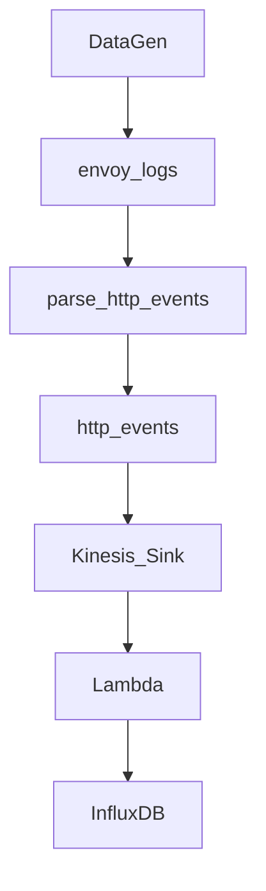
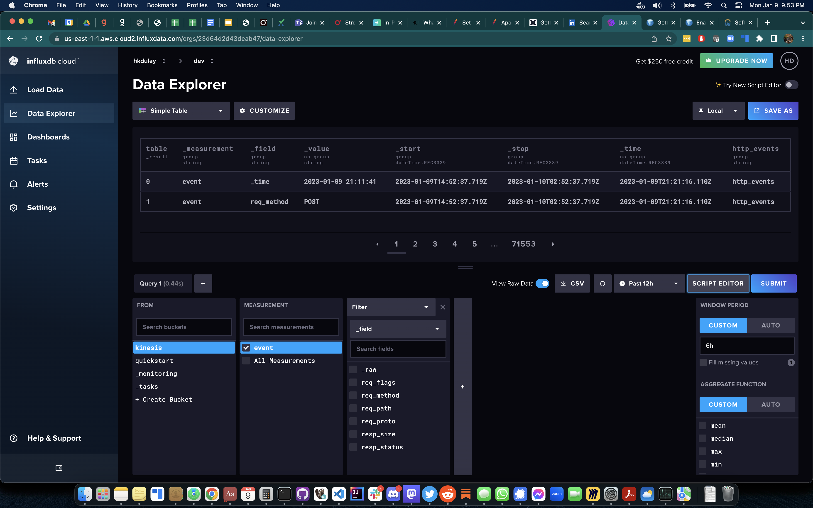

# InfluxDB and Decodable Integration
This example integrates Decodable and InfluxDB (Influx Data Cloud) via Kinesis + AWS Lambda / Python. We will be sending envoy logs being produced by the DataGen connector built into Decodable.



## Setup
Setup a python virtual environment and install the requirements.

```bash
python -m venv .venv

pip install -r requirements.txt
```

The requirements includes `influxdb_client` which will need to be packaged up and deployed using the AWS CLI tool. Therefore, you cannot copy paste the python code into the AWS web console.

## AWS Deployment and Environment Variables
As mentioned previously, the lambda function uses influxdb modules and will need to be packaged up and deployed from the command line. We have created [Makefile](./Makefile) that includes this command.

```bash
make deploy
```

This Makefile task is defined below. The output of this is the file `influx-deployment-package.zip` that gets deployed into your AWS lambda console.

```bash
rm -rf ./package
pip install --target ./package influxdb_client
cd package && zip -r ../influx-deployment-package.zip .
zip influx-deployment-package.zip lambda_function.py
aws lambda update-function-code --function-name influxdb --zip-file fileb://influx-deployment-package.zip
```

Proceed to the AWS console under lambda to find the function called `influxdb`. Click on the `Configuration` tab and select `Environment variables` on the left. Enter the values for these variables:

- INFLUXDB_BUCKET - the name of the InfluxDB bucket to write streaming data
- INFLUXDB_ORG - the Influx Data Cloud org
- INFLUXDB_TOKEN - the Influx Data Cloud token
- INFLUXDB_URL - the URL to Influx Data Cloud

## Permissions
On the `Configuration` page of the lambda function, click on `Permissions` on the left. Under `Execution role` you will see a Role name. Click on this role to add permissions to this function to read from Kinesis. Click on `Add permissions` and select `Create inline policy`. Go to the JSON view and paste the policy below.

```json
{
    "Version": "2012-10-17",
    "Statement": [
        {
            "Effect": "Allow",
            "Action": "kinesis:*",
            "Resource": "*"
        }
    ]
}
```

This will grant permissions for the lambda function to read from Kinesis.

## Setup Trigger
On the `Configuration` page, click on `Triggers` to the left. Then click on `Add trigger` on the right. Select a `Kinesis` source. Enter the Kinesis stream and click on Add.

Your function will not be invoked when a message/event arrives in the Kinesis stream.

## Setup a Kinesis Sink in Decodable.
Create a Datagen connector in Decodable that generates envoy_logs. Have that connector write it's data into a `_raw` field in a stream named `envoy_raw`.

Create a Decodable pipeline that parses the logs and writes the output into a stream called `http_events` by pasting the SQL below.

```sql
-- A new stream will be created for the output of this pipeline.
-- The stream name will match the name used in the 'insert' statement.
insert into http_events
select
    _raw,
    to_timestamp(fields['_time'], 'yyyy-MM-dd''T''HH:mm:ss''Z''') _time,
    fields['method'] req_method,
    fields['path'] req_path,
    fields['protocol'] req_proto,
    fields['flags'] req_flags,
    cast(fields['status'] as int) resp_status,
    cast(fields['size'] as int) resp_size
from (
    select
        `value` _raw,
        grok(`value`, '\[%{TIMESTAMP_ISO8601:_time}\] "%{DATA:method} %{DATA:path} %{DATA:protocol}" %{INT:status} %{DATA:flags} %{INT:size}') fields
    from envoy_raw
)
```

Follow the instructions in this [doc](https://docs.decodable.co/docs/connector-reference-kinesis). Use the Kinesis stream you're using when you created a trigger in the previous section.

## InfluxDB
You should see a similar view in InfluxDB as the image below.

