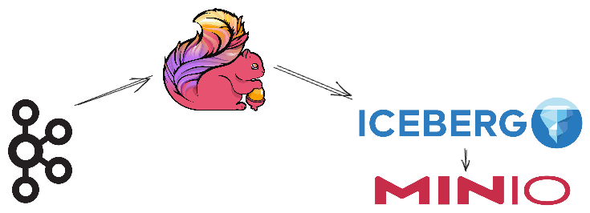

= Writing to Apache Iceberg from Apache Flink using data from Apache Kafka

This is the demo script to accompany my talk from Kafka Summit London 2024: https://talks.rmoff.net/8VjuaU/here-be-dragons-h-h-stacktraces-flink-sql-for-non-java-developers

Test data is generated using https://shadowtraffic.io/[ShadowTraffic]. Put your `license.env` file in the `shadowtraffic` folder. If you don't want to use ShadowTraffic you can insert your own dummy data on a Kafka topic.

== Startup the stack

[source,bash]
----
docker compose up -d 
----

== Demo 1: Exploring the SQL Client

[source,bash]
----
docker compose exec -it jobmanager bash -c "./bin/sql-client.sh"
----

=== Result Mode

==== table

[source,sql]
----
-- This is the default; setting it just for clarity
SET 'sql-client.execution.result-mode' = 'table';
----

[source,sql]
----
SELECT * FROM (
    VALUES ('Johnny'),
           ('Moira'),
           ('David'),
           ('David'),
           ('Johnny'));
----

==== changelog

[source,sql]
----
SET 'sql-client.execution.result-mode' = 'changelog';
----

[source,sql]
----
SELECT * FROM (
    VALUES ('Johnny'),
           ('Moira'),
           ('David'),
           ('David'),
           ('Johnny'));
----

==== tableau

[source,sql]
----
SET 'sql-client.execution.result-mode' = 'tableau';
----

[source,sql]
----
SELECT * FROM (
    VALUES ('Johnny'),
           ('Moira'),
           ('David'),
           ('David'),
           ('Johnny'));
----

=== Runtime Mode

==== streaming

[source,sql]
----
-- Streaming is the default
SET 'execution.runtime-mode' = 'streaming';
----

[source,sql]
----
SELECT name, COUNT(*) FROM (
    VALUES ('Johnny'), 
           ('Moira'), 
           ('David'), 
           ('David'), 
           ('Johnny')) AS tbl(name) 
    GROUP BY name;
----

==== batch

[source,sql]
----
SET 'execution.runtime-mode' = 'batch';
----

[source,sql]
----
SELECT name, COUNT(*) FROM (
    VALUES ('Johnny'), 
           ('Moira'), 
           ('David'), 
           ('David'), 
           ('Johnny')) AS tbl(name) 
    GROUP BY name;
----

== Demo 2: Streaming from Kafka to Iceberg with processing on the way (ETL)

Look at the stream of data on the orders topic:

[source,bash]
----
docker exec -i kcat kcat -b broker:29092 -C -t orders -c -U | jq '.'
----

=== Kafka source

Create a Flink table on the Kafka topic:

[source,sql]
----
CREATE TABLE t_k_orders
  (
     orderId          STRING,
     customerId       STRING,
     orderNumber      INT,
     product          STRING,
     backordered      BOOLEAN,
     cost             FLOAT,
     description      STRING,
     create_ts        BIGINT,
     creditCardNumber STRING,
     discountPercent  INT
  ) WITH (
    'connector' = 'kafka',
    'topic' = 'orders',
    'properties.bootstrap.servers' = 'broker:29092',
    'scan.startup.mode' = 'earliest-offset',
    'format' = 'json'
  );
----

Look at the data: 

[source,sql]
----
SET 'execution.runtime-mode' = 'streaming';
----

[source,sql]
----
SELECT * FROM t_k_orders LIMIT 10;
----

=== Iceberg sink 

Checkpoint frequently - a bad idea in production, but you'll not see data in Iceberg for the demo quickly otherwise. 

[source,sql]
----
SET 'execution.checkpointing.interval' = '60sec';
----

Set this so that the operators are separate in the Flink WebUI.

[source,sql]
----
SET 'pipeline.operator-chaining.enabled' = 'false';
----

Create an Iceberg table that picks all orders with a `cost` more than 100.

[source,sql]
----
CREATE TABLE t_i_orders 
  WITH (
  'connector' = 'iceberg',
  'catalog-type'='hive',
  'catalog-name'='dev',
  'warehouse' = 's3a://warehouse',
  'hive-conf-dir' = './conf')
  AS 
  SELECT * FROM t_k_orders 
   WHERE cost > 100;
----

View the Flink dashboard: http://localhost:8081/

View the MinIO browser and see that there are objects there: http://localhost:9001 (login:admin / password:password)

=== Iceberg

Launch DuckDB CLI: 

[source,bash]
----
docker exec -it jobmanager bash -c "duckdb"
----

Install the needful and configure S3/Minio connection

[source,sql]
----
.prompt '⚫◗ '
INSTALL httpfs;
INSTALL iceberg;
LOAD httpfs;
LOAD iceberg;
CREATE SECRET secret1 (
    TYPE S3,
    KEY_ID 'admin',
    SECRET 'password',
    REGION 'us-east-1',
    ENDPOINT 'minio:9000',
    URL_STYLE 'path',
    USE_SSL 'false'
);
----

Run this bash to generate a DuckDB SQL statement to query the latest version of the Iceberg table (https://duckdb.org/docs/guides/import/s3_iceberg_import#loading-iceberg-tables-from-s3[ref])

[source,bash]
----
docker exec mc bash -c \
        "mc ls -r minio/warehouse/" | grep orders | grep json | tail -n1 | \
        awk '{print "SELECT count(*), strftime(to_timestamp(max(create_ts)/1000),'\''%Y-%m-%d %H:%M:%S'\'') as max_ts, \n avg(cost), min(cost) \n FROM iceberg_scan('\''s3://warehouse/" $6"'\'');"}'
----

After running the SQL statement, modify it to a `SELECT *` and set it to line mode before running it.

[source,sql]
----
.mode line
----

---

== Appendix

=== Catalogs 

==== Hive Catalog

[source,sql]
----
 CREATE CATALOG c_hive WITH (
        'type' = 'hive',
        'hive-conf-dir' = './conf');
----

[source,sql]
----
CREATE DATABASE c_hive.db01;
----

[source,sql]
----
USE c_hive.db01;
----

[source,sql]
----
SHOW TABLES;
----

[source,sql]
----
CREATE TABLE c_hive.db01.t_k_test_topic (
  `col1` STRING
) WITH (
  'connector' = 'kafka',
  'topic' = 'test_topic',
  'properties.bootstrap.servers' = 'broker:29092',
  'scan.startup.mode' = 'earliest-offset',
  'format' = 'raw'
);
----

[source,sql]
----
select * from c_hive.db01.t_k_test_topic;
----

==== Iceberg catalog

[source,sql]
----
CREATE CATALOG c_iceberg WITH (
       'type' = 'iceberg',
       'catalog-type'='hive',
       'warehouse' = 's3a://warehouse',
       'hive-conf-dir' = './conf');
----

[source,sql]
----
CREATE DATABASE c_iceberg.dev;
----

[source,sql]
----
USE c_iceberg.dev;
----

[source,sql]
----
CREATE TABLE c_iceberg.dev.t_i_test AS 
  SELECT * FROM c_hive.db01.t_k_test_topic;
----

[source,sql]
----
SHOW JOBS;
----

[source,sql]
----
STOP JOB '6c9790735d4658d4ac9802961cd137b3';
----

=== Connectors

==== Connectors - Kafka

Send a message to Kafka topic

[source,bash]
----
echo "foobar" | docker exec -i kcat kcat -b broker:29092 -P -t test_topic
----

Read it back

[source,bash]
----
docker exec -i kcat kcat -b broker:29092 -C -t test_topic -u
----

Launch SQL Client

[source,bash]
----
docker exec -it jobmanager bash -c "./bin/sql-client.sh"
----

Define a Flink SQL Table to read from the Kafka topic

[source,sql]
----
CREATE TABLE t_k_test_topic (
  `msg` STRING
) WITH (
  'connector' = 'kafka',
  'topic' = 'test_topic',
  'properties.bootstrap.servers' = 'broker:29092',
  'scan.startup.mode' = 'earliest-offset',
  'format' = 'raw'
);
----

[source,sql]
----
SET 'sql-client.execution.result-mode' = 'tableau';
----

[source,sql]
----
SELECT * FROM t_k_test_topic;
----

[source,bash]
----
echo "foobar again" | docker exec -i kcat kcat -b broker:29092 -P -t test_topic
----

[source,sql]
----
insert into t_k_test_topic values ('Hello from the other side');
----

Read it back

[source,bash]
----
docker exec -i kcat kcat -b broker:29092 -C -t test_topic -u
----

===== Table configuration, e.g. Read from latest offset

Tables are just defining how to access data. Here we access the same Kafka topic using different offset semantics.

[source,sql]
----
CREATE TABLE t_k_test_topic_latest (
  `col1` STRING
) WITH (
  'connector' = 'kafka',
  'topic' = 'test_topic',
  'properties.bootstrap.servers' = 'broker:29092',
  'scan.startup.mode' = 'latest-offset',
  'format' = 'raw'
);
----

[source,sql]
----
select * from t_k_test_topic_latest;
----

==== Connectors - Iceberg

[source,sql]
----
CREATE TABLE t_iceberg_test (col1 STRING) 
  WITH (
  'connector' = 'iceberg',
  'catalog-type'='hive',
  'catalog-name'='dev',
  'warehouse' = 's3a://warehouse',
  'hive-conf-dir' = './conf');
----

[source,sql]
----
INSERT INTO t_iceberg_test VALUES ('FOO');
----

[source,bash]
----
docker exec mc bash -c \
        "mc ls -r minio/warehouse/"
----

[source,sql]
----
select * from t_iceberg_test;
----
