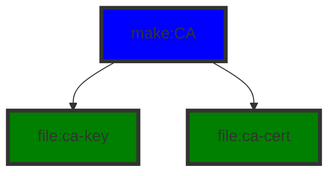
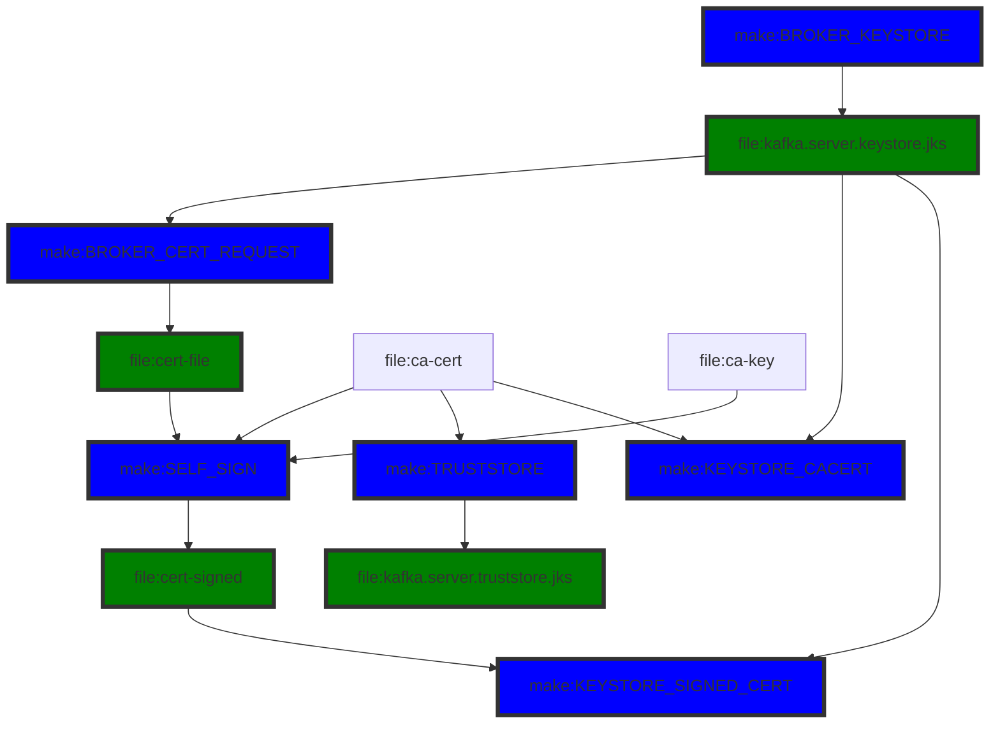
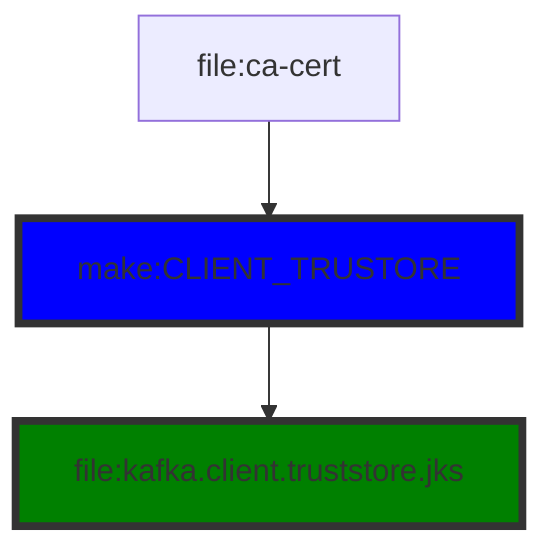
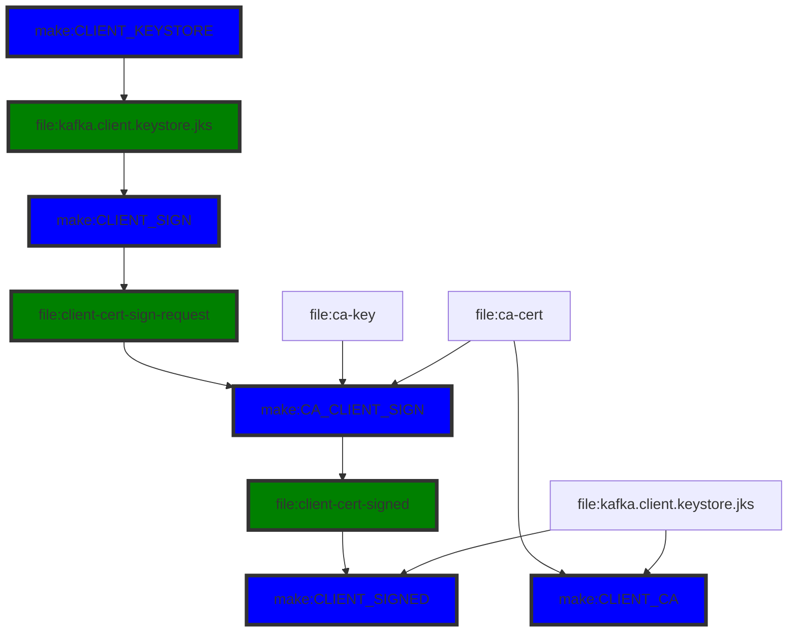

# TLS/mTLS Configuration of Apache Kafka - SELF SIGNING FLOW
Generating a self-signed certificate for a Kafka broker.


# Generate CA
- ca-cert = public CA certificate
- ca-key = private key of the ca-cert



# Broker Side
- cert-file = signing request
- cert-signed = signed certificate




## server.properties file
Requires Kafka restart.

```properties
listeners=PLAINTEXT://0.0.0.0:9092,SSL://0.0.0.0:9093
advertised.listeners=PLAINTEXT://<HOSTNAME>:9092,SSL://<HOSTNAME>:9093

ssl.keystore.location=<path>/kafka.server.keystore.jks
ssl.keystore.password=yourpassword
ssl.key.password=yourpassword
ssl.truststore.location=<path>/kafka.server.truststore.jks
ssl.truststore.password=yourpassword

```

Verify the SSL port
```bash
openssl s_client -connect <HOSTNAME>:9093
```

# Client configuration



## properties file

```properties
security.protocol=SSL
ssl.truststore.location=<path>/kafka.client.truststore.jks
ssl.truststore.password=yourclientpassword
```

Producer
```bash
./kafka-console-producer.sh --broker-list HOSTNAME:9093 --topic mytopic --producer.config PATH_TO_THE_ABOVE_PROPERTIES

```

Consumer
```bash
./kafka-console-consumer.sh --broker-list HOSTNAME:9093 --topic mytopic --consumer.config PATH_TO_THE_ABOVE_PROPERTIES
```

# mTLS
Client authentication. Broker work is same as above.




## server.properties

```properties
ssl.client.auth=required
```

## client.properties

```properties
security.protocol=SSL
ssl.truststore.location=<path to your truststore>
ssl.truststore.password=<the password>
ssl.keystore.location=<path to your keystore>
ssl.keystore.password=<the password>
ssl.key.password=<the password>

```


Producer
```bash
./kafka-console-producer.sh --broker-list HOSTNAME:9093 --topic mytopic --producer.config PATH_TO_THE_ABOVE_PROPERTIES

```

Consumer
```bash
./kafka-console-consumer.sh --bootstrap-server HOSTNAME:9093 --topic mytopic --consumer.config PATH_TO_THE_ABOVE_PROPERTIES
```
