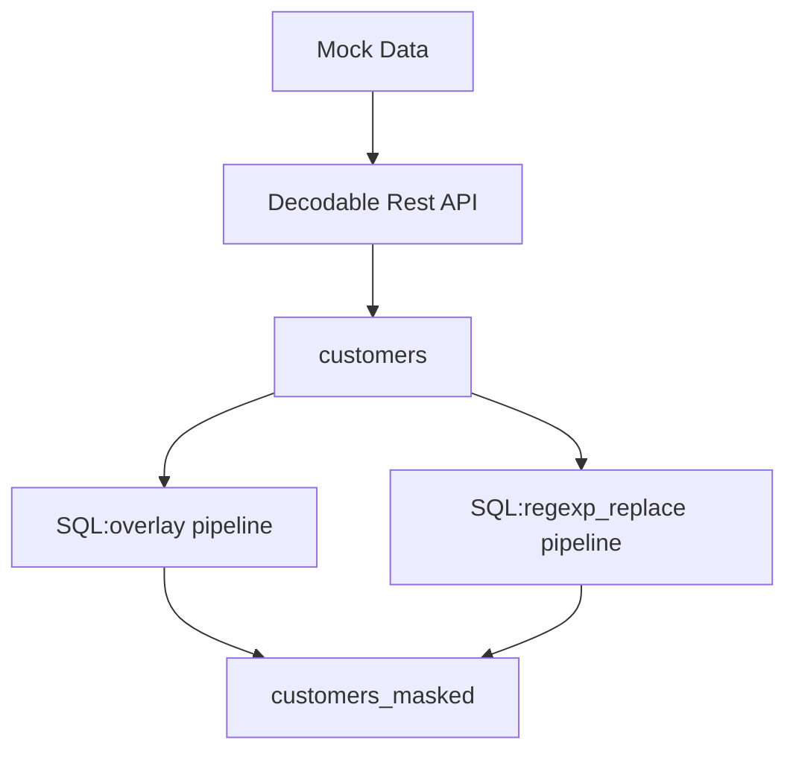

# Masking data with Decodable

The data used in this example was generated using https://www.mockaroo.com/.

In this example, we show two ways of masking data on real-time streaming data: overlay(), regexp_replace(), and omission.




```sql
insert into customers_masked
select 
    id,
    first_name,
    last_name,
    email,
    gender,
    ip_address, 
    OVERLAY(CAST(cc as STRING) PLACING '*************' FROM 1 FOR 12) as fn_overlay
from customers
```


```sql
insert into customers_masked
select 
    id,
    first_name,
    last_name,
    email,
    gender,
    REGEXP_REPLACE(ip_address, '\d', '*') ip_address,
    'removed' as cc
from customers
```

## Running

Create a `.env` file and place it with the contents below:

```
ACCOUNT=<< your decodable account name>>

```

Then run:

```bash
$ make flow # creates the data pipeline flow
$ make active # activates all components. please wait for them to all have running status
$ make run # sends data to the rest api

$ make clean # cleans deactivates and deletes all the components in Decodable
```