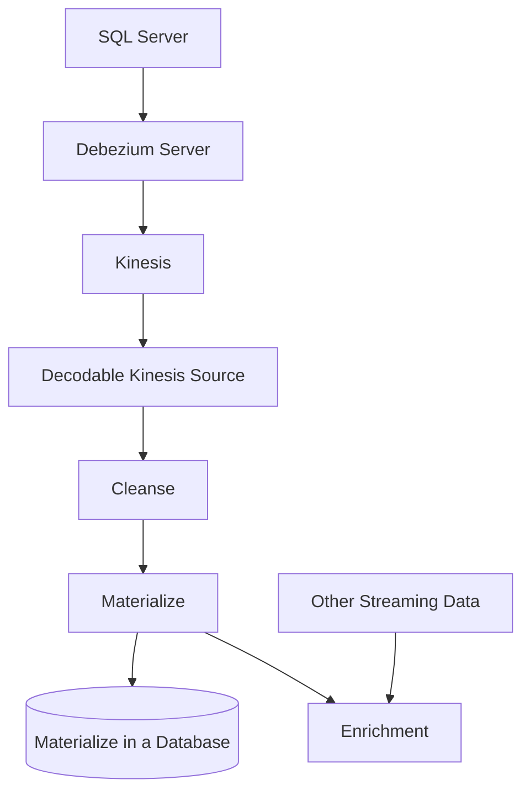
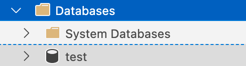

# SQL Server CDC Source
These instructions show how to setup the Debezium Sever and configure it to use a SQL Server database deployed in AWS RDS and to send CDC data into Kinesis. 

If sending data to Kafka, Debezium recommends to use a Apache Kafka Connect cluster. For all non-Kafka destinations, use the Debezium Server.





## Setup SQL Server

We will be using a SQL Server Docker image for these instructions. If you're running in RDS, make sure to set the database to be publicly accessible and is one of these instances: Enterprise, Developer, Enterprise Evaluation, and Standard editions. You will get the error below if you do not.

```
SQL Error [22988] [S0001]: This instance of SQL Server is the Express Edition (64-bit). Change data capture is only available in the Enterprise, Developer, Enterprise Evaluation, and Standard editions.
```

The docker image has this environment variable set to start the SQL Server Agent which is a requirement for the Debezium connector. You will need to do the same for your instance of SQL Server.

```
-e "MSSQL_AGENT_ENABLED=True" \
```

To start Docker SQL Server run this command:

```bash
make sqlserver
```

### Enabling CDC in MSSQL

Create a database and table below. You must create your own database instance else you will get an error stating you cannot enable CDC on a system database.



```sql
create database test -- cannot use system databases
use test

create table customers (
	userid int primary key,
	first_name varchar(63) not null,
	last_name varchar(63) not null,
	phone varchar(63)
);
```

It can be a bit complicated to setup MSSQL with CDC. Here are the steps to do this and some ways to validate the setup.

```sql

EXEC sys.sp_cdc_enable_db -- enable cdc for database

SELECT * FROM sys.filegroups; -- get file groups. 

exec sys.sp_cdc_enable_table -- enable cdc for table
	@source_schema = N'dbo',
	@source_name   = N'customers',
	@capture_instance=N'instance_customers',
	@role_name     = NULL,
	@filegroup_name = N'PRIMARY', -- set file group here
	@supports_net_changes=1

insert into customers values (1, 'foo','bar', '12345')
```

### Troubleshooting
Here are some queries you can run to help verify if CDC is configured for MSSQL database and table.

```sql
exec sys.sp_cdc_help_change_data_capture -- should get at least a record

-- DISABLE CDC FOR TABLE AND TRY AGAIN
-- exec sys.sp_cdc_disable_table   
-- 	@source_schema ='dbo' ,   
--  	@source_name = 'customers',
-- 	@capture_instance = 'all'

-- Check the contents of this table
select * from  msdb.dbo.cdc_jobs

-- Checks to see if the SQL Server Agent is running
SELECT 
    CASE 
        WHEN dss.status=4 THEN 1 
        ELSE 0 
    END AS isRunning 
FROM sys.dm_server_services dss 
WHERE dss.servicename LIKE N'SQL Server Agent (%';

-- Checks to see if the table is tracked by CDC
SELECT s.name AS Schema_Name, tb.name AS Table_Name
, tb.object_id, tb.type, tb.type_desc, tb.is_tracked_by_cdc
FROM sys.tables tb
INNER JOIN sys.schemas s on s.schema_id = tb.schema_id
WHERE tb.is_tracked_by_cdc = 1
```

## Create a Kinesis Stream in AWS
You will need to create TWO streams (see below). The `YOUR_PREFIX` value will be the value you put in the Debezium server configuration [below](#edit-the-confapplicationproperties)

Streams to create:
- YOUR_PREFIX.test.dbo.customers
- YOUR_PREFIX


## SQL Server JDBC Driver
https://learn.microsoft.com/en-us/sql/connect/jdbc/download-microsoft-jdbc-driver-for-sql-server?view=sql-server-ver16

Place in the lib directory in your Debezium home directory.

## Download Debezium server
Download link [here](https://repo1.maven.org/maven2/io/debezium/debezium-server-dist/2.0.0.Final/debezium-server-dist-2.0.0.Final.tar.gz).

Explode the tar file into a directory. The directory structure should be similar to below. 

```
/debezium-server$ ll
total 1864
-rwxr-xr-x@   1 hubertdulay  staff     698 Oct 14 07:26 run.sh*
-rw-r--r--@   1 hubertdulay  staff     354 Oct 14 07:26 run.bat
-rw-r--r--@   1 hubertdulay  staff   15739 Oct 14 07:26 README_ZH.md
-rw-r--r--@   1 hubertdulay  staff   18365 Oct 14 07:26 README_KO.md
-rw-r--r--@   1 hubertdulay  staff   19608 Oct 14 07:26 README_JA.md
-rw-r--r--@   1 hubertdulay  staff   16594 Oct 14 07:26 README.md
-rw-r--r--@   1 hubertdulay  staff   11357 Oct 14 07:26 LICENSE.txt
-rw-r--r--@   1 hubertdulay  staff  129157 Oct 14 07:26 LICENSE-3rd-PARTIES.txt
-rw-r--r--@   1 hubertdulay  staff    6489 Oct 14 07:26 COPYRIGHT.txt
-rw-r--r--@   1 hubertdulay  staff   19246 Oct 14 07:26 CONTRIBUTE.md
-rw-r--r--@   1 hubertdulay  staff  408916 Oct 14 07:26 CHANGELOG.md
-rw-r--r--@   1 hubertdulay  staff  286286 Oct 14 07:32 debezium-server-dist-2.0.0.Final-runner.jar
drwxr-xr-x  338 hubertdulay  staff   10816 Oct 26 14:42 lib/
drwxr-xr-x   16 hubertdulay  staff     512 Oct 26 14:42 lib_opt/
drwxr-xr-x@   4 hubertdulay  staff     128 Oct 26 14:44 conf/

```

## Edit the conf/application.properties
Copy the `conf/application.properties.example` file to  `conf/application.properties` and open it with your editor of choice.

```bash
$ vi conf/application.properteis
```

The values shown here are the values needed for Debezium server to connect to the MSSQL in the Docker container. Make sure the prefix has the same value as the Kinesis stream you create above. This configuration will also generate JSON messages in Debezium format.

For this property `debezium.source.offset.storage.file.filename=data/offsets.dat`, You will need to create an empty file `data/offsets.dat`.

For this property `debezium.source.schema.history.internal.file.filename=history`, you will need to create a file called `history`. This file will hold the history of the schema in cases where the schema changes. Usually this is done using a schema registry with Kafka. We override that behavior with this property `debezium.source.schema.history.internal=io.debezium.storage.file.history.FileSchemaHistory`. 

```properties

debezium.sink.type=kinesis
debezium.sink.kinesis.region=us-west-2
debezium.sink.kinesis.null.key=null

debezium.source.schema.history.internal=io.debezium.storage.file.history.FileSchemaHistory
debezium.source.schema.history.internal.file.filename=history
debezium.source.connector.class=io.debezium.connector.sqlserver.SqlServerConnector
debezium.source.offset.storage.file.filename=data/offsets.dat
debezium.source.offset.flush.interval.ms=0
debezium.source.database.hostname=localhost
debezium.source.database.port=1433
debezium.source.database.user=sa
debezium.source.database.password=yourStrong(!)Password
debezium.source.database.names=test
debezium.source.topic.prefix=YOUR_PREFIX
debezium.source.schema.include.list=dbo
debezium.source.database.encrypt=false
debezium.source.table.include.list=dbo.customers
debezium.source.key.converter=org.apache.kafka.connect.json.JsonConverter
debezium.source.value.converter=org.apache.kafka.connect.json.JsonConverter
```

## Execute
`jq` is optional but will help immensely when viewing Debezium server output logs in the console.

```bash
$ run.sh | jq
```

## SQL Pipelines
To cleanse the data for the data to become materialized, we'll need to prepare it. Run the sql below under pipelines.

```sql
insert into mssql_cdc_partitioned
select
    payload.after.userid,
    payload.after.first_name,
    payload.after.last_name,
    payload.after.phone,
    payload.op,
    TO_TIMESTAMP_LTZ(payload.ts_ms, 3) as ts_ms
from mssql_cdc
where payload.op <> 'd' --ignoring deletes

```

Next run the materialization sql which converts the append stream into a change stream (or a materialized view). You may not see your entire dataset in the preview. You will need to sink it into a database like PG to see the materialization.

```sql
insert into mssql_cdc_materialized
select *
from table(to_change(mssql_cdc_partitioned))

```
