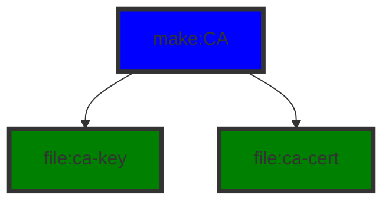
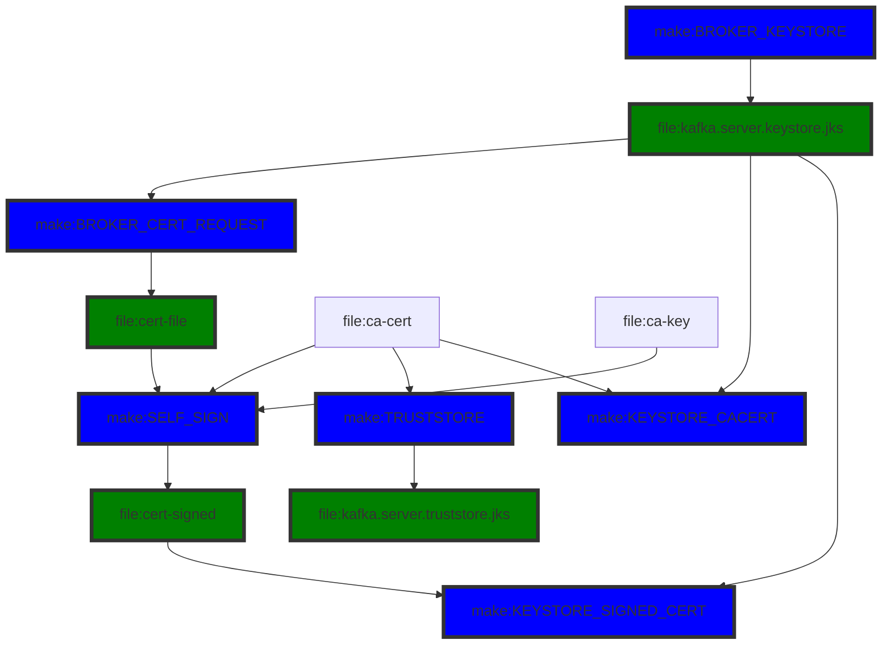
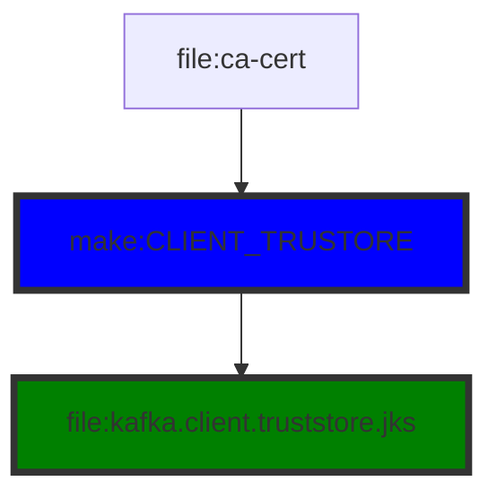
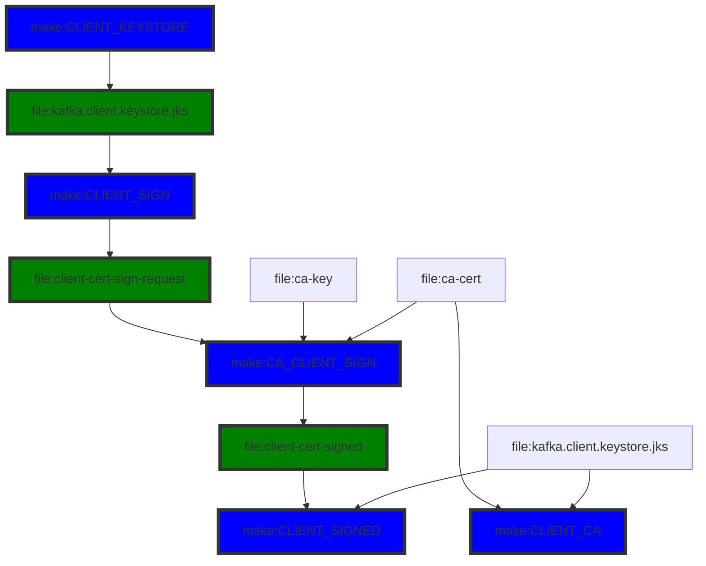

# TLS/mTLS Configuration of Apache Kafka - SELF SIGNING FLOW
Generating a self-signed certificate for a Kafka broker.


# Generate CA
- ca-cert = public CA certificate
- ca-key = private key of the ca-cert



# Broker Side
- cert-file = signing request
- cert-signed = signed certificate




## server.properties file
Requires Kafka restart.

set this environment property to show SSL debug logs.
```bash
export KAFKA_OPTS=-Djavax.net.debug=all
```

```properties
listeners=PLAINTEXT://0.0.0.0:9092,SSL://0.0.0.0:9093
advertised.listeners=PLAINTEXT://<HOSTNAME>:9092,SSL://<HOSTNAME>:9093

ssl.keystore.location=<path>/kafka.server.keystore.jks
ssl.keystore.password=yourpassword
ssl.key.password=yourpassword
ssl.truststore.location=<path>/kafka.server.truststore.jks
ssl.truststore.password=yourpassword

ssl.client.auth=required

```

Verify the SSL port
```bash
openssl s_client -connect <HOSTNAME>:9093
```

# Client configuration



## properties file

```properties
security.protocol=SSL
ssl.truststore.location=<path>/kafka.client.truststore.jks
ssl.truststore.password=yourclientpassword
```

Producer
```bash
./kafka-console-producer.sh --broker-list HOSTNAME:9093 --topic mytopic --producer.config PATH_TO_THE_ABOVE_PROPERTIES

```

Consumer
```bash
./kafka-console-consumer.sh --broker-list HOSTNAME:9093 --topic mytopic --consumer.config PATH_TO_THE_ABOVE_PROPERTIES
```

# Configuring Decodable

The common name (CN) must match exactly the fully qualified domain name (FQDN) of the server. The client compares the CN with the DNS domain name to ensure that it is indeed connecting to the desired server, not a malicious one. The hostname of the server can also be specified in the Subject Alternative Name (SAN). Since the distinguished name is used as the server principal when SSL is used as the inter-broker security protocol, it is useful to have hostname as a SAN rather than the CN.

To show the CN or SAN in a signed certificate, run the command below:

```bash
openssl x509 -noout -subject -in your-signed-cert
```

Host name verification of servers is enabled by default for client connections as well as inter-broker connections to prevent man-in-the-middle attacks. Server host name verification may be disabled by setting ssl.endpoint.identification.algorithm to an empty string. For example,

```properties
ssl.endpoint.identification.algorithm=
```


# mTLS
Client authentication. Broker work is same as above.




## server.properties

```properties
ssl.client.auth=required
```

## client.properties

```properties
security.protocol=SSL
ssl.truststore.location=<path to your truststore>
ssl.truststore.password=<the password>
ssl.keystore.location=<path to your keystore>
ssl.keystore.password=<the password>
ssl.key.password=<the password>

```


Producer
```bash
./kafka-console-producer.sh --broker-list HOSTNAME:9093 --topic mytopic --producer.config PATH_TO_THE_ABOVE_PROPERTIES

```

Consumer
```bash
./kafka-console-consumer.sh --bootstrap-server HOSTNAME:9093 --topic mytopic --consumer.config PATH_TO_THE_ABOVE_PROPERTIES
```
