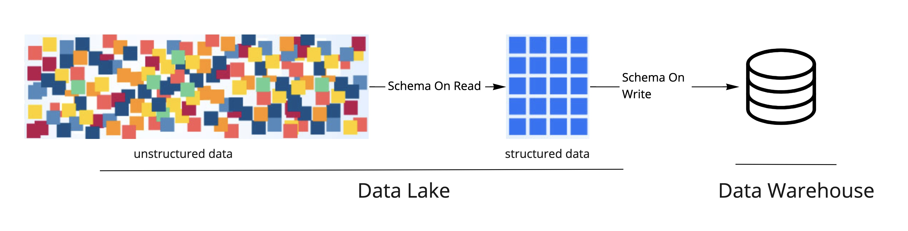
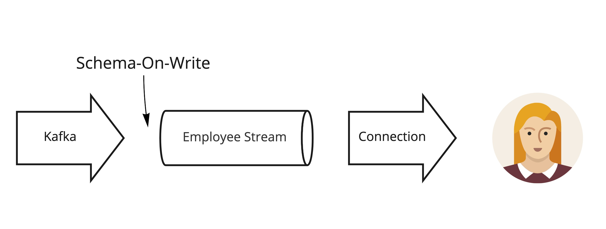

# Opinionated Data Pipelines
Schema-on-write is a feature many engineers always understood and used to their advantage when building batch data pipelines but in streaming data pipelines. In this example, we will introduce this idea with Decodable’s opinionated approach to building streaming data pipelines to bring schema-on-write to streaming.


The diagram above shows how unstructured data was allowed in the data lake with schema-on-read semantics. If schemas evolved, it broke downstream processes that gave the data structure since schema validation was deferred later.


This diagram shows how Decodable's opinionated streaming data pipelines protect downstream consumers who are the biggest stakeholders of your data.


## Requirements
* Setup an Account in Decodable.co & Install the Decodable CLI
You can follow the steps [here](https://docs.decodable.co/docs/setup)

* Install jq command line JSON processor
```bash
pip install jq
```

* Install kcat (formerly kafkacat)
```bash
brew install kcat
```

* Install Jinja
```bash
pip install jinja-cli
```


## Getting started
First create a ``.env`` file and place the contents these contents below replacing the values with yours. You can ``source .env`` to put all these values in the environment.

```Makefile
ACCOUNT=<<YOUR DECODABLE ACCOUNT NAME>>
SCHEMA=./schemas/employee.json

# confluent cloud connection
BOOTSTRAP=<<CONFLUENT BOOTSTRAP URL>>
CLUSTER_ID=<<CONFLUENT CLUSTER ID>>
CONFLUENT_KEY=<<CONFLUENT KEY>>
CONFLUENT_SECRET=<<CONFLUENT SECRET>>
TOPIC=<<TOPIC NAME>>
```

First log into Decodable using the Decodable CLI.

```bash
make login
```

### Step 1: The Schema
In the schema directory, there is a JSON schema ([Employee](schemas/employee.json)) that defines a domain entity. 


```json
{
    "$schema": "https://json-schema.org/draft/2020-12/schema",
    "$id": "https://example.com/product.schema.json",
    "title": "Employee",
    "description": "An employee in your company",
    "type": "object",
    "properties": {
        "empid": {
            "description": "Identifier that is not a SSN",
            "type": "integer"
        },
        "SSN": {
            "description": "Identifier that is not a SSN",
            "type": "string"
        }
        ,
        "fname": {
            "description": "First name",
            "type": "string"
        },
        "lname": {
            "description": "Last name",
            "type": "string"
        },
        "address": {
            "description": "Address",
            "type": "string"
        }
    },
    "required": [
        "empid", "SSN", "fname", "lname", "address"
    ]
}
```

This is the schema we expect our pipelines to use when validating data as they come in. You have the option to provide your own schema for testing.

Our first step is to create a stream definition in Decodable that conform to this entity (Employee). A stream is a partitioned, partially-ordered sequence of records on the Decodable platform. They can be used by any number of connections or pipelines as inputs or outputs. Streams present a universal interface to data from different sources, simplifying pipeline development.

We can build all of the entities in our domain model like we define tables in a database, pojos in Java, or models in golang.

Run this command to define our Employee entity as a stream in the Decodable platform.

```bash
make stream
```

### Step 2: Pipeline Assembly
Every component in the Decodable has a schema assigned to it. So when you assemble these components together, they should fit like puzzle pieces. If the schemas don't match, the components cannot be assembled. This opinionated approach to building streaming data pipelines keeps users from assembling components together that will break.


#### Schema Matching Error
Let's start by trying to create an ``invalid`` Confluent Cloud source connection that does not conform to the Employee schema in Decodable. 

```bash
make invalid
```

You will get the error below.

```
Error: 0001-01-01T00:00:00Z 0: Invalid connection. Reason: Connection schema doesn't match stream schema
make: *** [invalid] Error 1
```

The error occurred because the line ``--field empid=string`` does not match the Employee schema which defines ``empid=integer``. This is a design-time error. With schema-on-read approach, this would end up being a runtime error.

#### Valid Connection
Let's create a Confluent Cloud source connection to the Employee stream with the correct schema definition. The command below will create a valid source connection.

```bash
make valid
```

Run the command below to activate the connection to the Employee stream.

```bash
 make activate
```

### Step 3: Preview the Stream
Open another terminal window to view the contents of the Employee stream as messages come through.

```bash
make preview
```

### Step4: Test Valid & Invalid Messages
In this step we will see the how schema validation works in the Decodable platform. Back in the original terminal, publish some good messages to Kafka.

```bash
make publish JSON=data/good.json
```

```json
{
    "empid":1,
    "SSN": "123-45-6789",
    "fname": "foo",
    "lname": "bar",
    "address": "7 Highland Road Fake Town, PA 18064"
}
```

You will see in the other terminal the message we just sent come through. Now lets send a bad message.

```bash
make publish JSON=data/bad.json
```

```json
{
    "empid": "1",
    "SSN": "123-45-6789",
    "first_name": "bad",
    "last_name": "record",
    "address": "this is a bad record",
    "address2": "this is a bad record"
}
```

You will see in the other terminal that the message we just sent doesn't appear. Let's see the status of the source connection.

```bash
make error
```

You will get an error status message below.

```
Serialization issue with Avro data. This may be an underlying problem with the payload or the schema registry.
```

### Step5: Test Schema Evolution
Let's force a restart the connection.

```bash
make restart # Wait for status to be running.
```

Send a message with an additional field: `phone`.

```bash
make publish JSON=data/evolved.json
```

```json
{
    "empid":1,
    "SSN": "123-45-6789",
    "fname": "foo",
    "lname": "bar",
    "address": "7 Highland Road Fake Town, PA 18064",
    "phone":"123-456-7890"
}
```

This message will pass through without error. But the preview will only show the fields defined by the exiting schema.

```
$ make preview
decodable pl preview "select * from Employee"
Submitting query... done! (took 5.48s)
Waiting for results...
{"SSN":"123-45-6789","address":"7 Highland Road Fake Town, PA 18064","empid":1,"fname":"foo","lname":"bar"}
Records received:      1
Time to first record:  38.96s
Total time:            121.71s

```

### Step 6: Clean
To clean up Decodable 

```bash
make clean
```

## Error Handling
There are other ways of handling this type of error. By default, Decodable will continue to processes good messages and drop bad ones. Decodable will provide the option of a dead letter queue to hold all bad messages the connection encounters as an alternative handling solution.

