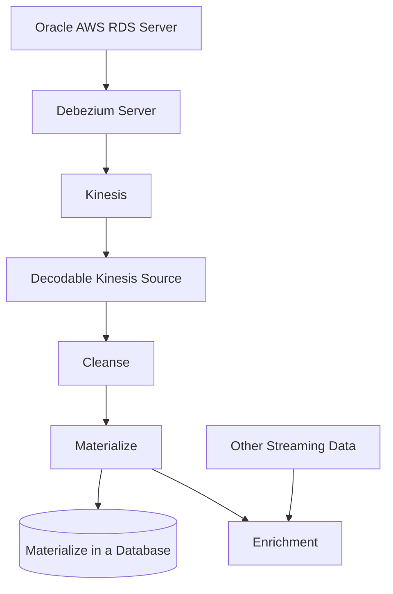

# Oracle CDC Uses Debezium

This example uses Oracle 19 in AWS RDS. We will be downloading, configuring a Debezium server with an Oracle CDC connector to read from the Oracle AWS RDS instance. This Debezium connector utilizes LogMiner as its method of ingestion change events.

---
Alternatively, if you are using the vagrant box for Oracle databases, you can clone the repository below:

```bash
git clone git@github.com:debezium/oracle-vagrant-box.git
```

You will need to modify the Vagrantfile to provide a valid `box` from Vagrant Cloud. The one configured no longer exists. Change from `33-cloud-base` to `34-cloud-base`

```text
config.vm.box = "fedora/33-cloud-base"

config.vm.box = "fedora/34-cloud-base"
```
---

Below is a diagram that outlines a possible use case. We will be implementing the top half before the cleanse job.



## Makefile
This example utilizes a Makefile that organizes all the commands. To hide credentials, it includes a `.env` file which needs populated in order for the commands to work.

Create a `.env` file in the local directory.

```properties

ORA_USER=
ORA_PASSWORD=
ORA_HOST=MY_ORACLE.rds.amazonaws.com
ORA_DATABASE=

AWS_REGION=
AWS_ARN=
AWS_KINESIS_STREAM=

```

## Creating an Oracle AWS RDS instance & ARCHIVELOG
If your Oracle source is an Amazon RDS database, it will be placed in ARCHIVELOG MODE if, and only if, `you enable backups`. If not, you will need to delete and recreate another Oracle instance.

To verify, execute the statement below. The output of it should say `ARCHIVELOG`. You can use any SQL client to execute this command. See here for [sqlplus](#sql-plus-setup).

```sql
SQL> SELECT LOG_MODE FROM V$DATABASE;

LOG_MODE
------------
ARCHIVELOG
```

***Don't forget to make sure your Oracle instance is set to publicly accessible !!!!***

## SQL PLUS setup

Install sqlplus [here](https://www.oracle.com/database/technologies/instant-client/macos-intel-x86-downloads.html)

The Makefile uses sqlplus.

```bash

# use sqlplus
$ sqlplus $(ORA_USER)/$(ORA_PASSWORD)@$(ORA_HOST):1521/$(ORA_DATABASE)


# Or run the Makefile
$ make db

```

## Oracle LogMiner Configuration
Run the following commands in sqlplus for RDS. The commands in the Oracle and Debezium documentations that enable LogMiner will not work because AWS blocks them. AWS also blocks your ability to login as `sysdba`. These commands are specific to Oracle AWS RDS instances.

```sql
SQL> exec rdsadmin.rdsadmin_util.set_configuration('archivelog retention hours',24);

PL/SQL procedure successfully completed.
```

```sql
SQL> exec rdsadmin.rdsadmin_util.alter_supplemental_logging('ADD');

PL/SQL procedure successfully completed.

```

Create the table we will consume events from and enable it for CDC capture.
```sql
create table admin.customers (
	userid int primary key,
	first_name varchar(63) not null,
	last_name varchar(63) not null,
	phone varchar(63)
);

ALTER TABLE admin.customers ADD SUPPLEMENTAL LOG DATA (ALL) COLUMNS;

```

## Create Kinesis Streams in AWS
Oracle metadata is always in all caps. You'll need to adjust your schemas and configuration that use table or column names as part of their values. For example, the Kinesis stream that will hold all the change data from Oracle will be `ora.ADMIN.CUSTOMERS` following the Debezium server configurations [below](#edit-the-confapplicationproperties).

- Create a `ora` stream. This corresponds to the `debezium.source.topic.prefix=ora` property in the Debezium configuration.
- Create a `ora.ADMIN.CUSTOMERS` that will hold the CDC data.

If you forget to create the stream or didn't name them properly, you will find this error in the logs. Notice it will provide you with the Kinesis stream it's expecting. "Stream `ora` under account xxx ..."

```json
{
    "exceptionType": "software.amazon.awssdk.services.kinesis.model.ResourceNotFoundException",
    "message": "Stream ora under account XXXXX not found. (Service: Kinesis, Status Code: 400, Request ID: XXXXX)"
}
```

## Download Debezium server
Download link [here](https://repo1.maven.org/maven2/io/debezium/debezium-server-dist/2.0.0.Final/debezium-server-dist-2.0.0.Final.tar.gz).

Explode the tar file into a directory. The directory structure should be similar to below. 

```
/debezium-server$ ll
total 1864
-rwxr-xr-x@   1 hubertdulay  staff     698 Oct 14 07:26 run.sh*
-rw-r--r--@   1 hubertdulay  staff     354 Oct 14 07:26 run.bat
-rw-r--r--@   1 hubertdulay  staff   15739 Oct 14 07:26 README_ZH.md
-rw-r--r--@   1 hubertdulay  staff   18365 Oct 14 07:26 README_KO.md
-rw-r--r--@   1 hubertdulay  staff   19608 Oct 14 07:26 README_JA.md
-rw-r--r--@   1 hubertdulay  staff   16594 Oct 14 07:26 README.md
-rw-r--r--@   1 hubertdulay  staff   11357 Oct 14 07:26 LICENSE.txt
-rw-r--r--@   1 hubertdulay  staff  129157 Oct 14 07:26 LICENSE-3rd-PARTIES.txt
-rw-r--r--@   1 hubertdulay  staff    6489 Oct 14 07:26 COPYRIGHT.txt
-rw-r--r--@   1 hubertdulay  staff   19246 Oct 14 07:26 CONTRIBUTE.md
-rw-r--r--@   1 hubertdulay  staff  408916 Oct 14 07:26 CHANGELOG.md
-rw-r--r--@   1 hubertdulay  staff  286286 Oct 14 07:32 debezium-server-dist-2.0.0.Final-runner.jar
drwxr-xr-x  338 hubertdulay  staff   10816 Oct 26 14:42 lib/
drwxr-xr-x   16 hubertdulay  staff     512 Oct 26 14:42 lib_opt/
drwxr-xr-x@   4 hubertdulay  staff     128 Oct 26 14:44 conf/

```

## Edit the conf/application.properties
Copy the `conf/application.properties.example` file to  `conf/application.properties` and open it with your editor of choice.

```bash
$ vi conf/application.properteis
```

The values shown here are the values needed for Debezium server to connect to the MSSQL in the Docker container. Make sure the prefix has the same value as the Kinesis stream you create above. This configuration will also generate JSON messages in Debezium format.

For this property `debezium.source.offset.storage.file.filename=data/offsets.dat`, You will need to create an empty file `data/offsets.dat`.

For this property `debezium.source.schema.history.internal.file.filename=history`, you will need to create a file called `history`. This file will hold the history of the schema in cases where the schema changes. Usually this is done using a schema registry with Kafka. We override that behavior with this property `debezium.source.schema.history.internal=io.debezium.storage.file.history.FileSchemaHistory`. 

```properties
debezium.sink.type=kinesis
debezium.sink.kinesis.region=$(AWS_REGION)
debezium.sink.kinesis.null.key=null

debezium.source.schema.history.internal=io.debezium.storage.file.history.FileSchemaHistory
debezium.source.schema.history.internal.file.filename=history
debezium.source.connector.class=io.debezium.connector.oracle.OracleConnector
debezium.source.offset.storage.file.filename=data/offsets.dat
debezium.source.offset.flush.interval.ms=0
debezium.source.database.server.name=ora_rds \
debezium.source.database.database.url=jdbc:oracle:thin:@//$(ORA_HOST):1521/$(ORA_DATABASE)
debezium.source.database.port=1521
debezium.source.database.user=$(ORA_USER)
debezium.source.database.hostname=$(ORA_HOST)
debezium.source.database.password=$(ORA_PASSWORD)
debezium.source.database.names=$(ORA_DATABASE)
debezium.source.database.dbname=$(ORA_DATABASE)
debezium.source.topic.prefix=ora
debezium.source.database.encrypt=false
debezium.source.table.include.list=admin.customers
debezium.source.key.converter=org.apache.kafka.connect.json.JsonConverter
debezium.source.value.converter=org.apache.kafka.connect.json.JsonConverter
quarkus.http.port=6060
debezium.source.key.converter.schemas.enable=false
```

In the make file, you can just run the task below. It will download the Debezium server and create the configuration above. This will truncate the `history` and `offset.dat` files to force Debezium to take a snapshot are restart for debugging purposes. See Makefile for details.

```bash
$ make ds
```

## Download Oracle JDBC Driver
https://www.oracle.com/database/technologies/appdev/jdbc-downloads.html and place into lib directory of the Debezium server below.

## Execute
`jq` is optional but will help immensely when viewing Debezium server output logs in the console.

```bash
$ run.sh | jq

# Makefile alternative
$ make ds
```

## Decodable Components

As mentioned earlier, Oracle upper cases its metadata. You'll need to adjust the schemas to match. Notice the ROW contain upper cased fields. Create the stream first then the kinesis source.

```bash
decodable stream create \
    --name oracle_cdc_kinesis_append \
    --field payload="ROW< \
        before ROW<USERID bytes, FIRST_NAME string, LAST_NAME string, PHONE string>, \
        after ROW<USERID bytes, FIRST_NAME string, LAST_NAME string, PHONE string>, \
        op string, ts_ms bigint>"

decodable conn create \
    --name oracle_cdc_kinesis_append_source \
    --connector kinesis \
    --type source \
    --stream-id=$(shell decodable stream list -o json | jq -sr '.[] |select(.name=="oracle_cdc_kinesis_append")|.id ' ) \
    --prop aws.credentials.role.arn=$(AWS_ARN) \
    --prop aws.region=$(AWS_REGION) \
    --prop format=json \
    --prop stream=$(AWS_KINESIS_STREAM)
```

Makefile alternative
```bash
$ make raw
$ make kinesis
```

**Oracle will also change the primary key (USERID) from Int to bytes when sending its payload to Kinesis. You will need to make this adjustment.** We will need to create a Decodable pipeline to convert the bytes into its original Int value.

## Payload
The `debezium.source.key.converter.schemas.enable=false` property in the Debezium server prevents the key schema from being sent to Kinesis because it's too large for Kinesis. You receive an error if you omit this property. 

Below is the entire event that the Debezium server sends to Kinesis and consumed by Decodable Kinesis source. You may be able to omit the value schema here has well. The schema we defined in our Decodable stream only defines the `payload` field of this event. It ignores the rest.

```json
{
    "schema": {
        "type": "struct",
        "fields": [
            {
                "type": "struct",
                "fields": [
                    {
                        "type": "bytes",
                        "optional": false,
                        "name": "org.apache.kafka.connect.data.Decimal",
                        "version": 1,
                        "parameters": {
                            "scale": "0",
                            "connect.decimal.precision": "38"
                        },
                        "field": "USERID"
                    },
                    {
                        "type": "string",
                        "optional": false,
                        "field": "FIRST_NAME"
                    },
                    {
                        "type": "string",
                        "optional": false,
                        "field": "LAST_NAME"
                    },
                    {
                        "type": "string",
                        "optional": true,
                        "field": "PHONE"
                    }
                ],
                "optional": true,
                "name": "ora.ADMIN.CUSTOMERS.Value",
                "field": "before"
            },
            {
                "type": "struct",
                "fields": [
                    {
                        "type": "bytes",
                        "optional": false,
                        "name": "org.apache.kafka.connect.data.Decimal",
                        "version": 1,
                        "parameters": {
                            "scale": "0",
                            "connect.decimal.precision": "38"
                        },
                        "field": "USERID"
                    },
                    {
                        "type": "string",
                        "optional": false,
                        "field": "FIRST_NAME"
                    },
                    {
                        "type": "string",
                        "optional": false,
                        "field": "LAST_NAME"
                    },
                    {
                        "type": "string",
                        "optional": true,
                        "field": "PHONE"
                    }
                ],
                "optional": true,
                "name": "ora.ADMIN.CUSTOMERS.Value",
                "field": "after"
            },
            {
                "type": "struct",
                "fields": [
                    {
                        "type": "string",
                        "optional": false,
                        "field": "version"
                    },
                    {
                        "type": "string",
                        "optional": false,
                        "field": "connector"
                    },
                    {
                        "type": "string",
                        "optional": false,
                        "field": "name"
                    },
                    {
                        "type": "int64",
                        "optional": false,
                        "field": "ts_ms"
                    },
                    {
                        "type": "string",
                        "optional": true,
                        "name": "io.debezium.data.Enum",
                        "version": 1,
                        "parameters": {
                            "allowed": "true,last,false,incremental"
                        },
                        "default": "false",
                        "field": "snapshot"
                    },
                    {
                        "type": "string",
                        "optional": false,
                        "field": "db"
                    },
                    {
                        "type": "string",
                        "optional": true,
                        "field": "sequence"
                    },
                    {
                        "type": "string",
                        "optional": false,
                        "field": "schema"
                    },
                    {
                        "type": "string",
                        "optional": false,
                        "field": "table"
                    },
                    {
                        "type": "string",
                        "optional": true,
                        "field": "txId"
                    },
                    {
                        "type": "string",
                        "optional": true,
                        "field": "scn"
                    },
                    {
                        "type": "string",
                        "optional": true,
                        "field": "commit_scn"
                    },
                    {
                        "type": "string",
                        "optional": true,
                        "field": "lcr_position"
                    },
                    {
                        "type": "string",
                        "optional": true,
                        "field": "rs_id"
                    },
                    {
                        "type": "int32",
                        "optional": true,
                        "field": "ssn"
                    },
                    {
                        "type": "int32",
                        "optional": true,
                        "field": "redo_thread"
                    },
                    {
                        "type": "string",
                        "optional": true,
                        "field": "user_name"
                    }
                ],
                "optional": false,
                "name": "io.debezium.connector.oracle.Source",
                "field": "source"
            },
            {
                "type": "string",
                "optional": false,
                "field": "op"
            },
            {
                "type": "int64",
                "optional": true,
                "field": "ts_ms"
            },
            {
                "type": "struct",
                "fields": [
                    {
                        "type": "string",
                        "optional": false,
                        "field": "id"
                    },
                    {
                        "type": "int64",
                        "optional": false,
                        "field": "total_order"
                    },
                    {
                        "type": "int64",
                        "optional": false,
                        "field": "data_collection_order"
                    }
                ],
                "optional": true,
                "name": "event.block",
                "version": 1,
                "field": "transaction"
            }
        ],
        "optional": false,
        "name": "ora.ADMIN.CUSTOMERS.Envelope",
        "version": 1
    },
    "payload": {
        "before": null,
        "after": {
            "USERID": "Aw==",
            "FIRST_NAME": "f3",
            "LAST_NAME": "b3",
            "PHONE": "333"
        },
        "source": {
            "version": "2.0.0.Final",
            "connector": "oracle",
            "name": "ora",
            "ts_ms": 1667525679000,
            "snapshot": "false",
            "db": "TEST",
            "sequence": null,
            "schema": "ADMIN",
            "table": "CUSTOMERS",
            "txId": "07000d005a030000",
            "scn": "1273960",
            "commit_scn": "1273961",
            "lcr_position": null,
            "rs_id": null,
            "ssn": 0,
            "redo_thread": 1,
            "user_name": "ADMIN"
        },
        "op": "c",
        "ts_ms": 1667525785087,
        "transaction": null
    }
}
```

