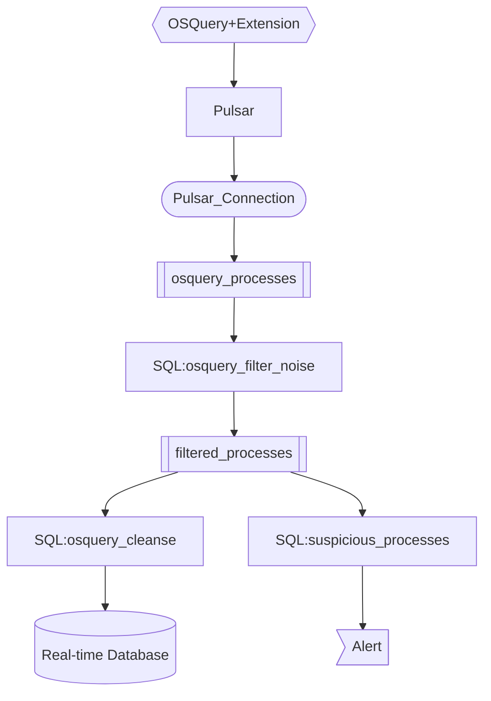

# OSQuery Log Routing





## Environment

Create a `.env` file and set the values.

```
DS_TOKEN=<< Datastax Token >>
TOPIC=<< Persistent Topic Name >>
PULSAR_ENDPOINT=<< PULSAR ENDPOINT >>
ADMIN_UR=<< Datastax Admin URL >>
```

## python
Pulsar require python 3.8

https://osquery.io/downloads/official/5.2.3

