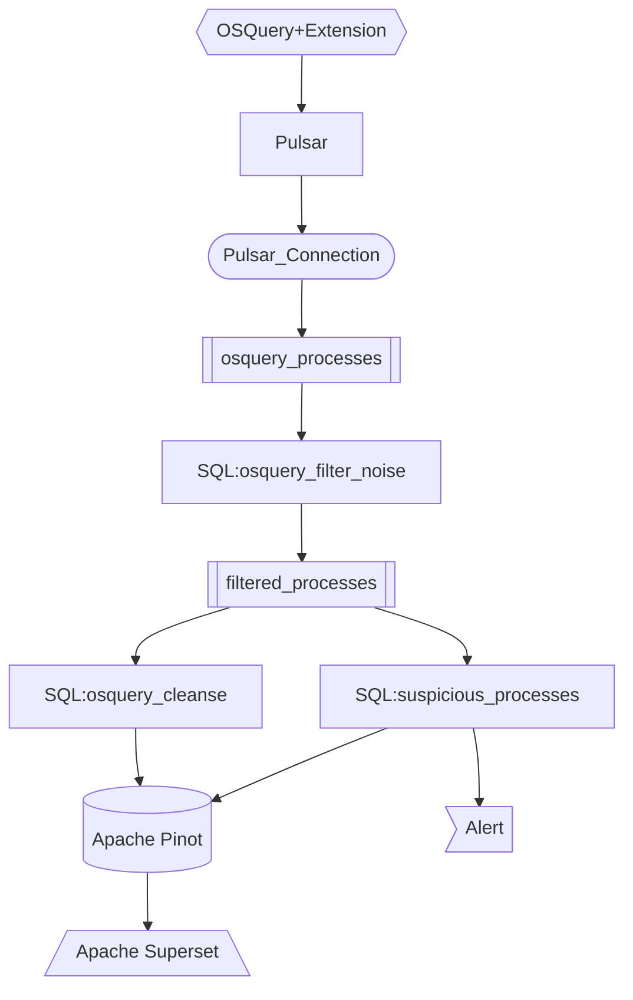

# Osquery logs to Apache Pinot

This example uses the output of stream in the [osquery example](../osquery/). We send this stream to Kafka to be consumed by Apache Pinot.



## Getting started

Create an `.env` file and populate your values

```
BOOTSTRAP=<< Kafka bootstrap servers >>
CONFLUENT_KEY=<< CONFLUENT KEY >>
CONFLUENT_SECRET=<< CONFLUENT SECRET >>
CLUSTER_ID=<< KAFKA CLUSTER ID >>

SCHEMA_REGISTRY=<< CONFLUENT CLOUD SCHEMA REGISTRY URL >>
CONFLUENT_SR_KEY=<< CONFLUENT SCHEMA REGISTRY KEY >>
CONFLUENT_SR_SECRET=<< CONFLUENT SCHEMA REGSITRY SECRET >>

TOPIC=<< KAFKA PINOT TOPIC >>

CONTROLLER_HOST=<< HOST/IP to PINOT >>
CONTROLLER_PORT=<< PINOT CONTROLLER PORT >>
```

Install pinot-admin

```bash
brew install pinot
```

Install Confluent Cloud CLI

```bash
curl -sL --http1.1 https://cnfl.io/cli | sh -s -- latest
```

## Install / Run Pinot EC2 Instance

Install Apache Pinot

```bash
PINOT_VERSION=0.10.0 #set to the Pinot version you decide to use

wget https://downloads.apache.org/pinot/apache-pinot-$PINOT_VERSION/apache-pinot-$PINOT_VERSION-bin.tar.gz

# untar it
tar -zxvf apache-pinot-$PINOT_VERSION-bin.tar.gz

# navigate to directory containing the launcher scripts
cd apache-pinot-$PINOT_VERSION-bin
```

Start Pinot

```bash
./bin/quick-start-streaming.sh &
```

This starts a streaming example built into Apache Pinot. 

## Start

```bash
make topic
make flow
make active

make clean # cleans Decodable
```


