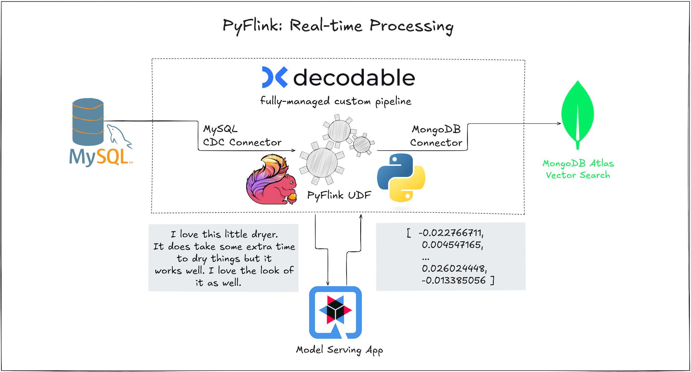

# PyFlink on Decodable with MongoDB Vector Search

## Demo Scenario Overview





### Managed Cloud Services

The demo scenario needs access to the following cloud services:

* **[Decodable](https://decodable.co):** used as fully-managed platform to run Apache Flink PyFlink jobs
* **[ngrok](https://ngrok.com/):** used to tunnel traffic between cloud services and local container applications over the public internet

#### Decodable

If you don’t have a Decodable account yet, [sign up for free here](https://app.decodable.co/-/accounts/create). You can log in with your Google or GitHub account, or sign up using your email address.


Make sure to use an **account on the free Developer plan** in order to avoid incurring any cost for running this demo scenario.
Before proceeding, log in to verify that you can access the Decodable Web Console and see the Dashboard:


#### ngrok

The PyFlink job running fully-managed on Decodable needs to access locally running services, namely, the MySQL instance which stores all user reviews, the Model Serving app which calculates the vector embeddings, and the MongoDB instance to store and index all vector embeddings.
In order for the PyFlink job to reach these locally running containerized services over the public internet, ngrok is used to tunnel the traffic accordingly.

> [!IMPORTANT]
> Make sure that you have [ngrok installed](https://ngrok.com/download).

1. Login into ngrok and **copy your auth token** which you can find [here](https://dashboard.ngrok.com/get-started/your-authtoken)

2. Open the file `ngrok.yml`, **paste your auth token** into [line 3](./ngrok.yml#L3), and save the updated file.

3. Run `ngrok start --all --config ngrok.yml` in a terminal which in total will set up three tunnels to your local machine: to MySQL, to the Model Serving app, and to MongoDB, all of which will be started as containers on your local machine in the next step.

Terminal output should look similar to the following:

```
ngrok                                                                                                         (Ctrl+C to quit)

Help shape K8s Bindings https://ngrok.com/new-features-update?ref=k8s

Session Status                online
Account                       <your-account> (Plan: Free)
Update                        update available (version 3.15.1, Ctrl-U to update)
Version                       3.14.0
Region                        Europe (eu)
Latency                       22ms
Web Interface                 http://127.0.0.1:4040
Forwarding                    tcp://2.tcp.eu.ngrok.io:10255 -> localhost:3306
Forwarding                    https://3f05-194-118-114-171.ngrok-free.app -> http://localhost:9090
Forwarding                    tcp://6.tcp.eu.ngrok.io:13920 -> localhost:27017

Connections                   ttl     opn     rt1     rt5     p50     p90
                              0       0       0.00    0.00    0.00    0.00 
```

**Take note of the three lines related to `Forwarding`. You'll need:**

1. the hostname for the **https tunnel** - in the example above hostname `3f05-194-118-114-171.ngrok-free.app` - which is used to reach the locally running Model Serving app from the public internet
2. the hostname and port for the **MySQL tcp tunnel** - in the example above hostname `2.tcp.eu.ngrok.io` and port `10255` - which is used to reach the locally running MySQL instance from the public internet
3. the hostname and port for the **MongoDB tcp tunnel** - in the example above hostname `6.tcp.eu.ngrok.io` and port `13920` - which is used to reach the locally running MongoDB instance from the public internet

### Local Container Environment

#### Docker Compose

Since all locally running services are containerized applications, you need to have have either [Docker](https://www.docker.com/) or [Podman](https://podman-desktop.io/) installed on your system.

> [!NOTE]  
> _OPTIONAL:_ The app for model inference supports two REST endpoints, one for local inference and another to delegate requests to a hosted model on HuggingFace. 
For the latter, you'd need an API KEY and set it in the `compose.yaml` [here](./compose.yaml#L63).

Next, switch to a terminal and run the whole demo stack with like so:

```bash 
docker compose -f compose.yaml up
```

This should result in four containers being successfully started and running:

```bash
docker ps
```

```
CONTAINER ID   IMAGE                                        COMMAND                  CREATED          STATUS                    PORTS                               NAMES
CONTAINER ID   IMAGE                                        COMMAND                  CREATED          STATUS                    PORTS                               NAMES
2afb3265c3a7   hpgrahsl/reviews-app:1.2.0                   "/opt/jboss/containe…"   30 seconds ago   Up 24 seconds             0.0.0.0:8080->8080/tcp, 8443/tcp    pyflink-decodable-review-app-1
95283e5ee3ca   hpgrahsl/model-serving-app:1.2.0             "/opt/jboss/containe…"   30 seconds ago   Up 30 seconds             8443/tcp, 0.0.0.0:9090->8080/tcp    pyflink-decodable-model-serving-app-1
e5b187de67f8   mongodb/mongodb-atlas-local:7.0.7            "/usr/local/bin/runn…"   30 seconds ago   Up 30 seconds (healthy)   0.0.0.0:27017->27017/tcp            pyflink-decodable-mongodb-1
ea5d4fb68181   quay.io/debezium/example-mysql:2.7.0.Final   "docker-entrypoint.s…"   30 seconds ago   Up 30 seconds (healthy)   0.0.0.0:3306->3306/tcp, 33060/tcp   pyflink-decodable-mysql-1
```

#### MongoDB Atlas

As part of the demo scenario, vector embeddings will be calculated based on a specific [embedding model](https://huggingface.co/sentence-transformers/all-mpnet-base-v2) and then ingested into a MongoDB collection for vector search.

The recommended way - in particular for production scenarios - would be to use MongoDB's Vector Search with fully-managed [Atlas](https://www.mongodb.com/products/platform/atlas-database) deployments.
In order to simplify the set up, this demo runs an [Atlas container locally](https://www.mongodb.com/docs/atlas/cli/current/atlas-cli-deploy-docker/) using Docker Compose.

> [!IMPORTANT]
> Before proceeding, make sure to download and install the following tools:
> 1. [Atlas CLI](https://www.mongodb.com/products/tools/atlas-cli)
> 2. [mongosh](https://www.mongodb.com/docs/mongodb-shell/install/#install-mongosh)

Then switch to a terminal window and run the following shell commands to intialize the database and define the vector search index:

```bash
USR=demousr
PWD=demopwd
CONTAINER_NAME=pyflink-decodable-mongodb-1

# create db and collection
cat << EOF | atlas deployments connect $CONTAINER_NAME --connectWith mongosh --type LOCAL --username $USR --password $PWD
use vector_demo;
db.createCollection('review_embeddings');
EOF

# create vector search index
atlas deployments search indexes create --deploymentName $CONTAINER_NAME --file ./db/mongodb/vector_index_def.json --username $USR --password $PWD
```

With all the infra in place, let's switch focus to the data processing with PyFlink on Decodable.

### PyFlink Job

#### Overview

[PyFlink](https://nightlies.apache.org/flink/flink-docs-release-1.20/docs/dev/python/overview/) is a Python API for Apache Flink. The PyFlink job for this demo scenario uses  PyFlink's [Table API](https://nightlies.apache.org/flink/flink-docs-master/docs/dev/python/table_api_tutorial/) which is a unified, relational API for batch and stream processing. It also allows you to delcaratively express your data processing needs by means of SQL. If necessary, you can extended offered functionalities with custom processing logic by writing your own user-defined functions ([UDFs](https://nightlies.apache.org/flink/flink-docs-release-1.20/docs/dev/python/table/udfs/python_udfs/)).

The demo scenario features a PyFlink job to create a basic real-time ETL pipeline which does the following:

1. continuously read text data from an operational database (MySQL) using Flink's MySQL CDC connector

2. apply custom processing logic by means of a user-defined function (UDF) which takes the text input and forwards it to an external service to retrieve the calculated vector embeddings

3. continuously write vector embeddings into a vector store (MongoDB with Vector Search) using the MongoDB connector

Find the most important code snippets of the PyFlink job below:

```python
    # define table source based on mysql-cdc connector
    t_env.execute_sql(f"""
                CREATE TABLE reviews (
                    id BIGINT,
                    itemId STRING,
                    reviewText STRING,
                    PRIMARY KEY (id) NOT ENFORCED
                )  WITH (
                    'connector' = 'mysql-cdc',
                    'hostname' = '{job_config['mysql_host']}',
                    'port' = '{job_config['mysql_port']}',
                    'username' = '{job_config['mysql_user']}',
                    'password' = '{job_config['mysql_password']}',
                    'jdbc.properties.maxAllowedPacket' = '16777216',
                    'server-time-zone' = 'UTC',
                    'database-name' = 'vector_demo',
                    'table-name' = 'Review');
                """)
```

```python
# define scalar user-defined functions
class RemoteEmbedding(ScalarFunction):
  
  def __init__(self, url):
      self.modelServerApiUrl = url
  
  def eval(self, text):
    response = requests.post(self.modelServerApiUrl,
                             data=text.encode('utf-8'),
                             headers={'Content-type': 'text/plain; charset=utf-8'})
    return json.loads(response.text)
  
class LocalEmbedding(ScalarFunction):
  
  model: None
  
  def __init__(self):
    self.model = SentenceTransformer(model_name_or_path='all-mpnet-base-v2',cache_folder='/opt/flink-libs/hf-hub-cache')

  def open(self, function_context: FunctionContext):
    self.model = SentenceTransformer(model_name_or_path='all-mpnet-base-v2',cache_folder='/opt/flink-libs/hf-hub-cache')
 
  def eval(self, text):
    return self.model.encode(text,None,None,32,None,'sentence_embedding','float32',True,False).tolist()
  
  def __getstate__(self):
    state = dict(self.__dict__)
    del state['model']
    return state
```

```python
# register UDFs and specify I/O data types
    t_env.create_temporary_system_function(
       "remote_embedding",
       udf(
          RemoteEmbedding(job_config['model_server']),
          input_types=[DataTypes.STRING()],
          result_type=DataTypes.ARRAY(DataTypes.DOUBLE())
        )
    )

    t_env.create_temporary_system_function(
       "local_embedding",
       udf(
          LocalEmbedding(),
          input_types=[DataTypes.STRING()],
          result_type=DataTypes.ARRAY(DataTypes.DOUBLE())
        )
    )
```

```python
# define table sink based on mongodb connector
t_env.execute_sql(f"""
                    CREATE TABLE review_embeddings (
                        _id BIGINT,
                        itemId STRING,
                        reviewText STRING,
                        embedding DOUBLE ARRAY,
                        PRIMARY KEY (_id) NOT ENFORCED
                    ) WITH (
                        'connector' = 'mongodb',
                        'uri' = '{mongodb_uri}',
                        'database' = 'vector_demo',
                        'collection' = 'review_embeddings'
                    )
                """)
```

```python
    # switch between local or remote embedding calculation according to configuration
    calc_embedding = "";
    if job_config['embedding_mode'] == 'remote':
        calc_embedding = 'REMOTE_EMBEDDING(reviewText) AS embedding'
    elif job_config['embedding_mode'] == 'local':
        calc_embedding = 'LOCAL_EMBEDDING(reviewText) AS embedding'
    else:
       print(f"error: embedding_mode must be either [local | remote] but was '{job_config['embedding_mode']}'")
       sys.exit(-1)
   
    # read from source table, calculate vector embeddings according to chosen mode, and insert into table sink
    t_env.execute_sql(
            f"""
                INSERT INTO review_embeddings
                    SELECT
                        id AS _id,
                        itemId,
                        reviewText,
                        {calc_embedding}
                    FROM reviews
            """
    )
```

#### Build Pyflink Job

In order to run this PyFlink job on Decodable, it's necessary to build a self-contained ZIP archive. The archive is supposed to provide both, all Apache Flink related libraries used in the PyFlink job as well as any additional Python packages the custom Python code might depend on.

To ease the generation of this build artefact, a container image is provided together with a `make` file to build this self-contained ZIP archive.

In your terminal, make sure you are in the root folder of this repository, then execute the following:

```bash
docker run -it --rm --name pyflink-job-artefact-builder -v ./pyflink-app:/home/pyflink-app docker.io/hpgrahsl/pyflink-job-artefact-builder:1.0.0
```

Given that the build process in the container ran succesfully, there is now a ZIP archive named `pyflink-job.zip` in the folder `./pyflink-app/target/` which is ready to be deployed to Decodable as a custom Python pipeline.

#### Deploy Pyflink Job

In the `pyflink-app` folder there is a YAML file `decodable-resources.yaml`  which describes all Decodable resources needed for the PyFlink job deployment.

> [!IMPORTANT]
> Before you deploy this using the Decodable CLI you have to specify all the necessary secrets matching your setup.

The secret named `job_config` must be modified which is found in the `pyflink-app/.secrets` folder. Adapt all placeholders in the following fields of the JSON:

* `model_server`: adapt the placeholder with your **ngrok hostname from the HTTPs tunnel** for the model serving app
* `mongodb_uri`: adapt the placeholder with your **ngrok hostname and port for the MongoDB TCP tunnel**
* `mysql_host`: adapt the placeholder with your proper **ngrok hostname from the MySQL TCP tunnel**
* `mysql_port`: adapt the placeholder with your proper **ngrok port from the MySQL TCP tunnel**

Make sure all changes to this file are saved.

From the terminal within the `pyflink-app` folder use the [Decodable CLI](https://docs.decodable.co/cli.html) to deploy the PyFlink job as follows:

```bash
decodable apply decodable-resources.yaml
```

The first step is that the CLI will upload and validate the self-contained ZIP archive. Right after that the other Decodable resources (secrets + pipeline) specified in the YAML manifest are created and the pipeline is automatically started.

Once the pipeline is up and running, the MySQL CDC connector performs a so-called initial snapshot of the existing user reviews in the corresponding source database table. The PyFlink job transforms the textual user reviews by means of the custom UDF - either the `LOCAL_EMBEDDING` or the `REMOTE_EMBEDDING` function - which is used to calculate the vector embeddings. The results are written into the collection using the MongoDB connector.

### User Reviews Generator

To simulate continuous user load, there is a data genertor which sends user reviews - by default 1 per second - to the Reviews App which stores them into the MySQL database table. This creates a steady stream of new user reviews being processed in real-time by the fully-managed PyFlink job running on Decodable.

The data generator can be run from the root folder of this repository as follows:

```bash
docker run -it --rm --name data-generator-user-reviews --network vector-ingest-network docker.io/hpgrahsl/data-generator:1.1.3
```

This should result in terminal output like below:

```bash
...
📤 posting user review via REST API
{"id":28,"itemId":"B007AVZQ1U","reviewText":"If you have reusable single cup maker and cup these liners are a must have for easy clean up. Much easier on the landfill than the plastic cups. Easy to use and the 'lid' on the top is actually a game changer. Keeps the grounds exactly where they are suppose to be - in the making cup - NOT your drinking cup. Love them, feel really comfortable recommending them. I never hesitate to update my reviews should new info seem useful."}
⏱️ delaying for 1.0s
📤 posting user review via REST API
{"id":29,"itemId":"B084L49119","reviewText":"I was a little disappointed that it doesn't quite fit in my single cup maker - I had to really slam the top down - eventually I get it in. Eh. It's like the puncture needle of my maker is a tiny bit off. I do recommend the cup liners. It brews a lighter than the commercial single coffee cups in my opinion - but if you have ground coffee - its worth a try just to keep the single use cups out of the garbage. Just know it doesn't fit ALL single cup makers. The maker I use is not a national brand. All of that said, I never hesitate to update my reviews should new info seem useful."}
⏱️ delaying for 1.0s
📤 posting user review via REST API
{"id":30,"itemId":"B07VSFPBW5","reviewText":"I purchased a single cup brewer that has the option of your own coffee... came with a cup to do that - but it is a pain to clean - so I buy these... it's a taller single cup holder so these taller liners are perfect. I have one cup of coffee a day - and sometimes none at all - so these will last me a good long time. I like that they are non-bleached - the less chemicals the better in my mind."}
⏱️ delaying for 1.0s
...
```

Each of these reviews is captured via CDC from the PyFlink job, transformed using the UDF and the corresponding vector embeddings stored into the MongoDB collection.

### Semantic Search

With vector embeddings for textual reviews present in MongoDB and indexed for vector search, it's possible to run semantic search queries against this continuously updated user reviews.

For this, the Review App provides a specific REST endpoint which can be queried like so:

```bash
curl -L -G --data-urlencode "text=amazing product would by this again any time" localhost:8080/api/v1/search/
```

Feel free to adapt the query string `"text=<YOUR_QUERY_STRING_HERE>"` to any arbitrary query you want try semantic search with.
