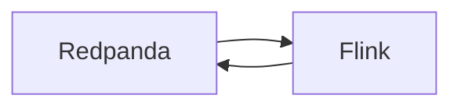
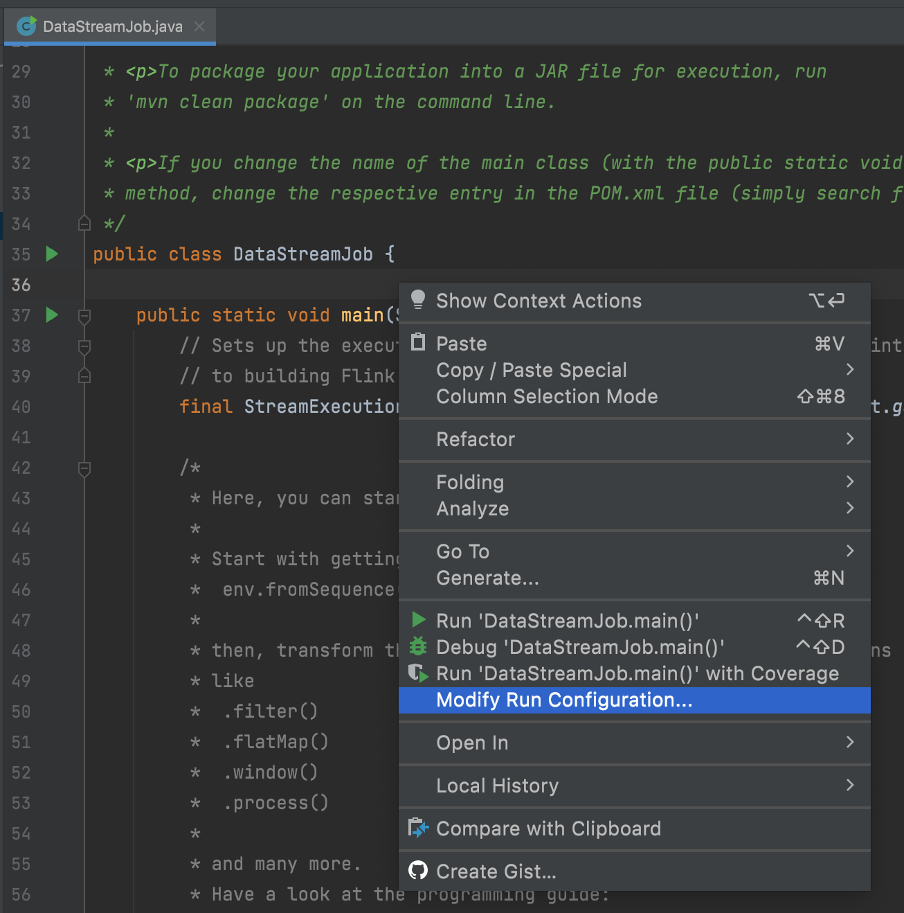
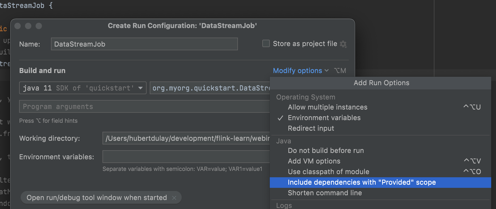
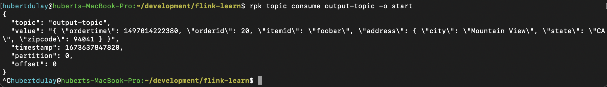
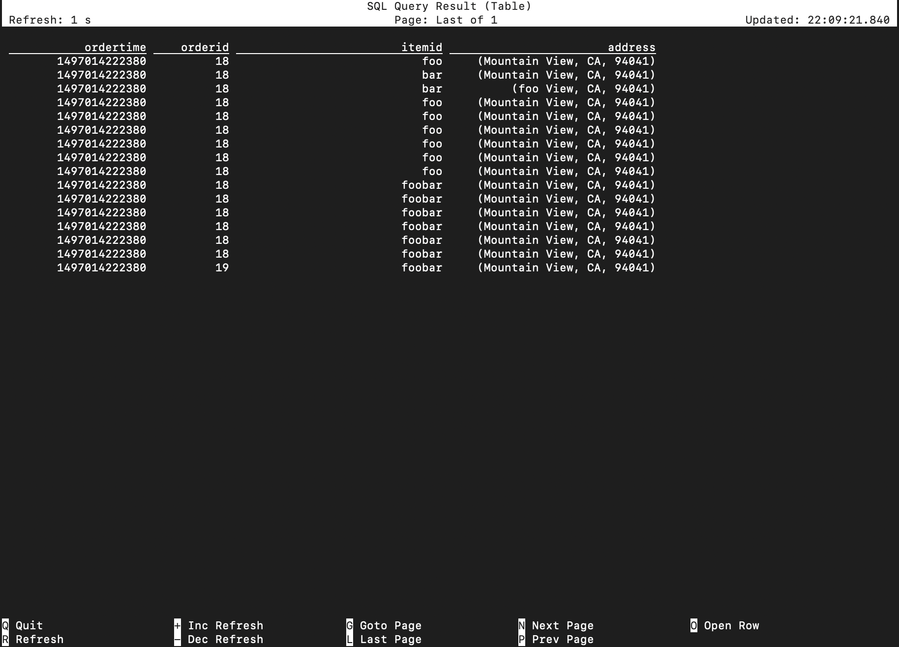
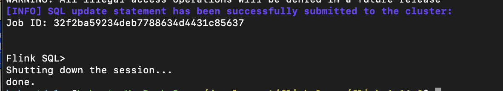

# Getting started with Apache Flink & FlinkSQL
With heavy adoption at both large and small companies, [Apache Flink](https://flink.apache.org/) has emerged as the clear winner in the stream processing war. However, many streaming engineers have been embedded in Apache Spark or Kafka Streams/ksqlDB ecosystems and do not have much experience with using Flink.

## Goal
This webinar is for engineers who are new and interested in Apache Flink and Flink SQL, and we’ll be demonstrating for you how you can get started with Apache Flink and Flink SQL. By the end of this webinar, you will have:
Created and configured a Flink application on your local machine that reads and writes data from one Redpanda topic to another topic. 
Added a transformation to the Flink application that filters out unwanted data before it is sent to the desired Redpanda topic. 

Note: We’ll be using Java and SQL in this webinar, but you can also use Apache Flink in Scala and Python. 

## Prerequisites

- Java 11
- IntelliJ IDEA
- Apache Maven 
- [Docker](https://docs.docker.com/get-docker/)
- [Redpanda and the rpk CLI](https://docs.redpanda.com/docs/platform/quickstart/)
- [Flink](https://flink.apache.org/downloads.html#apache-flink-1160)

```bash
java -version
tar -xzf flink-*.tgz

./bin/start-cluster.sh # start the flink cluster
./bin/stop-cluster.sh  # stop the flink cluster
```

We will need the Flink Kafka connector for this webinar. Download it [here](https://nightlies.apache.org/flink/flink-docs-release-1.16/docs/connectors/table/kafka/) and place it into the lib directory of your Flink deployment.

# Redpanda
In this webinar, we’ll be sending data to Redpanda, a Kafka-compatible and Zookeeperless streaming platform for mission critical workloads. We’ll set up Flink to read from one Redpanda topic, process that data, and then send it back to a different topic in Redpanda. You'll need to install Redpanda and it's CLI rpk, which can be found [here](https://docs.redpanda.com/docs/platform/quickstart/).



## Starting Up a Redpanda Cluster Locally
Do the following steps to start a local Redpanda cluster. 
Start Redpanda using the `rpk` CLI.

```bash
rpk container -n 3 start
```

The output should looks similar to this:
```
Starting cluster
Waiting for the cluster to be ready...
  NODE ID  ADDRESS          
  0        127.0.0.1:55834  
  2        127.0.0.1:55828  
  1        127.0.0.1:55832  

Cluster started! You may use rpk to interact with it. E.g:

  rpk cluster info --brokers 127.0.0.1:55834,127.0.0.1:55828,127.0.0.1:55832

You may also set an environment variable with the comma-separated list of broker addresses:

  export REDPANDA_BROKERS="127.0.0.1:55834,127.0.0.1:55828,127.0.0.1:55832"
  rpk cluster info

```
Create a `.env` file and paste the last line of the output excluding the `export` term. You will need to copy this file into the project directory created later in this README.

```properties
REDPANDA_BROKERS=127.0.0.1:53348,127.0.0.1:53353,127.0.0.1:53354
```

Pre-create the topics we will be using in the webinar.

```bash
rpk topic create input-topic output-topic
```

<!-- 
## Redpanda Console
Redpanda comes with a console which we will use to monitor messages sent to it. 

```bash
source .env
docker run --network=host \
  -e KAFKA_BROKERS=$REDPANDA_BROKERS \
  docker.redpanda.com/vectorized/console:latest
```

The Redpanda console can be accessed [here](localhost:8080). -->

# Flink Quickstart using Java
Create a project by running the following command. This creates a directory with a Java project that we will later import to IntelliJ.

```bash
mvn archetype:generate \
  -DarchetypeGroupId=org.apache.flink \
  -DarchetypeArtifactId=flink-quickstart-java \
  -DarchetypeVersion=1.16.0 \
  -DgroupId=org.myorg.quickstart \
  -DartifactId=quickstart \
  -Dversion=0.1 \
  -Dpackage=org.myorg.quickstart \
  -DinteractiveMode=false
```

**NOTE**: Don't forget to copy the `.env` file into this directory.

## Import your project into IntelliJ
To import your project into IntelliJ, do the following configuration steps. You will need to do some additional configuration in IntelliJ to get Flink working properly. Detailed information can be found [here](https://nightlies.apache.org/flink/flink-docs-master/docs/dev/configuration/maven/#importing-the-project-into-your-ide). Specifically, follow the instructions below.

> Note on IntelliJ: To make the applications run within IntelliJ IDEA, it is necessary to tick the Include dependencies with "Provided" scope box in the run configuration. If this option is not available (possibly due to using an older IntelliJ IDEA version), then a workaround is to create a test that calls the application’s `main()` method.

1. Navigate to the `DataStreamJob` file. Right click on the `DataStreamJob` code and select `Modify Run Configuration`.




2. Next click on `Modify options` and click on `Include dependencies with "Provided" scope`. 


### WARNING
> If you forget to do this, you will get class loading errors when attempting to debug this class.

## Set up the Streaming Execution Environment
The quickstart will create a skeleton code for you to get started. The first important line of code is creating an environment.

```java
final StreamExecutionEnvironment env = StreamExecutionEnvironment.getExecutionEnvironment();
```

From Apache Flink Documentation:
>Typically, you only need to use getExecutionEnvironment(), since this will do the right thing depending on the context: if you are executing your program inside an IDE or as a regular Java program it will create a local environment that will execute your program on your local machine. If you created a JAR file from your program, and invoke it through the command line, the Flink cluster manager will execute your main method and getExecutionEnvironment() will return an execution environment for executing your program on a cluster.


## Checkpointing

Checkpoints allow Flink to recover state and positions in the streams to give the application the same semantics as a failure-free execution.

```java
// start a checkpoint every 1000 ms
env.enableCheckpointing(1000);
```

For more information on unaligned checkpoints, click [here](https://nightlies.apache.org/flink/flink-docs-master/docs/ops/state/checkpointing_under_backpressure/#unaligned-checkpoints).

## Kafka Source
Since Redpanda is Kafka compliant, we can use the Kafka source connector to consume from Redpanda. 

1. Update the `pom.xml` with the Kafka connector library for Flink. Open the quickstart pom.xml. You will notice that it already has a dependency entry for Kafka that is commented. Uncomment it and rebuild the project.

```xml
        <!-- Add connector dependencies here. They must be in the default scope (compile). -->
        <!-- Example:

		<dependency>
			<groupId>org.apache.flink</groupId>
			<artifactId>flink-connector-kafka</artifactId>
			<version>${flink.version}</version>
		</dependency>
		-->
```

2. Next add the following imports:

```java
import org.apache.flink.api.java.utils.ParameterTool;
import org.apache.flink.streaming.api.CheckpointingMode;
import org.apache.flink.streaming.api.environment.CheckpointConfig;
import org.apache.flink.streaming.api.environment.StreamExecutionEnvironment;
import org.apache.flink.api.common.eventtime.WatermarkStrategy;
import org.apache.flink.api.common.serialization.SimpleStringSchema;
import org.apache.flink.connector.base.DeliveryGuarantee;
import org.apache.flink.connector.kafka.sink.KafkaRecordSerializationSchema;
import org.apache.flink.connector.kafka.sink.KafkaSink;
import org.apache.flink.connector.kafka.source.KafkaSource;
import org.apache.flink.connector.kafka.source.enumerator.initializer.OffsetsInitializer;
import org.apache.flink.streaming.api.datastream.DataStreamSource;
import org.apache.flink.streaming.api.datastream.SingleOutputStreamOperator;
import org.apache.flink.streaming.api.functions.sink.PrintSink;
```

1. Create a secured source connector to Redpanda by copying and pasting the code below. It will read the properties from the .env file and create a Kafka source.

```java
String bootstrap_servers = ...;
KafkaSource<String> ksource = KafkaSource.<String>builder()
        .setBootstrapServers(bootstrap_servers)
        .setTopics("input-topic")
        .setGroupId("flink-test")
        .setStartingOffsets(OffsetsInitializer.earliest())
        .setValueOnlyDeserializer(new SimpleStringSchema())
        .setProperty("acks", "all")
        .build();
```

## Create a stream from the Kafka source connector
Create a Kafka source by copying and pasting the code below.

```java
DataStream<String> stream = env.fromSource(
    ksource, 
    WatermarkStrategy.noWatermarks(), 
    "Redpanda Source"
);
```

**Note**: Creating the stream from the source connector may require a watermark depending on how the data is processed downstream. Flink provides watermarking to support late arriving data. In this example, we are not providing any watermarks.


## Transformation
Now, let’s filter out records that we don’t care about. In this case, we’ll be filtering our records that only contain “foo”. The description for the filter function has been taken from Javadocs and pasted below.

Javadoc:
> Applies a Filter transformation on a DataStream. The transformation calls a FilterFunction for each element of the DataStream and retains only those element for which the function returns true. `Elements for which the function returns false are filtered.` The user can also extend RichFilterFunction to gain access to other features provided by the org.apache.flink.api.common.functions.RichFunction interface.

```java
DataStream<String> filtered = stream.filter(string -> string.contains("foo"));
```

## Add a PrintSink for debugging
You can use the PrintSink to log your messages to the console in IntelliJ. The short-cut key stroke to find classes is: `⌥ ⏎`.

```java
PrintSink<String> sink = new PrintSink<>(true);

filtered.sinkTo(sink); // add the print sink to the stream
```

## Send Data To Redpanda
From the rpk CLI, run the following commands to generate data to our Redpanda cluster.

```bash
source .env
rpk topic produce input-topic --brokers $REDPANDA_BROKERS
```

```json
{ "ordertime": 1497014222380, "orderid": 20, "itemid": "foobar", "address": { "city": "Mountain View", "state": "CA", "zipcode": 94041 } }
```

## Kafka Sink
We will again use Redpanda as the destination for the filtered Redpanda records. Using the same credentials as in the source, we will now be sending the data back to Redpanda instead of printing it to the console.

```java
KafkaSink<String> sink = KafkaSink.<String>builder()
    .setBootstrapServers(bootstrap_servers)
    .setRecordSerializer(KafkaRecordSerializationSchema.builder()
            .setTopic("output-topic")
            .setValueSerializationSchema(new SimpleStringSchema())
            .build()
    )
    .setProperty("acks", "all")
    .setDeliveryGuarantee(DeliveryGuarantee.AT_LEAST_ONCE)
    .build();


filtered.sinkTo(sink); // add the Kafka sink to the stream
```

## RPK Consumer
From the `rpk` CLI, start consuming records from the output topic.

```bash
source .env
rpk topic consume output-topic --brokers $REDPANDA_BROKERS
```

Below is the expected output.




## Compile and build the application
To compile the application, perform the following steps.

```bash
# build a shaded jar
mvn package 

# Run this command providing the correct paths.
../../flink-1.16.0/bin/flink run -c org.myorg.quickstart.DataStreamJob target/quickstart-0.1.jar
```

## Monitor Your Job
You can open the Flink Console at http://localhost:8081.

## Stop Your Job
To stop your running job, you can use the Flink Console or run this command.

```bash
./bin/flink stop <Job ID>
```


# FlinkSQL Tutorial
In this part of the webinar, we will implement the same workflow using Flink SQL. Start the Flink cluster and then proceed to the [console](http://localhost:8081/#/overview).

```bash
./bin/start-cluster.sh
```

To monitor the log you can either use the console or tail the log file.

```bash
tail -f log/flink-hubertdulay-sql-client-*.log
```

## Start the SQL-CLIENT
Instead of using Java, we'll be submitting SQL to Flink. Start the SQL client using the command below.

```bash
./bin/sql-client.sh embedded
```

## Create a Source Connector to Redpanda
Create a table that will serve as the source for the topic that we’ll be ingesting data from. In this example, the `address` field is a complex type. We will be using a `ROW<>` type to describe the address.

```sql
-- { "ordertime": 1497014222380, "orderid": 100, "itemid": "foobar", "address": { "city": "hubert", "state": "CA", "zipcode": 94041 } }
CREATE TABLE input_topic (
    ordertime bigint,
    orderid INT,
    itemid string,
    address ROW<city string, state string, zipcode string>
 ) WITH (
  'connector' = 'kafka',
  'topic' = 'input-topic',
  'properties.bootstrap.servers' = '{{ BOOTSTRAP_SERVER }}', -- provide the bootstrap server
  'properties.group.id' = 'flinksql',
  'scan.startup.mode' = 'earliest-offset',
  'format' = 'json',
  'json.ignore-parse-errors' = 'true'
);

```

<!-- **IMPORTANT: For Flink SQL - Change the PlainLoginModule to the Shaded**
Notice in the `properties.sasl.jaas.config` option, the specified login module is different compared to the one we supplied in Java. In this case, we want to use the one shaded into the Flink namespace instead.

- Java - org.apache.kafka.common.security.plain.PlainLoginModule
- SQL - `org.apache.flink.kafka.shaded.`org.apache.kafka.common.security.plain.PlainLoginModule

Here is the [documentation](https://nightlies.apache.org/flink/flink-docs-release-1.16/docs/connectors/table/kafka/#security) from Apache Flink:

> Please note that the class path of the login module in sasl.jaas.config might be different if you relocate Kafka client dependencies, so you may need to rewrite it with the actual class path of the module in the JAR. For example if you are using SQL client JAR, which has relocate Kafka client dependencies to org.apache.flink.kafka.shaded.org.apache.kafka, the path of plain login module should be 
> `org.apache.flink.kafka.shaded.org.apache.kafka.common.security.plain.PlainLoginModule` 
> instead. -->

Select from the table. The output show appear below.

```sql
select * from input_topic;
```



## Transform filter and Sink to Redpanda
We create another table that filters the records and sends them to Redpanda.

```sql
create table output_topic 
WITH (
  'connector' = 'kafka',
  'topic' = 'output-topic',
  'properties.bootstrap.servers' = '{{ BOOTSTRAP_SERVER }}', -- provide the bootstrap server
  'format' = 'json',
  'json.ignore-parse-errors' = 'true'
)
as select * from input_topic where itemid like '%foo%' OR address['city'] like '%foo%';
```

Alternatively, you can put all of your SQL into a file and run it from the command line.

```bash
./bin/sql-client.sh embedded -f ../webinar/sql/pipeline.sql 
```

You should see your job submitted with the output below.



If you run the `rpk` command to consume from the `output-topic`, you should see the records coming through. Also checkout the Flink console to see your job running. 


# Summary
In this webinar, we installed Apache Flink and build a simple pipeline in Java and in SQL. We also used Redpanda to read and write streaming data. For more information about Apache Flink and how you can do this in Decodable, please reach out or support@decodable.co.
