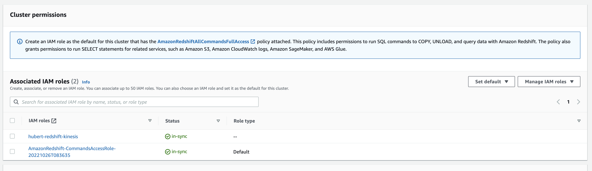

# Writing Real Time CDC Events to Redshift
In this example, we will be mirroring a Postgres table in Redshift. Amazon Redshift acts as a stream consumer. An Amazon Redshift materialized view is the landing area for data that is read from the stream, which is processed as it arrives. For instance, JSON values can be consumed and mapped to Redshift data columns using SQL, which is familiar. When the materialized view is refreshed, Redshift compute nodes allocate each data shard to a compute slice. Each slice consumes data from the allocated shards until the view reaches parity with the stream. In the same manner, subsequent materialized view refreshes read data from the last SEQUENCE_NUMBER of the previous refresh until it reaches parity with the stream data.

Details of this solution can be found [here](https://docs.aws.amazon.com/redshift/latest/dg/materialized-view-streaming-ingestion.html).

## Use case
Redshift has the ability to materialize views from a Kinesis stream. Although JOINs are not currently supported and requires preprocessing of your data prior reaching Kinesis. Decodable provides this stream processing to allow you to mirror/replicate data from any database (eg. postgres) into Redshift.


## Create a Decodable Kinesis Sink
First create a Kinesis stream from which Redshift will read. Then follow the instructions [here](https://docs.decodable.co/docs/connector-reference-kinesis) to create a Kinesis sink to write to said stream.

## Create an IAM Role
Create an IAM Role and choose a "custom trust policy".


Here is the trust policy to use. For more details follow these [instructions]([https://](https://docs.aws.amazon.com/redshift/latest/mgmt/authorizing-redshift-service.html)) for configuring a trust policy.

```json
{
    "Version": "2012-10-17",
    "Statement": [
        {
            "Effect": "Allow",
            "Principal": {
                "Service": "redshift.amazonaws.com"
            },
            "Action": "sts:AssumeRole"
        }
    ]
}
```

Permissions 
```json
{
    "Version": "2012-10-17",
    "Statement": [
        {
            "Sid": "ReadStream",
            "Effect": "Allow",
            "Action": [
                "kinesis:DescribeStreamSummary",
                "kinesis:GetShardIterator",
                "kinesis:GetRecords",
                "kinesis:DescribeStream"
            ],
            "Resource": "arn:aws:kinesis:*:0123456789:stream/*"
        },
        {
            "Sid": "ListStream",
            "Effect": "Allow",
            "Action": [
                "kinesis:ListStreams",
                "kinesis:ListShards"
            ],
            "Resource": "*"
        }
    ]
}
```


## Assign the IAM to Redshift
Redshift needs to assume the role that you created in the previous section. This will allow Redshift to read from your Kinesis stream.



## Define a External Schema

Setting up Amazon Redshift streaming ingestion involves creating an external schema that maps to the streaming data source and creating a materialized view that references the external schema. CREATE EXTERNAL SCHEMA and to reference a Kinesis Data Streams resource. 

```sql
CREATE EXTERNAL SCHEMA postgres_users_schema
FROM KINESIS
IAM_ROLE 'arn:aws:kinesis:*:0123456789:stream/*';
```

Using a sql client, you can refresh the schema view to see the external schema you just created as well as all the Kinesis streams you currently have access to. In the image below, the Kinesis stream we're using is called `decodable-firehose-redshift`. Notice the columns it has predefined.


## Create a materialized view
In Redshift, create a materialized view from the external schema that holds all the Kinesis streams and the stream that contains your data.

```sql
CREATE MATERIALIZED VIEW postgres_users_schema_view AS
SELECT approximate_arrival_timestamp,
       JSON_PARSE(from_varbyte(kinesis_data , 'utf-8')) as Data
FROM postgres_users_schema."hubert-redshift"
--WHERE is_utf8(Data) AND is_valid_json(from_varbyte(Data, 'utf-8'));
```

Where `postgres_users_schema` is the external schema pointing to Kinesis and  `"hubert-redshift"` is the Kinesis stream name.

The `where` clause is optional.
```sql 
...WHERE is_utf8(Data) AND is_valid_json(from_varbyte(Data, 'utf-8'));
```

## Refresh the Materialized view
You will need to refresh the materialized view before you can start querying it. You may want to run the refresh command on a scheduled run. **__This is important because the refresh will timeout if it takes longer than an hour__**!!!! 

The solution below deletes all the records in the merge table that have a matching record in the Kinesis stream using the first SQL. The second SQL inserts all the records thereby updating all the records to the latest state and omits inserting records that have an operation of 'd' which indicates a deletion from the source table.

```sql
REFRESH MATERIALIZED VIEW postgres_users_schema_view;
```

You can now query the view. The `data` column is a complex type. To access the fields within the JSON, follow the syntax below.

```sql
select 
	data.after.userid,
	data.after.first_name,
	data.after.last_name,
	data.after.phone
from postgres_users_schema_view
```

## Merge data
Below are example of how to merge the latest data in Kinesis into a Redshift table executing the operations and building a materialized view.

Create the merge table that will be the materialized view.

```sql
create table customers_merged (
	userid int primary key,
	first_name varchar(63) not null,
	last_name varchar(63) not null,
	phone varchar(63)
);
```

Performs a delete on the merged table.
```sql

-- DELETE
with customers_flattened as (
	select 
		case 
			when data.op = 'd' then data.before.userid
			else data.after.userid
		end as userid,
		data.after.first_name,
		data.after.last_name,
		data.after.phone,
		data.op,
		approximate_arrival_timestamp ts_ms
	from postgres_users_schema_view
),
customers_latest as (
	select 
		B.userid,
		A.first_name,
		A.last_name,
		A.phone,
		A.op,
		A.ts_ms ts_ms
	from customers_flattened A
	join (
		select 
			userid,
			max(ts_ms) ts_ms
		from customers_flattened
		group by userid
	) B on A.userid = B.userid and A.ts_ms = B.ts_ms
	ORDER BY USERID
)
delete from customers_merged
where userid in ( 
	select userid from customers_latest
)
;


```

Performs insert into merged table
```sql
-- INSERT
insert into customers_merged
with customers_flattened as (
	select 
		case 
			when data.op = 'd' then data.before.userid
			else data.after.userid
		end as userid,
		data.after.first_name,
		data.after.last_name,
		data.after.phone,
		data.op,
		approximate_arrival_timestamp ts_ms
	from postgres_users_schema_view
),
customers_latest as (
	select 
		B.userid,
		A.first_name,
		A.last_name,
		A.phone,
		A.op,
		A.ts_ms ts_ms
	from customers_flattened A
	join (
		select 
			userid,
			max(ts_ms) ts_ms
		from customers_flattened
		group by userid
	) B on A.userid = B.userid and A.ts_ms = B.ts_ms
	ORDER BY USERID
)
select 
	cast(A.userid as int), 
	cast(A.first_name as varchar), 
	cast(A.last_name as varchar), 
	cast(A.phone as varchar)
from customers_latest A
left join customers_merged B on A.userid=B.userid
where B.userid is null and op <> 'd'


```


To schedule these commands, follow this AWS [document](https://docs.aws.amazon.com/redshift/latest/mgmt/query-editor-schedule-query.html). Make sure you are using version 1 of the query editor.

