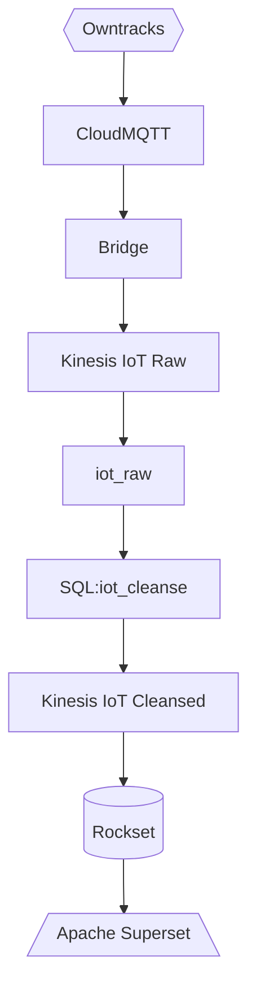

# IoT Data to Rockset

Below is the flow of IoT data from the device (cell phone) to the real-time dashboard (superset). We will be utilizing a cloud MQTT broker and AWS Kinesis to capture and stream data. Decodable will be responsible for preparing and aggregating the data prior to reaching the real-time analytical database (Rockset).



## Command Line Requirements

- python3
- decodable cli - https://docs.decodable.co/docs/setup
- optional mosquitto cli
```bash
brew install mosquitto
```
- optional AWS2 CLI -  https://docs.aws.amazon.com/cli/latest/userguide/getting-started-install.html

## Owntracks Phone App

https://owntracks.org/

## Cloud MQTT Broker
- cloudmqtt.com
- hivemq.com


## Getting started

Create an `.env` file and populate your values

```
MQTT_HOST=
MQTT_USER=
MQTT_PASSWORD=
MQTT_PORT=
TOPIC=owntracks/\#

ARN=
KINESIS_STREAM=
REGION=
```

Create the flow
```bash
make flow
```

