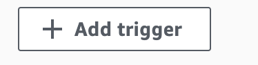
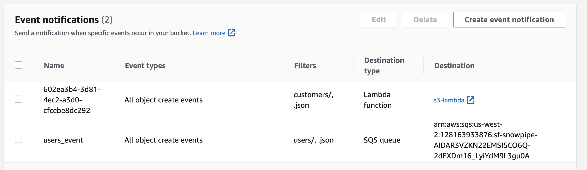

# S3 Events via Lambda to Decodable
This demo shows how to notify an AWS lambda function to send latest contents to Decodable. 

## Event JSON

```json
{
  "Records": [
    {
      "eventVersion": "2.0",
      "eventSource": "aws:s3",
      "awsRegion": "us-east-1",
      "eventTime": "1970-01-01T00:00:00.000Z",
      "eventName": "ObjectCreated:Put",
      "userIdentity": {
        "principalId": "EXAMPLE"
      },
      "requestParameters": {
        "sourceIPAddress": "127.0.0.1"
      },
      "responseElements": {
        "x-amz-request-id": "EXAMPLE123456789",
        "x-amz-id-2": "EXAMPLE123/5678abcdefghijklambdaisawesome/mnopqrstuvwxyzABCDEFGH"
      },
      "s3": {
        "s3SchemaVersion": "1.0",
        "configurationId": "testConfigRule",
        "bucket": {
          "name": "hubert-demos",
          "ownerIdentity": {
            "principalId": "EXAMPLE"
          },
          "arn": "arn:aws:s3:::hubert-demos"
        },
        "object": {
          "key": "customers/data.1665604325206.tcyegm4k.json",
          "size": 1024,
          "eTag": "0123456789abcdef0123456789abcdef",
          "sequencer": "0A1B2C3D4E5F678901"
        }
      }
    }
  ]
}
```

## Lambda Permissions
For S3 read
```json
{
    "Version": "2012-10-17",
    "Statement": [
        {
            "Sid": "VisualEditor0",
            "Effect": "Allow",
            "Action": "s3:GetObject",
            "Resource": "arn:aws:s3:::hubert-s3-lambda/events/*"
        }
    ]
}
```

For Kinesis write
```json
{
    "Version": "2012-10-17",
    "Statement": [
        {
            "Effect": "Allow",
            "Action": "kinesis:*",
            "Resource": "*"
        }
    ]
}
```

## Lambda

```python
import json
import urllib.parse
import boto3
import base64, io
import requests

print('Loading function')

s3 = boto3.client('s3')
kinesis = boto3.client('kinesis','us-west-2')


def lambda_handler(event, context):

    # Get the object from the event and show its content type
    for record in event['Records']:
        bucket = record['s3']['bucket']['name']
        key = urllib.parse.unquote_plus(record['s3']['object']['key'], encoding='utf-8')
        try:
            response = s3.get_object(Bucket=bucket, Key=key)
            body = response['Body'].read()
            for record in body.decode('utf-8').split('\n')[:-1]:
                kinesis.put_record(
                    StreamName='s3-kinesis',
                    Data=record,
                    PartitionKey="-1")
            
            return "success"
            
        except Exception as e:
            print(e)
            print('Error getting object {} from bucket {}. Make sure they exist and your bucket is in the same region as this function.'.format(key, bucket))
            raise e

```

## Create a notification

Add trigger on the lambda page


- Choose S3
- Enter your bucket name
- Choose all create events
- Set prefix to be your subdirectory
- Set suffix to be either .json or .parquet
- Accept the Recursive invocation acknowledgement

Go to your the root of your S3 bucket and click on properties. Under `Event Notifications` you will see your lambda function.

