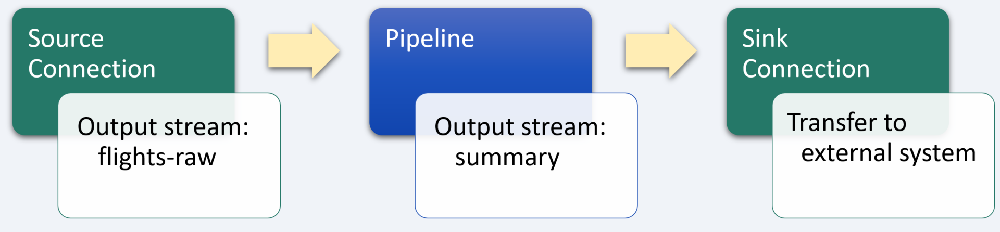
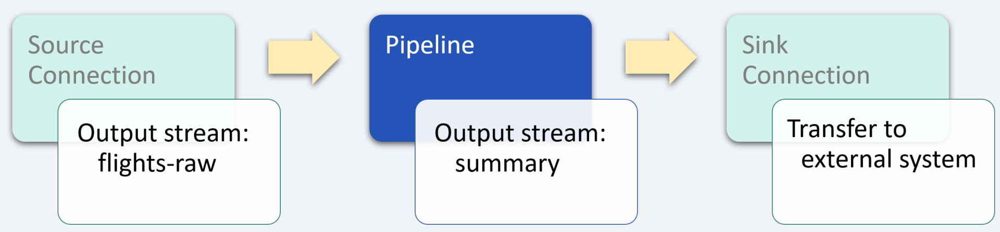

# Airline flight tracking

_industry alignment:_ Transportation
_keywords:_ `transportation` `extract` `transform` `enrich`

> Note: To follow along with the examples, you will need a Decodable account. To create your account, [sign up for free](https://app.decodable.co/-/accounts/create). All code in this guide can be found in this [GitHub repo](https://github.com/decodableco/examples).

In the transportation sector, it is imperative to know which assets are where, when they arrive or depart from points along their route, and whether or not they are proceeding on schedule. This is especially true for airlines, where customers expect accurate, real-time updates on flight status at every stage of their journey. Being able to extract key insights from complex data streams helps airlines keep their operations flowing smoothly and their passengers well-informed.

In this example, we'll walk through how the Decodable data service is used to clean, transform, and enrich real-time flight data. The processed data can then be used to update airline websites and status boards in airport terminals.

## Pipeline Architecture

Below we can see a sample of raw flight event data. In its current form, it is far more complex and detailed than what passengers want to know about their flights and what is needed to update a flight status board in an airport terminal. By using one or more Decodable [pipelines](https://docs.decodable.co/docs/pipelines), which are streaming SQL queries that process data, we can transform the raw data into a form that is best suited for how it will be consumed.

```json
{
  "flights": [
    {
      "flight_date": "2021-12-12",
      "flight_status": "active",
      "departure": {
        "airport": "San Francisco International",
        "timezone": "America/Los_Angeles",
        "iata": "SFO",
        "icao": "KSFO",
        "terminal": "2",
        "gate": "D11",
        "delay": 13,
        "scheduled": "2021-12-12T04:20:00+00:00",
        "estimated": "2021-12-12T04:20:00+00:00",
        "actual": "2021-12-12T04:20:13+00:00",
        "estimated_runway": "2021-12-12T04:20:13+00:00",
        "actual_runway": "2021-12-12T04:20:13+00:00"
      },
      "arrival": {
        "airport": "Dallas/Fort Worth International",
        "timezone": "America/Chicago",
        "iata": "DFW",
        "icao": "KDFW",
        "terminal": "A",
        "gate": "A22",
        "baggage": "A17",
        "delay": 0,
        "scheduled": "2021-12-12T04:20:00+00:00",
        "estimated": "2021-12-12T04:20:00+00:00",
        "actual": null,
        "estimated_runway": null,
        "actual_runway": null
      },
      "airline": {
        "name": "American Airlines",
        "iata": "AA",
        "icao": "AAL"
      },
      "flight": {
        "number": "1004",
        "iata": "AA1004",
        "icao": "AAL1004",
        "codeshared": null
      },
      "aircraft": {
        "registration": "N160AN",
        "iata": "A321",
        "icao": "A321",
        "icao24": "A0F1BB"
      },
      "live": {
        "updated": "2021-12-12T10:00:00+00:00",
        "latitude": 36.2856,
        "longitude": -106.807,
        "altitude": 8846.82,
        "direction": 114.34,
        "speed_horizontal": 894.348,
        "speed_vertical": 1.188,
        "is_ground": false
      }
    }
  ]
}
```

For this example, only a single pipeline is needed to process the raw incoming data into the desired form. But it is also possible to use multiple pipelines in a series of stages, with the output of each one being used as the input for the next. Depending on the complexity of the desired processing, it can be helpful to break it down into smaller, more manageable steps. This results in pipelines that are easier to test and maintain. Each stage in the sequence of pipelines is used to bring the data closer to its final desired form using SQL queries.



Decodable uses SQL to process data that should feel familiar to anyone who has used relational database systems. The primary differences you'll notice are that:

- You _activate_ a pipeline to start it, and _deactivate_ a pipeline to stop it
- All pipeline queries specify a source and a sink
- Certain operations, notably JOINs and aggregations, must include windows

Unlike relational databases, all pipelines write their results into an output data stream (or sink). As a result, all pipelines are a single statement in the form `INSERT INTO <sink> SELECT ... FROM <source>`, where sink and source are streams you've defined.

## Transform and enrich data stream



For this example, each record of the data stream contains a single `flights` field, which in turn contains an array of flight data that needs to be unnested (or demultiplexed) into multiple records. To accomplish this, a [cross join](https://www.sqltutorial.org/sql-cross-join/) is performed between the `flights-raw` data stream and the results of using the `unnest` function on the `flights` field.

For example, if a given input record contains an array of 5 flights, this pipeline will transform each input record into 5 separate output records for processing by subsequent pipelines.

When the pipeline is running, the effects of unnesting the input records can be seen in the Overview tab which shows real-time data flow statistics. The input metrics will show a given number of records per second, while the output metrics will show a higher number based on how many elements are in the `flights` array.

With each flight represented by its own record, additional transformations can be performed to clean the input data. For this example, the `flight.live.updated` field will be converted from a `string` to a `timestamp`, which enables more sophisticated processing, such as using SQL [group window functions](https://nightlies.apache.org/flink/flink-docs-release-1.16/docs/dev/table/sql/queries/window-tvf/).

The flight status can be further enriched by calculating `flight_status` a field based on the departure and arrival delay fields, and a `flight_stage` field based on whether the flight is on the ground and has yet to arrive at its destination.

#### Pipeline: Extract flight data

```sql
insert into summary
select
  to_timestamp(convert_tz(
    replace(left(`flight.live.updated`, 19), 'T', ' '),
    'UTC',
    `flight.arrival.timezone`)
  ) as update_timestamp,
  `flight.airline.name` as airline_name,
  `flight.airline.iata` as airline_iata,
  `flight.flight.number` as flight_number,
  `flight.departure.airport` as departuring_from,
  `flight.departure.iata` as departuring_iata,
  `flight.arrival.airport` as arriving_at,
  `flight.arrival.iata` as arriving_iata,
  `flight.arrival.gate` as arrival_gate,
  to_timestamp(convert_tz(
    replace(left(`flight.arrival.estimated`, 19), 'T', ' '),
    'UTC',
    `flight.arrival.timezone`)
  ) as arrival_time,
  case
    when `e.departure.delay` + `e.arrival.delay` > 15 then 'DELAYED'
    else 'ON TIME'
  end as flight_status,
  case
    when cast(`flight.live.is_ground` as int) = 0 then 'IN FLIGHT'
    when cast(`flight.live.is_ground` as int) = 1 and
         coalesce(`flight.arrival.actual`, '') = '' then 'DEPARTING'
    else 'ARRIVED'
  end as flight_stage
from `flights-raw`
cross join unnest(flights) as flight
```

After creating a new pipeline and entering the SQL query, clicking the `Run Preview` button will verify its syntax and then fire up a new executable environment to process the next 10 records coming in from the source stream and display the results. Decodable handles all the heavy lifting on the backend, allowing you to focus on working directly with your data streams to ensure that you are getting the results you need.

## Conclusion

At this point, a sink [connection](https://docs.decodable.co/docs/connections) (one that writes a stream to an external system, such as AWS S3, Kafka, Kinesis, Postgres, Pulsar, or Redpanda) can be created to allow the results to be consumed by your own applications and services.

```json
{
  "update_timestamp": "2019-12-11 22:21:00",
  "airline_name": "American Airlines",
  "airline_iata": "AA",
  "flight_number": "1004",
  "departuring_from": "San Francisco International",
  "departuring_iata": "SFO",
  "arriving_at": "Dallas/Fort Worth International",
  "arriving_iata": "DFW",
  "arrival_gate": "A22",
  "arrival_time": "2019-12-11 23:42:00",
  "flight_status": "ON TIME",
  "flight_stage": "IN FLIGHT"
}
```

As we can see from this example, a sophisticated business problem can be addressed in a very straight-forward way using Decodable pipelines. It is not necessary to create docker containers, there is no SQL server infrastructure to set up or maintain, all that is needed is a working familiarity with creating the SQL queries themselves.

You can watch a demonstration of this example on the [Decodable YouTube channel](https://www.youtube.com/channel/UChRQwfRNURBcurHSut2pm9Q).

[](http://www.youtube.com/watch?v=eojB1G1C2oU "ML Feature extraction using SQL pipeline transformations and the Moonsense SDK")

Additional documentation for all of Decodable's services is available [here](https://docs.decodable.co/docs).

Please consider joining us on our [community Slack](https://join.slack.com/t/decodablecommunity/shared_invite/zt-uvow71bk-Uf914umgpoyIbOQSxriJkA).
