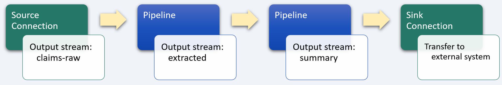
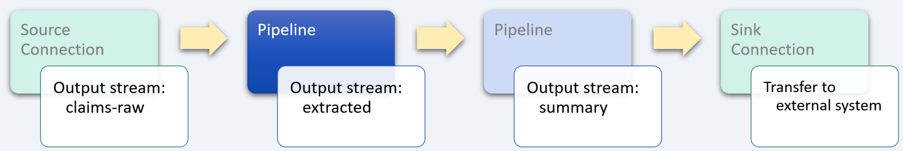
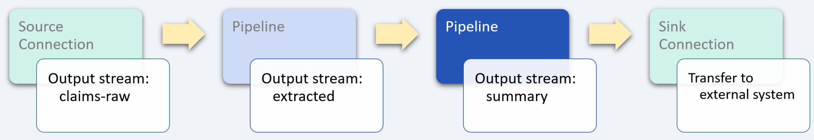

# Claim adjudication

_industry alignment:_ Financial, Insurance
_keywords:_ `finance` `insurance` `extract` `transform` `enrich` `tumble`

> Note: To follow along with the examples, you will need a Decodable account. To create your account, [sign up for free](https://app.decodable.co/-/accounts/create). All code in this guide can be found in this [GitHub repo](https://github.com/decodableco/examples).

Claims adjudication is the process used by insurance companies in determining their financial responsibility for the payment to the provider for a medical claim. The insurance company can decide to pay the claim in full, deny the claim, or to reduce the amount paid to the provider. The cost of performing claims administration and adjudication is approximately 5 percent of total revenues, the largest category of payer administrative expenses outside of general administration. These costs are driven mostly by the complexity of prevailing adjudication processes, which continue to rely on manual scanning for validation, and involve significant time delays in servicing patients.

A variety of errors or inconsistencies in claims data can indicate the need for review by a claims examiner, including mismatched coding, improper documentation, omission of required data, and noncompliance. In this example, we'll walk through how the Decodable data service can be used to identify patients who may have claims that require review due to the same exam or procedure being performed more than once on the same day at the same facility.

## Pipeline Architecture

Below we can see a sample of raw claims data where each record represents a given facility (hospital, clinic, etc.) for a given day, which could include hundreds of individual claims. In its current form, it is far too complex and detailed for claims examiners to use for identifying potential issues. By using one or more Decodable [pipelines](https://docs.decodable.co/docs/pipelines), which are streaming SQL queries that process data, we can transform the raw data into a form that is best suited for how it will be consumed.

```json
{
  "claim_date": "2020-07-31",
  "facility_id": "46cfa81e-5820-44cb-ab01-637f8a8a8e2e",
  "claims": [
    {
      "claim_id": "637eafba-f742-4661-bdfb-d8c6781d3b9d",
      "member_id": "18bb9373-7a5e-430e-890d-dfa86add931a",
      "currency": "USD",
      "sum_of_claims": 482.72,
      "sum_of_claims_finance": null,
      "type_of_visit": "Out-Patient",
      "member_plan": "TOP-UP",
      "procedure_code": "1C04",
      "date_of_consultation": "2020-07-31 10:40:00",
      "provider_id": "87423368-4e31-41dc-a30a-5ace06d33288",
      "approved_query_status": null,
      "finance_audit_status": "pending",
      "audit_status": "pending"
    },
    {
      "claim_id": "f9ac56aa-be32-4b54-9ec1-e1198f5b4f54",
      "member_id": "18bb9373-7a5e-430e-7c56-79704a2492ec",
      "currency": "USD",
      "sum_of_claims": 482.72,
      "sum_of_claims_finance": null,
      "type_of_visit": "Preventative",
      "member_plan": "PPO-FAMILY",
      "procedure_code": "3F71",
      "date_of_consultation": "2020-07-31 14:15:00",
      "provider_id": "87423368-4e31-41dc-a30a-5ace06d33288",
      "approved_query_status": null,
      "finance_audit_status": "pending",
      "audit_status": "pending"
    }
  ]
}
```

For this example, two separate pipelines are used in series, with the output of each one being used as the input for the next. While it is possible to perform all the desired processing in a single large, complex pipeline, it is most often desirable to split them into smaller, more manageable processing steps. This results in pipelines that are easier to test and maintain. Each stage in the sequence of pipelines is used to bring the data closer to its final desired form using SQL queries.


Decodable uses SQL to process data that should feel familiar to anyone who has used relational database systems. The primary differences you'll notice are that:

- You _activate_ a pipeline to start it, and _deactivate_ a pipeline to stop it
- All pipeline queries specify a source and a sink
- Certain operations, notably JOINs and aggregations, must include windows

Unlike relational databases, all pipelines write their results into an output data stream (or sink). As a result, all pipelines are a single statement in the form `INSERT INTO <sink> SELECT ... FROM <source>`, where sink and source are streams you've defined.

## Unnest data stream array



For this example, each record of the raw tracking stream contains data about the date of the patient's visit and the facility they visited, as well as a `claims` field, which contains an array of claims data that needs to be unnested (or demultiplexed) into multiple records. To accomplish this, a [cross join](https://www.sqltutorial.org/sql-cross-join/) is performed between the `claims-raw` data stream and the results of using the `unnest` function on the `claims` field.

For example, if a given input record contains an array of 100 insurance claims, this pipeline will transform each input record into 100 separate output records for processing by subsequent pipelines.

When the pipeline is running, the effects of unnesting the input records can be seen in the Overview tab which shows real-time data flow statistics. The input metrics will show a given number of records per second, while the output metrics will show a higher number based on how many elements are in the `claims` array.

#### Pipeline: Extract claims data

```sql
insert into extracted
select

  -- each element of the `claims` array creates a new record
  to_timestamp(claim.date_of_consultation) as date_of_consultation,
  claim.member_id as member_id,
  claim.procedure_code as procedure_code,

  -- non-array fields common to each record are also included in the output
  to_timestamp(concat(claim_date, ' 00:00:00')) as claim_date,
  facility_id

from `claims-raw`
cross join unnest(`claims`) as claim
```

After creating a new pipeline and entering the SQL query, clicking the `Run Preview` button will verify its syntax and then fire up a new executable environment to process the next 10 records coming in from the source stream and display the results. Decodable handles all the heavy lifting on the backend, allowing you to focus on working directly with your data streams to ensure that you are getting the results you need.

## Aggregate and filter claims data



In this final pipeline stage, an inner `select` query leverages the SQL `tumble` [group window function](https://nightlies.apache.org/flink/flink-docs-release-1.16/docs/dev/table/sql/queries/window-tvf/) to create a set of records across a non-overlapping, continuous window with a fixed duration of 1 day. Grouping these records by patient and procedure allows the total number of records for that grouping to be calculated. Then in the outer `select` query, the results of the inner query are filtered to include only those records which indicate a noncompliant duplication of services.

#### Pipeline: Aggregate and filter

```sql
insert into summary
select
  *
from (
  select
    window_start,
    window_end,
    claim_date,
    facility_id,
    member_id,
    procedure_code,
    count(1) as duplicate_claims -- # of claims per member per procedure
  from table (
    tumble(
      table extracted
      descriptor(claim_date),
      interval '1' day
    )
  )
  group by
    window_start,
    window_end,
    claim_date,
    facility_id,
    member_id,
    procedure_code
)
where duplicate_claims > 1
```

## Conclusion

At this point, a sink [connection](https://docs.decodable.co/docs/connections) (one that writes a stream to an external system, such as AWS S3, Kafka, Kinesis, Postgres, Pulsar, or Redpanda) can be created to allow the results to be consumed by your own applications and services.

```json
{
  "window_start": "2020-07-31 00:00:00",
  "window_end": "2020-07-31 23:59:59",
  "claim_date": "2020-07-31 00:00:00",
  "facility_id": "46cfa81e-5820-44cb-ab01-637f8a8a8e2e",
  "member_id": "18bb9373-7a5e-430e-890d-dfa86add931a",
  "procedure_code": "1C04",
  "duplicate_claims": 2
}
```

As we can see from this example, a sophisticated business problem can be addressed in a very straight-forward way using Decodable pipelines. It is not necessary to create docker containers, there is no SQL server infrastructure to set up or maintain, all that is needed is a working familiarity with creating the SQL queries themselves.

You can watch demonstrations of several examples on the [Decodable YouTube channel](https://www.youtube.com/channel/UChRQwfRNURBcurHSut2pm9Q).

Additional documentation for all of Decodable's services is available [here](https://docs.decodable.co/docs).

Please consider joining us on our [community Slack](https://join.slack.com/t/decodablecommunity/shared_invite/zt-uvow71bk-Uf914umgpoyIbOQSxriJkA).
