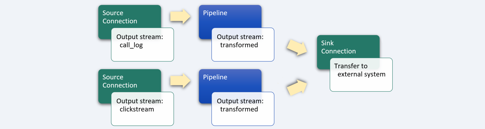
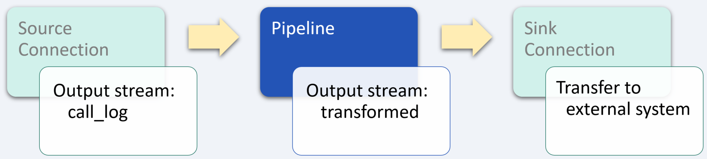
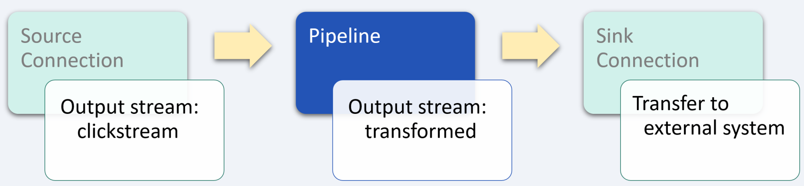

# Customer 360

_industry alignment:_ B2C
_keywords:_ `business` `extract` `transform` `aggregate`

> Note: To follow along with the examples, you will need a Decodable account. To create your account, [sign up for free](https://app.decodable.co/-/accounts/create). All code in this guide can be found in this [GitHub repo](https://github.com/decodableco/examples).

Customer 360 refers to getting a single view of customer engagement across the entire customer journey. It connects apps and data sources from customer interactions to give businesses a 360-degree customer view. It includes customer data from a variety of sources, including customer demographics, customer relationship management (CRM), social media, eCommerce, marketing, sales, customer service, mobile apps, and many other customer touchpoints.

Businesses can leverage insights gained from a comprehensive customer view to improve and deliver exceptional experiences, increase customer loyalty, create reliable customer profiles to improve marketing and sales initiatives, streamline and connect business processes and workflows to improve efficiency and functionality, and reduce time and cost caused by human error in the customer journey.

In this example, we'll walk through how the Decodable data service is used to clean, transform, and aggregate data from multiple data sources.

## Pipeline Architecture

Customer 360 data comes in many forms from many sources, including call logs, clickstream data, ecommerce activity, geolocation, NPS systems, and social media feeds. For this example, we will look at transforming two different data sources into a consistent schema which can then be sent to the same sink [connection](https://docs.decodable.co/docs/connections) to be used for analysis, regardless of the original source or form of the data.

Below we can see examples of raw call log and clickstream data. Each data source is in a unique data format and uses different field names for similar data. By using one or more Decodable [pipelines](https://docs.decodable.co/docs/pipelines), which are streaming SQL queries that process data, we can transform the raw data into a form that is best suited for how it will be consumed.

**Call Log Records**

```json
{
  "log_datatime": "2020-03-04 13:19:22",
  "xml": "<call_log><activity_id>701C</activity_id><call_id>367e5d7e-a3e6-4d27-a5c7-35706e9dca9d</call_id><user_id>4433a94b-12c5-4397-8837-3eedf11e78e6</user_id><start_time>2020-03-04 13:15:12</start_time><end_time>2020-03-04 13:19:22</end_time><call_time_seconds>207</call_time_seconds><from_phone_number>+37277774841</from_phone_number><to_phone_number>+37249234343</to_phone_number><outcome>answered</outcome><has_recording>false</has_recording></call_log>"
}
```

**Clickstream Log Records**

```json
{
  "event_timestamp": "2020-11-16 14:32:19",
  "user_id": "4433a94b-12c5-4397-8837-3eedf11e78e6",
  "site_id": "wj32-gao1-4w1o-iqp4",
  "pages_visited": 8,
  "total_seconds_on_site": 426,
  "avg_percent_viewed": 28.198543
}
```

For this example, a single pipeline is used to process each of the two raw incoming data streams into the desired form. Depending on the complexity of the processing required, it is also possible to use multiple pipelines in a series of stages, with the output of each one being used as the input for the next. In more complex cases, it can be helpful to break it down into smaller, more manageable steps. This results in pipelines that are easier to test and maintain. Each stage in the sequence of pipelines is used to bring the data closer to its final desired form using SQL queries.



Decodable uses SQL to process data that should feel familiar to anyone who has used relational database systems. The primary differences you'll notice are that:

- You _activate_ a pipeline to start it, and _deactivate_ a pipeline to stop it
- All pipeline queries specify a source and a sink
- Certain operations, notably JOINs and aggregations, must include windows

Unlike relational databases, all pipelines write their results into an output data stream (or sink). As a result, all pipelines are a single statement in the form `INSERT INTO <sink> SELECT ... FROM <source>`, where sink and source are streams you've defined.

### Transform call logs



As with most data services pipelines, the first step is to apply a variety of transformations to clean up and simplify the input data. For this example, an inner `select` is used to parse the XML object blob using the [xpaths](https://docs.decodable.co/docs/function-reference#xml-functions) function and extract the desired fields. Then the `start_time` field is converted from a `string` to a `timestamp` type and the `call_time_seconds` field in converted to an integer.

#### Pipeline: Standardize data stream

```sql
insert into transformed
select
  call_log.user_id as user_id,
  to_timestamp(call_log.start_time) as engagement_datetime,
  'sales call' as engagement_type,
  call_log.call_id as engagement_source_id,
  cast(call_log.call_time_seconds as int) as engagement_seconds
from (
  select
    -- parse XML to a DOM and extract fields using XPath expressions
    xpaths(xml,
      'user_id', '//call_log/user_id',
      'start_time', '//call_log/start_time',
      'call_id', '//call_log/call_id',
      'call_time_seconds', '//call_log/call_time_seconds'
    ) as call_log
  from `call_log`
)
```

After creating a new pipeline and entering the SQL query, clicking the `Run Preview` button will verify its syntax and then fire up a new executable environment to process the next 10 records coming in from the source stream and display the results. Decodable handles all the heavy lifting on the backend, allowing you to focus on working directly with your data streams to ensure that you are getting the results you need.

### Transform clickstream



For the website clickstream data, the required transformations for this example are fairly minimal. Primarily the field names are changed to match the desired schema for a standardized data stream, and the `event_timestamp` field is converted to a `timestamp`.

#### Pipeline: Standardize data stream

```sql
insert into transformed
select
  user_id,
  to_timestamp(event_timestamp) as engagement_datetime,
  'website' as engagement_type,
  site_id as engagement_source_id,
  total_seconds_on_site as engagement_seconds
from `clickstream`
```

## Conclusion

At this point, a sink [connection](https://docs.decodable.co/docs/connections) (one that writes a stream to an external system, such as AWS S3, Kafka, Kinesis, Postgres, Pulsar, or Redpanda) can be created to allow the results to be consumed by your own applications and services.

```json
{
  "user_id": "4433a94b-12c5-4397-8837-3eedf11e78e6",
  "engagement_datetime": "2020-11-16 22:59:59",
  "engagement_type": "website",
  "engagement_source_id": "wj32-gao1-4w1o-iqp4",
  "engagement_seconds": 426
}
```

As we can see from this example, a sophisticated business problem can be addressed in a very straight-forward way using Decodable pipelines. It is not necessary to create docker containers, there is no SQL server infrastructure to set up or maintain, all that is needed is a working familiarity with creating the SQL queries themselves.

You can watch demonstrations of several examples on the [Decodable YouTube channel](https://www.youtube.com/channel/UChRQwfRNURBcurHSut2pm9Q).

Additional documentation for all of Decodable's services is available [here](https://docs.decodable.co/docs).

Please consider joining us on our [community Slack](https://join.slack.com/t/decodablecommunity/shared_invite/zt-uvow71bk-Uf914umgpoyIbOQSxriJkA).
