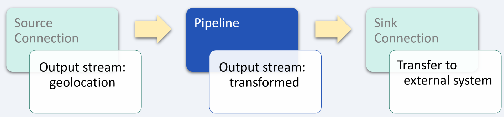

# Customer Data Platform

_industry alignment:_ Business
_keywords:_ `business` `CDP` `transform`

> Note: To follow along with the examples, you will need a Decodable account. To create your account, [sign up for free](https://app.decodable.co/-/accounts/create). All code in this guide can be found in this [GitHub repo](https://github.com/decodableco/examples).

With nearly 60% of the global population connected online, we are truly living in a data-driven economy. Even so, many businesses struggle to capture most of the data generated by websites, mobile apps, social media, and other digital channels every day. Customer Data Platform (CDP) embodies the process of collecting and using data from the users of your digital properties, including profile data and real-time interaction data (behavioral, demographics, transactional), data from marketing campaigns, customer support, point of sale, IoT, and many more. By creating a comprehensive view of potential customers, businesses can generate more insightful customer analytics, identify new audience segments, and optimize marketing campaigns.

In this example, we'll walk through how the Decodable data service is used to clean, transform, and aggregate data from multiple data sources.

## Pipeline Architecture

Data streams that feed Customer Data Platforms come in many forms from many sources, including call logs, clickstream data, ecommerce activity, geolocation, point-of-sale terminals, NPS systems, and social media feeds. For this example, we will look at transforming two different data sources into a consistent schema which can then be sent to the same sink [connection](https://docs.decodable.co/docs/connections) to be used for analysis, regardless of the original source or form of the data.

Below we can see examples of raw geolocation and point of sale data. Each data source is in a unique data format and uses different field names for similar data. By using one or more Decodable [pipelines](https://docs.decodable.co/docs/pipelines), which are streaming SQL queries that process data, we can transform the raw data into a form that is best suited for how it will be consumed.

**GeoLocation Records**

```json
{
  "timestamp": "2021-05-20 12:34:50.627Z",
  "device_id": "3fba0ca6-1fee-4dea-b208-a82255823a62",
  "advertising_id": "515d7bcb-2801-4ad9-8ebf-a226be0d55f7",
  "country": "Canada",
  "countryCode": "CA",
  "region": "QC",
  "regionName": "Quebec",
  "city": "Montreal",
  "zip": "H1K",
  "lat": 45.6085,
  "lon": -73.5493,
  "location_guid": "8463adad-b785-4aa9-bb61-233c03eef420",
  "timezone": "America/Toronto",
  "isp": "Le Groupe Videotron Ltee",
  "as": "AS5769 Videotron Telecom Ltee"
}
```

**Point of Sale Records**

```json
{
  "transaction_id": "ec12db9f-f3a3-46c0-a267-b4800b209adf",
  "terminal_id": "ba20148e-cf9a-4b36-b8a4-f0fdbf916639",
  "terminal_location": "8463adad-b785-4aa9-bb61-233c03eef420",
  "payer_id": "515d7bcb-2801-4ad9-8ebf-a226be0d55f7",
  "created_at": "2021-05-20T22:40:38.862Z",
  "updated_at": "2021-05-20T22:40:39.066Z",
  "transaction_amount": {
    "amount": 100,
    "currency": "USD"
  },
  "card_details": {
    "status": "CAPTURED",
    "card": {
      "card_brand": "BRAND",
      "last_4": "5858",
      "exp_month": 5,
      "exp_year": 2023,
      "fingerprint": "sq-1-Gg4tFVdtVF6tOSc8REcyHNW1aBKSZp3iQb3ZzdVG_JtpLftLvVkQhlXizopHIGbIgQ",
      "card_type": "DEBIT"
    }
  }
}
```

For this example, a single pipeline is used to process each of the two raw incoming data streams into the desired form. Depending on the complexity of the processing required, it is also possible to use multiple pipelines in a series of stages, with the output of each one being used as the input for the next. In more complex cases, it can be helpful to break it down into smaller, more manageable steps. This results in pipelines that are easier to test and maintain. Each stage in the sequence of pipelines is used to bring the data closer to its final desired form using SQL queries.


Decodable uses SQL to process data that should feel familiar to anyone who has used relational database systems. The primary differences you'll notice are that:

- You _activate_ a pipeline to start it, and _deactivate_ a pipeline to stop it
- All pipeline queries specify a source and a sink
- Certain operations, notably JOINs and aggregations, must include windows

Unlike relational databases, all pipelines write their results into an output data stream (or sink). As a result, all pipelines are a single statement in the form `INSERT INTO <sink> SELECT ... FROM <source>`, where sink and source are streams you've defined.

### Transform geolocation records



For this example, a combination of customer device locations and where they have made purchases will be used to inform marketing campaign activities. This first pipeline will transform the raw geolocation data stream into a standardized schema.

#### Pipeline: Standardize data stream

```sql
insert into transformed
select
  advertising_id as user_id,
  to_timestamp(`timestamp`) as engagement_datetime,
  'geolocation' as engagement_type,
  device_id as engagement_source_id,
  location_guid as location_id
from `geolocation`
```

After creating a new pipeline and entering the SQL query, clicking the `Run Preview` button will verify its syntax and then fire up a new executable environment to process the next 10 records coming in from the source stream and display the results. Decodable handles all the heavy lifting on the backend, allowing you to focus on working directly with your data streams to ensure that you are getting the results you need.

### Transform point-of-sales records


For the point of sales terminal data, the required transformations for this example are fairly minimal. Primarily the field names are changed to match the desired schema for a standardized data stream, and the `created_at` field is converted to a `timestamp`.

#### Pipeline: Standardize data stream

```sql
insert into transformed
select
  payer_id as user_id,
  to_timestamp(`created_at`, 'yyyy-MM-dd''T''HH:mm:ss.SSS''Z''') as engagement_datetime,
  'pos-terminal' as engagement_type,
  terminal_id as engagement_source_id,
  terminal_location as location_id
from `pos-terminal`
```

## Conclusion

At this point, a sink [connection](https://docs.decodable.co/docs/connections) (one that writes a stream to an external system, such as AWS S3, Kafka, Kinesis, Postgres, Pulsar, or Redpanda) can be created to allow the results to be consumed by your own applications and services.

```json
{
  "user_id": "4433a94b-12c5-4397-8837-3eedf11e78e6",
  "engagement_datetime": "2021-05-20 12:34:50",
  "engagement_type": "geolocation",
  "engagement_source_id": "3fba0ca6-1fee-4dea-b208-a82255823a62",
  "location_id": "8463adad-b785-4aa9-bb61-233c03eef420"
}
```

As we can see from this example, a sophisticated business problem can be addressed in a very straight-forward way using Decodable pipelines. It is not necessary to create docker containers, there is no SQL server infrastructure to set up or maintain, all that is needed is a working familiarity with creating the SQL queries themselves.

You can watch demonstrations of several examples on the [Decodable YouTube channel](https://www.youtube.com/channel/UChRQwfRNURBcurHSut2pm9Q).

Additional documentation for all of Decodable's services is available [here](https://docs.decodable.co/docs).

Please consider joining us on our [community Slack](https://join.slack.com/t/decodablecommunity/shared_invite/zt-uvow71bk-Uf914umgpoyIbOQSxriJkA).
