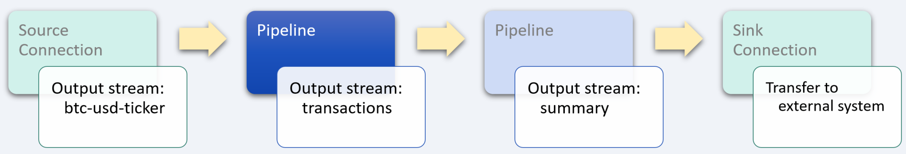

# Financial volatility analysis

_industry alignment:_ Financial Services
_keywords:_ `finance` `transform` `filter` `extract` `aggregate` `tumble`

> Note: To follow along with the examples, you will need a Decodable account. To create your account, [sign up for free](https://app.decodable.co/-/accounts/create). All code in this guide can be found in this [GitHub repo](https://github.com/decodableco/examples).

Financial analysis is used to evaluate economic trends, set financial policy, build long-term plans for business activity, and identify investments or prioritize projects. This is done through the synthesis of financial activity, which is often available as real-time data streams. One of the most common ways to analyze financial data is to calculate changes in the data over time, which can be used to compare against another set of data or against its own historical performance. Insights into market fluctuations can then be used to drive business decisions.

In this example, we'll walk through how the Decodable data service is used to clean, transform, enrich, and aggregate real-time currency data describing Coinbase transactions which are sent from the [DataPM](https://www.datapm.io/) data package manager. The processed data can then be sent onward to a team of financial analysts or data scientists.

## Pipeline Architecture

Below we can see a sample of the raw currency data from Coinbase. In its current form, it is purely transactional, without any information about how the market is behaving over time. By using one or more Decodable [pipelines](https://docs.decodable.co/docs/pipelines), which are streaming SQL queries that process data, we can transform the raw data into a form that is best suited for how it will be used.

```json
{
  "type": "ticker",
  "sequence": 27937593412,
  "product_id": "ETH-USD",
  "price ": 3031.1,
  "open_24h": 3289.45,
  "volume_24h": 205991.38400573,
  "low_24h": 2977.77,
  "high_24h": 3300.77,
  "volume_30d": 4819218.05843514,
  "best_bid": 3031.01,
  "best_ask": 3031.1,
  "side": "buy",
  "time": "2022-04-11T18:55:26.637Z",
  "trade_id": 254979310,
  "last_size": 0.02833571
}
```

For this example, two separate pipelines are used in series, with the output of each one being used as the input for the next. While it is possible to perform all the desired processing in a single large, complex pipeline, it is most often desirable to split them into smaller, more manageable processing steps. This results in pipelines that are easier to test and maintain. Each stage in the sequence of pipelines is used to bring the data closer to its final desired form using SQL queries.


Decodable uses SQL to process data that should feel familiar to anyone who has used relational database systems. The primary differences you'll notice are that:

- You _activate_ a pipeline to start it, and _deactivate_ a pipeline to stop it
- All pipeline queries specify a source and a sink
- Certain operations, notably JOINs and aggregations, must include windows

Unlike relational databases, all pipelines write their results into an output data stream (or sink). As a result, all pipelines are a single statement in the form `INSERT INTO <sink> SELECT ... FROM <source>`, where sink and source are streams you've defined.

## Transform input data stream



As with most data services pipelines, the first step is to apply a variety of transformations to clean the input data. For this example, the data will be modified as follows:

- the `time` field will be converted from a `string` to a `timestamp`, which will enable more sophisticated processing in subsequent pipelines

- the `type` field will be renamed so that it doesn't conflict with the SQL reserved keyword; this is done purely to simplify the SQL used in further processing

- several fields are `cast` from `floats` to `decimal` types in order to ensure the desired level of precision

#### Pipeline: Coinbase Exchange Transactions

```sql
insert into coinbase_exchange_transactions
select
  to_timestamp(`time`, 'yyyy-MM-dd''T''HH:mm:ss.SSSSSS''Z''') as tx_time,
  `type` as tx_type,
  cast(sequence as bigint) as sequence,
  product_id,
  cast(price as decimal(10, 2)) as price,
  cast(open_24h as decimal(10, 2)) as open_24h,
  cast(volume_24h as decimal(10, 2)) as volume_24h,
  cast(low_24h as decimal(10, 2)) as low_24h,
  cast(high_24h as decimal(10, 2)) as high_24h,
  cast(volume_30d as decimal(10, 2)) as volume_30d,
  cast(best_bid as decimal(10, 2)) as best_bid,
  cast(best_ask as decimal(10, 2)) as best_ask,
  side,
  cast(trade_id as bigint) as trade_id,
  cast(last_size as bigint) as last_size
from `coinbase-btc-usd-ticker`
```

After creating a new pipeline and copying in the SQL query, clicking the `Run Preview` button will verify its syntax and then fire up a new executable environment to process the next 10 records coming in from the source stream and display the results. Decodable handles all the heavy lifting on the backend, allowing you to focus on working directly with your data streams to ensure that you are getting the results you need.

## Filter and Aggregate


Decodable's pipelines are able to leverage powerful SQL [group window functions](https://nightlies.apache.org/flink/flink-docs-release-1.16/docs/dev/table/sql/queries/window-tvf/) such as `tumble`. In this example, an inner nested `select` query is used to collect and filter buy-side pricing updates for `BTC-USD` across a non-overlapping, continuous window with a fixed duration of 5 seconds. These records are aggregated and then enriched with data from the previous record using the `lag` [window function](https://www.sqltutorial.org/sql-window-functions/sql-lag/), which provides access to a record at a specified physical offset which comes before the current record (in this case that is simply the previous record). This allows the pipeline to produce a final result that summarizes how the data is changing over time that is well suited for analysis.

#### Pipeline: Coinbase Transaction Summary

```sql
insert into coinbase_transaction_summary
select
  *,
  price_min - price_min_prev as price_min_change,
  price_max - price_max_prev as price_max_change,
  price_avg - price_avg_prev as price_avg_change
from (
  select
    *,
    lag(price_min, 1) over (order by window_time) as price_min_prev,
    lag(price_max, 1) over (order by window_time) as price_max_prev,
    lag(price_avg, 1) over (order by window_time) as price_avg_prev
  from (
    select
      window_start,
      window_end,
      window_time,
      product_id,
      side,
      count(1) as volume, -- # records received during tumble interval
      min(price) as price_min,
      max(price) as price_max,
      avg(price) as price_avg
    from table (
      tumble(
        table coinbase_exchange_transactions,
        descriptor(tx_time),
        interval '5' second
      )
    )
    where
      product_id = 'BTC-USD' and
      side = 'buy'
    group by
      window_start,
      window_end,
      window_time,
      product_id,
      side
  )
)
```

## Conclusion

Clicking the `Run Preview` button will begin the 5-second tumble interval and then display the output data stream of this final step of the multi-stage pipeline for this example, as shown below. At this point, a sink [connection](https://docs.decodable.co/docs/connections) (one that writes a stream to an external system, such as AWS S3, Kafka, Kinesis, Postgres, Pulsar, or Redpanda) can be created to allow the results to be consumed by your own applications and services.

```json
{
  "window_start": "2022-04-07 18:25:10",
  "window_end": "2022-04-07 18:25:15",
  "window_time": "2022-04-07 18:25:14.999",
  "product_id": "BTC-USD",
  "side": "buy",
  "volume": 29,
  "price_min": 43716,
  "price_max": 43719.88,
  "price_avg": 43716.96,
  "price_min_prev": 43712.27,
  "price_max_prev": 43717.21,
  "price_avg_prev": 43714.497143,
  "price_min_change": 3.73,
  "price_max_change": 2.67,
  "price_avg_change": 2.462857
}
```

As we can see from this example, a sophisticated business problem can be addressed in a very straight-forward way using Decodable pipelines. It is not necessary to create docker containers, there is no SQL server infrastructure to set up or maintain, all that is needed is a working familiarity with creating the SQL queries themselves.

You can watch a demonstration of this example on the [Decodable YouTube channel](https://www.youtube.com/channel/UChRQwfRNURBcurHSut2pm9Q).

[](http://www.youtube.com/watch?v=eojB1G1C2oU "ML Feature extraction using SQL pipeline transformations and the Moonsense SDK")

Additional documentation for all of Decodable's services is available [here](https://docs.decodable.co/docs).

Please consider joining us on our [community Slack](https://join.slack.com/t/decodablecommunity/shared_invite/zt-uvow71bk-Uf914umgpoyIbOQSxriJkA).
