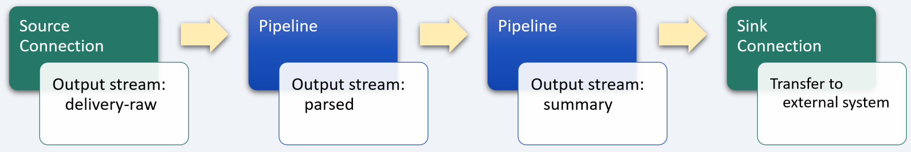
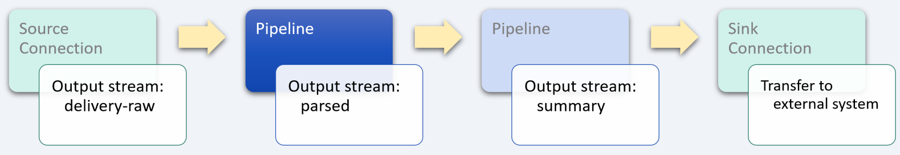
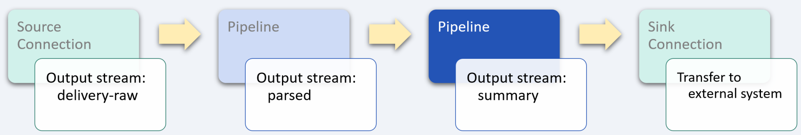

# Food delivery

_industry alignment:_ Logistics
_keywords:_ `hospitality` `delivery` `xml` `extract` `transform` `aggregate`

> Note: To follow along with the examples, you will need a Decodable account. To create your account, [sign up for free](https://app.decodable.co/-/accounts/create). All code in this guide can be found in this [GitHub repo](https://github.com/decodableco/examples).

How the world eats is changing dramatically. Twenty years ago, restaurant-quality meal delivery was largely limited to pizza. Today, food delivery has become a global market worth more than $150 billion, having more than tripled in the last 5 years. The advent of appealing, user-friendly apps and tech-enabled driver networks, coupled with changing consumer expectations, has unlocked ready-to-eat food delivery as a major category.

In this example, we'll walk through how the Decodable data service is used to clean, transform, and enrich real-time food delivery data. The processed data can then be used to send customers SMS text messages with progress status updates.

## Pipeline Architecture

Below we can see a sample of raw food delivery data. For this example, the source of the data is a legacy system that produces an XML object.

```json
{
  "updated_at": "2022-01-01 10:53:11",
  "xml": "<order id=\"629812004\" state=\"8\" state_human_readable=\"dispatched\" tracking_url=\"https://example-app.com/order/9f0Ljd9g3\"><branch id=\"382102714\"><location><latitude>37.869169</latitude><longitude>-122.206648</longitude></location></branch><customer id=\"782312311\"><location><latitude>37.874173</latitude><longitude>-122.220741</longitude></location></customer><driver id=\"429178231\"><location><latitude>37.8924376</latitude><longitude>-122.216880</longitude></location></driver><timestamps><ordered_at>2022-01-01 10:35:00</ordered_at><pending_at>2022-01-01 10:37:00</pending_at><vendor_accepted_at>2022-01-01 10:39:00</vendor_accepted_at><driver_accepted_at>2022-01-01 10:44:00</driver_accepted_at><dispatched_at>2022-01-01 10:49:00</dispatched_at><completed_at/><cancelled_at/></timestamps><estimations><earliest_completed_at>2022-01-01 10:59:00</earliest_completed_at><latest_completed_at>2022-01-01 11:05:00</latest_completed_at></estimations><message>&lt;span style=&quot;color: red;&quot;&gt;Sorry, your order is running a little late.&lt;/span&gt;</message><notification>Sorry, your order is running a little late.</notification></order>"
}
```

Even when the XML is examined in its structured form, it is far more complex and detailed than what customers want to know about their delivery and what is needed to update them with status messages. By using one or more Decodable [pipelines](https://docs.decodable.co/docs/pipelines), which are streaming SQL queries that process data, we can transform the raw data into a form that is best suited for how it will be consumed.

```xml
<order id="629812004" state="8" state_human_readable="dispatched" tracking_url="https://example-app.com/order/9f0Ljd9g3">
  <branch id="382102714">
    <location>
      <latitude>37.869169</latitude>
      <longitude>-122.206648</longitude>
    </location>
  </branch>
  <customer id="782312311">
    <location>
      <latitude>37.874173</latitude>
      <longitude>-122.220741</longitude>
    </location>
  </customer>
  <driver id="429178231">
    <location>
      <latitude>37.8924376</latitude>
      <longitude>-122.216880</longitude>
    </location>
  </driver>
  <timestamps>
    <ordered_at>2022-01-01 10:35:00</ordered_at>
    <pending_at>2022-01-01 10:37:00</pending_at>
    <vendor_accepted_at>2022-01-01 10:39:00</vendor_accepted_at>
    <driver_accepted_at>2022-01-01 10:44:00</driver_accepted_at>
    <dispatched_at>2022-01-01 10:49:00</dispatched_at>
    <completed_at/>
    <cancelled_at/>
  </timestamps>
  <estimations>
    <earliest_completed_at>2022-01-01 10:59:00</earliest_completed_at>
    <latest_completed_at>2022-01-01 11:05:00</latest_completed_at>
  </estimations>
  <message>&lt;span style=&quot;color: red;&quot;&gt;Sorry, your order is running a little late.&lt;/span&gt;</message>
  <notification>Sorry, your order is running a little late.</notification>
</order>
```

For this example, two separate pipelines are used in series, with the output of each one being used as the input for the next. While it is possible to perform all the desired processing in a single large, complex pipeline, it is most often desirable to split them into smaller, more manageable processing steps. This results in pipelines that are easier to test and maintain. Each stage in the sequence of pipelines is used to bring the data closer to its final desired form using SQL queries.



Decodable uses SQL to process data that should feel familiar to anyone who has used relational database systems. The primary differences you'll notice are that:

- You _activate_ a pipeline to start it, and _deactivate_ a pipeline to stop it
- All pipeline queries specify a source and a sink
- Certain operations, notably JOINs and aggregations, must include windows

Unlike relational databases, all pipelines write their results into an output data stream (or sink). As a result, all pipelines are a single statement in the form `INSERT INTO <sink> SELECT ... FROM <source>`, where sink and source are streams you've defined.

## Parse XML object



As with most data services pipelines, the first step is to apply a variety of transformations to clean up and simplify the input data. For this example, the first pipeline is used to parse and restructure the raw data as follows:

- parse the XML object blob using the [xpaths](https://docs.decodable.co/docs/function-reference#xml-functions) function and extract the desired fields

- numeric fields will be converted from `string` to integers or floats as needed

- the time-based fields will be converted from `string` to `timestamp` data types, which enables more sophisticated processing in subsequent pipelines

#### Pipeline: Extract delivery update data

```sql
insert into parsed
select
  cast(delivery_update.order_id as bigint) as order_id,
  cast(delivery_update.branch_id as bigint) as branch_id,
  cast(delivery_update.customer_id as bigint) as customer_id,
  delivery_update.state_human_readable as state_human_readable,
  delivery_update.notification as notification,
  to_timestamp(delivery_update.earliest) as earliest,
  to_timestamp(delivery_update.latest) as latest,
  to_timestamp(delivery_update.dispatched_at) as dispatched_at,
  to_timestamp(delivery_update.completed_at) as completed_at,
  cast(delivery_update.branch_lat as float) as branch_lat,
  cast(delivery_update.branch_lon as float) as branch_lon,
  cast(delivery_update.customer_lat as float) as customer_lat,
  cast(delivery_update.customer_lon as float) as customer_lon,
  cast(delivery_update.driver_lat as float) as driver_lat,
  cast(delivery_update.driver_lon as float) as driver_lon
from (
  select
    -- parse XML to a DOM and extract fields using XPath expressions
    xpaths(xml,
      'order_id', '//order/@id',
      'branch_id', '//order/branch/@id',
      'customer_id', '//order/customer/@id',
      'state_human_readable', '//order/@state_human_readable',
      'notification', '//order/notification',
      'earliest', '//order/estimations/earliest_completed_at',
      'latest', '//order/estimations/latest_completed_at',
      'dispatched_at', '//order/timestamps/dispatched_at',
      'completed_at', '//order/timestamps/completed_at',
      'branch_lat', '//order/branch/location/latitude',
      'branch_lon', '//order/branch/location/longitude',
      'customer_lat', '//order/customer/location/latitude',
      'customer_lon', '//order/customer/location/longitude',
      'driver_lat', '//order/driver/location/latitude',
      'driver_lon', '//order/driver/location/longitude'
    ) as delivery_update
  from `delivery-raw`
)
```

## Enrich data stream



For this example, we want to enrich the data stream with the delivery driver's progress in reaching the customer destination. SQL provides a comprehensive set of powerful [functions](https://docs.decodable.co/docs/function-reference), such as `power` and `sqrt`, which can be leveraged to perform calculations that are useful for subsequent processing. This somewhat complex SQL query example could be broken down into two smaller, simpler queries; but it is also possible to create pipelines of arbitrary complexity based on your requirements.

An inner nested `select` query calculates distances using the latitude and longitude of the origination point (i.e., the branch location), the driver location, and the customer location. By using the SQL `case` statement, we can avoid performing the expensive haversine distance formula based on whether the driver has left the branch location or arrived at the customer location. By taking care to reduce the computational complexity of the pipeline, stream processing throughput can be increased.

Once the distances have been calculated, the surrounding query calculates a progress percentage based on how far the driver is from the customer and the overall distance between the branch and the customer.

#### Pipeline: Calculate delivery progress

```sql
insert into status
select
  *,
  floor((branch_distance - driver_distance) / branch_distance * 100) as percent_complete
from (
  select
    order_id,
    branch_id,
    customer_id,
    state_human_readable,
    notification,
    earliest,
    latest,
    case
      when coalesce(dispatched_at, '') = '' then 1
      when coalesce(completed_at, '') <> '' then 1
      else 12742 * asin(sqrt(
             power(sin((branch_lat - customer_lat) * 0.008725), 2) +
               cos(customer_lat * 0.01745) *
               cos(branch_lat * 0.01745) *
               power(sin((branch_lon - customer_ lon) * 0.008725), 2)
           ))
    end as branch_distance,
    case
      when coalesce(timestamps.dispatched_at, '') = '' then 1
      when coalesce(timestamps.completed_at, '') <> '' then 0
      else 12742 * asin(sqrt(
             power(sin((driver_lat - customer_lat) * 0.008725), 2) +
               cos(customer_lat * 0.01745) *
               cos(driver_lat * 0.01745) *
               power(sin((driver_lon - customer_lon) * 0.008725), 2)
           ))
    end as driver_distance
  from parsed
)
```

After creating a new pipeline and entering the SQL query, clicking the `Run Preview` button will verify its syntax and then fire up a new executable environment to process the next 10 records coming in from the source stream and display the results. Decodable handles all the heavy lifting on the backend, allowing you to focus on working directly with your data streams to ensure that you are getting the results you need.

## Conclusion

At this point, a sink [connection](https://docs.decodable.co/docs/connections) (one that writes a stream to an external system, such as AWS S3, Kafka, Kinesis, Postgres, Pulsar, or Redpanda) can be created to allow the results to be consumed by your own applications and services.

```json
{
  "order_id": 629812004,
  "branch_id": 382102714,
  "customer_id": 782312311,
  "state_human_readable": "dispatched",
  "notification": "Sorry, your order is running a little late.",
  "earliest": "2022-01-01 10:59:00",
  "latest": "2022-01-01 11:05:00",
  "branch_distance": 11,
  "driver_distance": 8,
  "percent_complete": 27
}
```

As we can see from this example, a sophisticated business problem can be addressed in a very straight-forward way using Decodable pipelines. It is not necessary to create docker containers, there is no SQL server infrastructure to set up or maintain, all that is needed is a working familiarity with creating the SQL queries themselves.

You can watch demonstrations of several examples on the [Decodable YouTube channel](https://www.youtube.com/channel/UChRQwfRNURBcurHSut2pm9Q).

Additional documentation for all of Decodable's services is available [here](https://docs.decodable.co/docs).

Please consider joining us on our [community Slack](https://join.slack.com/t/decodablecommunity/shared_invite/zt-uvow71bk-Uf914umgpoyIbOQSxriJkA).
