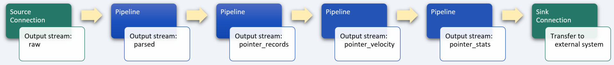
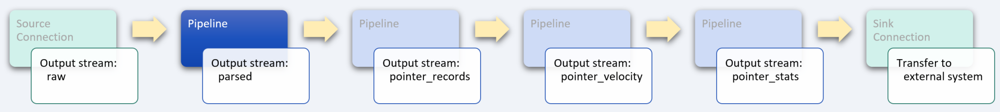
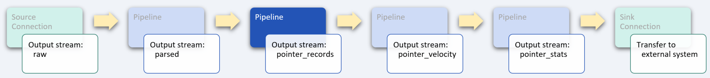
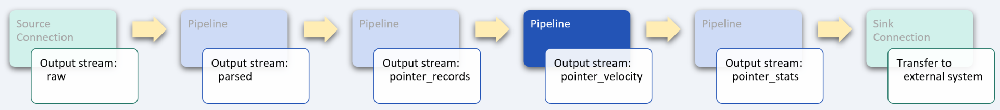
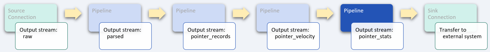

# Feature extraction for training machine learning models

_industry alignment:_ Fraud Detection / Regulatory Compliance
_keywords:_ `detection` `ML/AI` `transform` `filter` `aggregate` `tumble`

> Note: To follow along with the examples, you will need a Decodable account. To create your account, [sign up for free](https://app.decodable.co/-/accounts/create). All code in this guide can be found in this [GitHub repo](https://github.com/decodableco/examples).

Securing online applications and services is a major requirement for businesses of all types, and threat actors are constantly increasing the sophistication of their attacks. One example of this is mobile device emulators being used to spoof devices and mimic user behavior in an attempt to take over legitimate user accounts. With telemetry data such as accelerator and gyroscope signals, it is possible to train machine learning models to identify fraudulent activity and detect automated bots.

In this example, we'll walk through how the Decodable data service is used to clean, transform, enrich, and aggregate real-time telemetry data describing a device's accelerometer and touch screen interactions which is being sent from the [Moonsense](https://www.moonsense.io/) SDK. The processed data can then be sent onward to a fraud detection model for training or evaluation.

## Pipeline Architecture

Below we can see a sample of the raw telemetry data from a typical user's device. In its current form, it is not suitable for use by a machine learning model. By using one or more Decodable [pipelines](https://docs.decodable.co/docs/pipelines), which are streaming SQL queries that process data, we can transform the raw data into a form that is best suited for how it will be used.

```json
{
  "bundle": {
    "client_time": {
      "wall_time_millis": "1640122674127",
      "timer_millis": "137168",
      "timer_realtime_millis": "137168"
    },
    "pointer_data": [
      {
        "determined_at": "136893",
        "type": "TOUCH",
        "buttons": "1",
        "delta": {},
        "pos": {
          "dx": 27,
          "dy": 208
        },
        "pressure_range": {
          "upper_bound": 1
        },
        "radius_major": 40.472574869791664,
        "radius_minor": 40.472574869791664,
        "size": 14742.263849318027
      }
    ],
    "index": 1,
    "text_change_data": [
      {
        "determined_at": "136989",
        "target": {
          "target_id": "de8dfdd2-9121-401e-90a5-c9c2b8c2f9e4",
          "target_type": "range"
        },
        "masked_text": "d?"
      }
    ]
  },
  "app_id": "Wyk48mvsheCX4rg5d954tj",
  "credential_id": "a7RZotQQqYn7wbpei2hAhV",
  "session_id": "SjBbhxS88pngxDgzRYssma",
  "server_time_millis": "1640122674226208"
}
```

For this example, four separate pipelines are used in series, with the output of each one being used as the input for the next. While it is possible to perform all the desired processing in a single large, complex pipeline, it is most often desirable to split them into smaller, more manageable processing steps. This results in pipelines that are easier to test and maintain. Each stage in the sequence of pipelines is used to bring the data closer to its final desired form using SQL queries.



Decodable uses SQL to process data that should feel familiar to anyone who has used relational database systems. The primary differences you'll notice are that:

- You _activate_ a pipeline to start it, and _deactivate_ a pipeline to stop it
- All pipeline queries specify a source and a sink
- Certain operations, notably JOINs and aggregations, must include windows

Unlike relational databases, all pipelines write their results into an output data stream (or sink). As a result, all pipelines are a single statement in the form `INSERT INTO <sink> SELECT ... FROM <source>`, where sink and source are streams you've defined.

## Clean the input data stream



As with most data services pipelines, the first step is to apply a variety of transformations to clean up and simplify the input data. For this example, the first pipeline is used to parse and restructure the raw data as follows:

- the time fields will be converted from strings of integers representing epoch milliseconds to `timestamp` fields, which will enable more sophisticated processing in subsequent pipelines

- several fields that are nested inside the complex JSON source object will be elevated to simple top-level fields, which can then be more easily accessed in subsequent pipelines

- only the fields required by subsequent pipelines will be included in the output stream, filtering out extraneous fields and simplifying the data to be processed

#### Pipeline: Parse Moonsense Data

```sql
insert into moonsense_parsed
select
  app_id,
  session_id,
  user_id,
  to_timestamp_ltz(cast(left(server_time_millis, 13) as bigint), 3) as server_time,
  to_timestamp_ltz(cast(client_time.wall_time_millis as bigint), 3) as wall_time,
  cast(client_time.timer_millis as bigint) as timer_millis,
  cast(client_time.timer_realtime_millis as bigint) as timer_realtime_millis,
  bundle.location_data as location_data,
  bundle.accelerometer_data as accelerometer_data,
  bundle.magnetometer_data as magnetometer_data,
  bundle.gyroscope_data as gyroscope_data,
  bundle.battery as battery,
  bundle.activity_data as activity_data,
  bundle.orientation_data as orientation_data,
  bundle.pointer_data as pointer_data
from moonsense_raw
```

After creating a new pipeline and copying in the SQL query, clicking the `Run Preview` button will verify its syntax and then fire up a new executable environment to process the next 10 records coming in from the source stream and display the results. Decodable handles all the heavy lifting on the backend, allowing you to focus on working directly with your data streams to ensure that you are getting the results you need.

## Unnest data stream array



To help detect non-human bot activity, the raw pointer data from the parsed telemetry data stream can be analyzed. In order to facilitate that, the `pointer_data` field, which contains an array of pointer positions, needs to be unnested (or demultiplexed) into multiple records. To accomplish this, a [cross join](https://www.sqltutorial.org/sql-cross-join/) is performed between the `moonsense_parsed` data stream and the results of using the `unnest` function on the `pointer_data` field.

For example, if a given input record contains an array of 5 pointer positions, this pipeline will transform each input record into 5 separate output records for processing by subsequent pipelines.

When the pipeline is running, the effects of unnesting the input records can be seen in the Overview tab which shows real-time data flow statistics. The input metrics will show a given number of records per second, while the output metrics will show a higher number based on how many elements are in the `pointer_data` array.

#### Pipeline: Extract Pointer Records

```sql
insert into moonsense_pointer_records
select

  -- each element of the `pointer_data` array creates a new record
  cast(pointer.determined_at as bigint) as determined_at,
  pointer.pos.dx as dx,
  pointer.pos.dy as dy,
  pointer.radius_major as radius,
  pointer.size as size,

  -- non-array fields common to each record are also included in the output
  app_id,
  session_id,
  user_id,
  server_time,
  wall_time,
  timer_millis,
  timer_realtime_millis

from moonsense_parsed
cross join unnest(pointer_data) as pointer
```

## Enrich data stream



In the next stage of pipeline processing, we want to determine how quickly the pointer's position is changing. Because SQL provides a comprehensive set of powerful [functions](https://docs.decodable.co/docs/function-reference), such as `power` and `sqrt`, we can leverage these to enrich the data stream with the results of calculations that are more useful for subsequent processing.

This somewhat complex SQL query could be broken down into multiple smaller, simpler queries; but it is also possible to create pipelines of arbitrary complexity based on your requirements.

An inner nested `select` query is used to combine the change in pointer position data from the previous record with the current record using the `lag` [window function](https://www.sqltutorial.org/sql-window-functions/sql-lag/), which provides access to a record at a specified physical offset which comes before the current record (in this case that is simply the previous record). A surrounding `select` query calculates the change in time and position between two consecutive pointer position records. Finally, the outermost `select` query calculates the pointer velocity and outputs that into a new data stream for processing by the next pipeline.

#### Pipeline: Calculate Pointer Velocity

```sql
insert into moonsense_pointer_velocity
select
  session_id,
  server_time,
  determined_at,
  dx,
  dy,
  size,
  t_delta,
  d_delta,
  case
    when t_delta is null then 0
    when t_delta = 0 then 0
    else d_delta / t_delta
  end as velocity
from (
  select
    *,
    abs(determined_at - determined_at_prev) as t_delta,
    sqrt(power(dx - dx_prev, 2) + power(dy - dy_prev, 2)) as d_delta
  from (
    select
      *,
      lag(dx, 1) over (
        partition by session_id
        order by server_time
      ) as dx_prev,
      lag(dy, 1) over (
        partition by session_id
        order by server_time
      ) as dy_prev,
      lag(determined_at, 1) over (
        partition by session_id
        order by server_time
      ) as determined_at_prev
    from moonsense_pointer_records
  )
)
```

## Aggregate data stream



In this final pipeline stage, the data is aggregated into summary statistics that can then be fed into a detection model for training or evaluation. By leveraging the SQL `tumble` [group window function](https://nightlies.apache.org/flink/flink-docs-release-1.16/docs/dev/table/sql/queries/window-tvf/), a data distribution matrix is created across a non-overlapping, continuous window with a fixed duration of 10 seconds. For each set of records, the number of pointer updates and totals for the interval are calculated.

For this example, we have focused only on the pointer position, but the original data stream contains a wealth of additional information, all of which can be processed in a similar manner.

#### Pipeline: Calculate Pointer Statistics

```sql
insert into moonsense_pointer_stats
select
  window_start,
  window_end,
  session_id,
  count(1) as record_count, -- # records received during tumble interval

  -- calculate a distribution matrix for the pointer velocities
  min(inst_velocity) as velocity_p0,
  approx_percentile(inst_velocity, 0.25) as velocity_p25,
  approx_percentile(inst_velocity, 0.5) as velocity_p50 ,
  approx_percentile(inst_velocity, 0.75) as velocity_p75,
  max(inst_velocity) as velocity_p100,

  avg(inst_velocity) as velocity_mean,
  sum(d_delta) as total_distance,
  sum(t_delta) as total_duration,
  sum(d_delta)/sum(t_delta) as total_velocity
from table (
    tumble(
      table moonsense_pointer_velocity,
      descriptor(server_time),
      interval '10' seconds
    )
  )
group by
  window_start,
  window_end,
  session_id
```

## Conclusion

Clicking the `Run Preview` button will begin the 10-second tumble interval and then display the output data stream of this final step of the multi-stage pipeline for this example, as shown below. At this point, a sink [connection](https://docs.decodable.co/docs/connections) (one that writes a stream to an external system, such as AWS S3, Kafka, Kinesis, Postgres, Pulsar, or Redpanda) can be created to allow the results to be consumed by your own applications and services.

```json
{
  "server_time": "2022-03-31 18:27:40",
  "session_id": "5kj23DQ31ds2SJF23r",
  "record_count": 108,
  "velocity_p0": 0.0623409298,
  "velocity_p25": 0.2609802933,
  "velocity_p50": 0.3587928732,
  "velocity_p75": 0.4160982341,
  "velocity_p100": 0.4620938423,
  "velocity_mean": 0.3220938409,
  "total_distance": 1268.2983742386,
  "total_duration": 4934,
  "total_velocity": 0.2572387498
}
```

As we can see from this example, a sophisticated business problem can be addressed in a very straight-forward way using Decodable pipelines. It is not necessary to create docker containers, there is no SQL server infrastructure to set up or maintain, all that is needed is a working familiarity with creating the SQL queries themselves.

You can watch a demonstration of this example on the [Decodable YouTube channel](https://www.youtube.com/channel/UChRQwfRNURBcurHSut2pm9Q).

[](http://www.youtube.com/watch?v=9_weUdT2zs0 "ML Feature extraction using SQL pipeline transformations and the Moonsense SDK")

Additional documentation for all of Decodable's services is available [here](https://docs.decodable.co/docs).

Please consider joining us on our [community Slack](https://join.slack.com/t/decodablecommunity/shared_invite/zt-uvow71bk-Uf914umgpoyIbOQSxriJkA).
