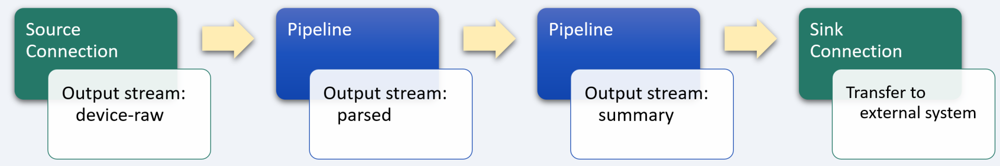
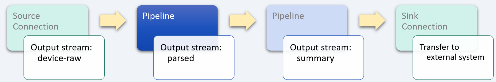
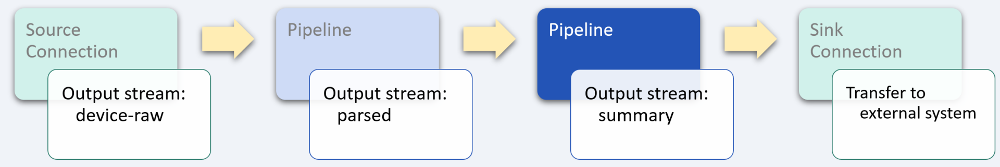

# Healthcare monitoring

_industry alignment:_ Healthcare
_keywords:_ `healthcare` `monitoring` `extract` `transform` `enrich` `aggregate`

> Note: To follow along with the examples, you will need a Decodable account. To create your account, [sign up for free](https://app.decodable.co/-/accounts/create). All code in this guide can be found in this [GitHub repo](https://github.com/decodableco/examples).

Centuries ago, people died primarily due to wars, disease, and low levels of living standards and medical care. Today, chronic diseases are the main threat to longevity, and the reality of modern medicine is that there are many more patients than doctors who are able to help them. Health monitoring systems provide multiple options to change the traditional management of patients, reduce the cost of health care, and help hospitals improve their treatment processes. The global patient monitoring devices market is expected to reach over $73 billion by 2028, with significant growth attributed in part to technological advancement in patient monitoring devices.

In this example, we'll walk through how the Decodable data service is used to transform, enrich, and aggregate real-time healthcare monitoring data. The processed data can then be used to inform healthcare staff of any changes in patient condition, alert them to issues with the monitoring devices, and enable proactive responses.

## Pipeline Architecture

Below we can see a sample of raw device monitoring event data. In its current form, measurement data is nested inside an array, making it difficult to monitor the change in their values over time. By using one or more Decodable [pipelines](https://docs.decodable.co/docs/pipelines), which are streaming SQL queries that process data, we can transform the raw data into a form that is best suited for how it will be consumed.

```json
{
  "patient_id": "e148046d-e020-4303-937c-397439cfb832",
  "device_id": "7cc1ca2a-87b8-467a-b2ce-4052974e043f",
  "measurement_type": "blood pressure",
  "measured_at": "2021-02-23t22:06:00.000z",
  "values": [
    {
      "value": 84,
      "type": "diastolic"
    },
    {
      "value": 129,
      "type": "systolic"
    },
    {
      "value": 62,
      "type": "pulse"
    },
    {
      "value": 0,
      "type": "irregular"
    }
  ],
  "signal_strength_percentage": 94,
  "battery_percentage": 58,
  "device_type": "pylobp",
  "device_model": "py-802-lte"
}
```

For this example, two separate pipelines are used in series, with the output of each one being used as the input for the next. While it is possible to perform all the desired processing in a single large, complex pipeline, it is most often desirable to split them into smaller, more manageable processing steps. This results in pipelines that are easier to test and maintain. Each stage in the sequence of pipelines is used to bring the data closer to its final desired form using SQL queries.



Decodable uses SQL to process data that should feel familiar to anyone who has used relational database systems. The primary differences you'll notice are that:

- You _activate_ a pipeline to start it, and _deactivate_ a pipeline to stop it
- All pipeline queries specify a source and a sink
- Certain operations, notably JOINs and aggregations, must include windows

Unlike relational databases, all pipelines write their results into an output data stream (or sink). As a result, all pipelines are a single statement in the form `INSERT INTO <sink> SELECT ... FROM <source>`, where sink and source are streams you've defined.

## Unnest data stream array



For this example, each record of the raw monitoring stream contains data about the patient and device, as well as a `values` field, which contains an array of measurements that needs to be unnested (or demultiplexed) into multiple records to make it easier to access. To accomplish this, a [cross join](https://www.sqltutorial.org/sql-cross-join/) is performed between the `device-raw` data stream and the results of using the `unnest` function on the `values` field.

For example, if a given input record contains an array of 4 measurement values, this pipeline will transform each input record into 4 separate output records for processing by subsequent pipelines.

When the pipeline is running, the effects of unnesting the input records can be seen in the Overview tab which shows real-time data flow statistics. The input metrics will show a given number of records per second, while the output metrics will show a higher number based on how many elements are in the `events` array.

#### Pipeline: Extract and transform monitoring data

```sql
insert into parsed
select

  -- each element of the `values` array creates a new record
  -- assign each value type to its own field
  case
    when v.type = 'diastolic' then v.value
    else -1
  end as diastolic,
  case
    when v.type = 'systolic' then v.value
    else -1
  end as systolic,
  case
    when v.type = 'pulse' then v.value
    else -1
  end as pulse,
  case
    when v.type = 'irregular' then v.value
    else -1
  end as irregular,

  -- non-array fields common to each record are also included in the output
  patient_id,
  device_id,
  measurement_type,
  to_timestamp(measured_at, 'yyyy-MM-dd''T''HH:mm:ss.sss''Z''' ) as measured_at,
  case
    when signal_strength_percentage < 90 then 'CHECK SIGNAL'
    else 'GOOD SIGNAL'
  end as signal_status,
  case
    when battery_percentage > 80 then 'BATTERY GOOD'
    when battery_percentage > 50 then 'BATTERY OKAY'
    else 'BATTERY LOW'
  end as battery_status
from `device-raw`
cross join unnest(`values`) as v
```

After creating a new pipeline and entering the SQL query, clicking the `Run Preview` button will verify its syntax and then fire up a new executable environment to process the next 10 records coming in from the source stream and display the results. Decodable handles all the heavy lifting on the backend, allowing you to focus on working directly with your data streams to ensure that you are getting the results you need.

## Aggregate data stream



In the next stage of pipeline processing, we want to consolidate the device measurement values back into a single record with the value of each measurement in its own field. This is easily accomplished using standard SQL [functions](https://docs.decodable.co/docs/function-reference) and a `group by` clause.

#### Pipeline: Consolidate device measurements

```sql
insert into summary
select
  patient_id,
  device_id,
  measurement_type,
  measured_at,
  max(diastolic) as diastolic,
  max(systolic) as systolic,
  max(pulse) as pulse,
  max(irregular) as irregular,
  signal_status,
  battery_status
from parsed
group by
  patient_id,
  device_id,
  measurement_type,
  measured_at,
  signal_status,
  battery_status
```

## Conclusion

At this point, a sink [connection](https://docs.decodable.co/docs/connections) (one that writes a stream to an external system, such as AWS S3, Kafka, Kinesis, Postgres, Pulsar, or Redpanda) can be created to allow the results to be consumed by your own applications and services.

```json
{
  "patient_id": "e148046d-e020-4303-937c-397439cfb832",
  "device_id": "7cc1ca2a-87b8-467a-b2ce-4052974e043f",
  "measurement_type": "blood pressure",
  "measured_at": "2021-02-23 22:06:00",
  "diastolic": 84,
  "systolic": 129,
  "pulse": 62,
  "irregular": 0,
  "signal_status": "GOOD SIGNAL",
  "battery_status": "BATTERY OKAY"
}
```

As we can see from this example, a sophisticated business problem can be addressed in a very straight-forward way using Decodable pipelines. It is not necessary to create docker containers, there is no SQL server infrastructure to set up or maintain, all that is needed is a working familiarity with creating the SQL queries themselves.

You can watch demonstrations of several examples on the [Decodable YouTube channel](https://www.youtube.com/channel/UChRQwfRNURBcurHSut2pm9Q).

Additional documentation for all of Decodable's services is available [here](https://docs.decodable.co/docs).

Please consider joining us on our [community Slack](https://join.slack.com/t/decodablecommunity/shared_invite/zt-uvow71bk-Uf914umgpoyIbOQSxriJkA).
