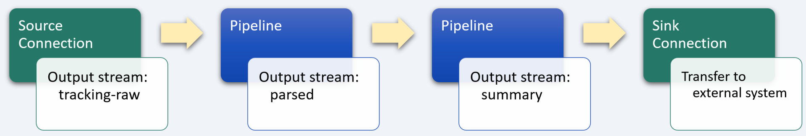
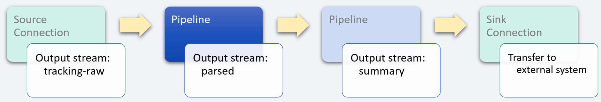
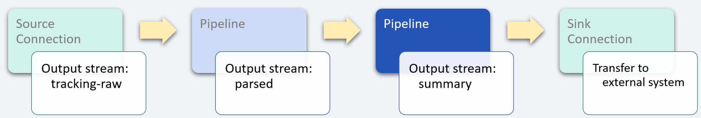

# Shipping logistics tracking

_industry alignment:_ Transportation
_keywords:_ `transportation` `tracking` `extract` `transform` `enrich`

> Note: To follow along with the examples, you will need a Decodable account. To create your account, [sign up for free](https://app.decodable.co/-/accounts/create). All code in this guide can be found in this [GitHub repo](https://github.com/decodableco/examples).

Shipping's ability to offer efficient and economical long-distance transport puts it at the center of the world economy. The ability to see, in real-time, logistics and tracking information helps facilitate better transportation decisions leading to reduced costs and enhanced services, which plays a key role in improving the customer experience as well as increasing profitability. Being able to offer order tracking provides customers with peace of mind, can win over hesitant buyers, and can even build customer loyalty.

In this example, we'll walk through how the Decodable data service is used to clean, transform, and enrich real-time shipping data. The processed data can then be used to update package tracking websites and mobile apps for customers, or to feed into operational models for transport companies.

## Pipeline Architecture

Below we can see a sample of raw shipping event data. In its current form, it is more complex and detailed than what customers want to know about their shipments and what is needed to update a mobile app or website. By using one or more Decodable [pipelines](https://docs.decodable.co/docs/pipelines), which are streaming SQL queries that process data, we can transform the raw data into a form that is best suited for how it will be consumed.

```json
{
  "tracking_number": "9405511899223197428490",
  "tracking_url": "https://tools.usps.com/go/TrackConfirmAction.action?tLabels=9405511899223197428490",
  "status_code": "DE",
  "carrier_code": "usps",
  "carrier_id": 1,
  "carrier_detail_code": null,
  "status_description": "Delivered",
  "carrier_status_code": "01",
  "carrier_status_description": "Your item was delivered in or at the mailbox at 2:03 pm on September 20, 2021 in SAN FRANCISCO, CA 94118.",
  "ship_date": null,
  "estimated_delivery_date": null,
  "actual_delivery_date": null,
  "exception_description": null,
  "events": [
    {
      "occurred_at": "2021-09-20T19:03:00Z",
      "carrier_occurred_at": "2021-09-20T14:03:00",
      "description": "Delivered, In/At Mailbox",
      "city_locality": "SAN FRANCISCO",
      "state_province": "CA",
      "postal_code": "94118",
      "country_code": "",
      "company_name": "",
      "signer": "",
      "event_code": "01",
      "carrier_detail_code": null,
      "status_code": null,
      "status_description": null,
      "carrier_status_code": "01",
      "carrier_status_description": "Delivered, In/At Mailbox",
      "latitude": 37.774,
      "longitude": -122.475
    },
    {
      "occurred_at": "2021-09-20T13:10:00Z",
      "carrier_occurred_at": "2021-09-20T08:10:00",
      "description": "Out for Delivery",
      "city_locality": "SAN FRANCISCO",
      "state_province": "CA",
      "postal_code": "94118",
      "country_code": "",
      "company_name": "",
      "signer": "",
      "event_code": "OF",
      "carrier_detail_code": null,
      "status_code": null,
      "status_description": null,
      "carrier_status_code": "OF",
      "carrier_status_description": "Out for Delivery",
      "latitude": 37.671,
      "longitude": -122.328
    }
  ]
}
```

For this example, two separate pipelines are used in series, with the output of each one being used as the input for the next. While it is possible to perform all the desired processing in a single large, complex pipeline, it is most often desirable to split them into smaller, more manageable processing steps. This results in pipelines that are easier to test and maintain. Each stage in the sequence of pipelines is used to bring the data closer to its final desired form using SQL queries.



Decodable uses SQL to process data that should feel familiar to anyone who has used relational database systems. The primary differences you'll notice are that:

- You _activate_ a pipeline to start it, and _deactivate_ a pipeline to stop it
- All pipeline queries specify a source and a sink
- Certain operations, notably JOINs and aggregations, must include windows

Unlike relational databases, all pipelines write their results into an output data stream (or sink). As a result, all pipelines are a single statement in the form `INSERT INTO <sink> SELECT ... FROM <source>`, where sink and source are streams you've defined.

## Unnest data stream array



For this example, each record of the raw tracking stream contains data about the shipment as well as an `events` field, which contains an array of tracking data that needs to be unnested (or demultiplexed) into multiple records. To accomplish this, a [cross join](https://www.sqltutorial.org/sql-cross-join/) is performed between the `tracking-raw` data stream and the results of using the `unnest` function on the `events` field.

For example, if a given input record contains an array of 5 shipping event updates, this pipeline will transform each input record into 5 separate output records for processing by subsequent pipelines.

When the pipeline is running, the effects of unnesting the input records can be seen in the Overview tab which shows real-time data flow statistics. The input metrics will show a given number of records per second, while the output metrics will show a higher number based on how many elements are in the `events` array.

#### Pipeline: Extract tracking data

```sql
insert into parsed
select

  -- each element of the `events` array creates a new record
  to_timestamp(e.occurred_at, 'yyyy-MM-dd''T''HH:mm:ss''Z''') as occurred_at,
  e.description as description,
  e.city_locality as city_locality,
  e.state_province as state_province,
  e.postal_code as postal_code,
  e.country_code as country_code,
  e.latitude as latitude,
  e.longitude as longitude,

  -- non-array fields common to each record are also included in the output
  tracking_number,
  status_description,
  carrier_code,
  carrier_status_description

from `tracking-raw`
cross join unnest(`events`) as e
```

After creating a new pipeline and entering the SQL query, clicking the `Run Preview` button will verify its syntax and then fire up a new executable environment to process the next 10 records coming in from the source stream and display the results. Decodable handles all the heavy lifting on the backend, allowing you to focus on working directly with your data streams to ensure that you are getting the results you need.

## Transform and enrich data stream



In the next stage of pipeline processing, we want to determine how far the package traveled and how much time has elapsed since the last tracking update. Because SQL provides a comprehensive set of powerful [functions](https://docs.decodable.co/docs/function-reference), such as `cos` and `sqrt`, we can leverage these to enrich the data stream with the results of calculations that are more useful for subsequent processing.

An inner nested `select` query is used to combine the tracking data from the previous record with the current record using the `lag` [window function](https://www.sqltutorial.org/sql-window-functions/sql-lag/), which provides access to a record at a specified physical offset which comes before the current record (in this case that is simply the previous record). Then the outermost `select` query calculates the distance and the difference between the times.

#### Pipeline: Calculate distance and elapsed time

```sql
insert into summary
select
  *,
  timestampdiff(
      MINUTE,
      occurred_at,
      occurred_at_prev
  ) as elapsed_minutes,
  12742 * asin(sqrt(
    power(sin((latitude_prev - latitude) * 0.008725), 2) +
      cos(latitude * 0.01745) *
      cos(latitude_prev * 0.01745) *
      power(sin((longitude_prev - longitude) * 0.008725), 2)
  )) as distance_traveled -- via haversine formula (in km)
from (
  select
    *,
    lag(occurred_at, 1) over (
      partition by tracking_number
      order by occurred_at
    ) as occurred_at_prev,
    lag(latitude, 1) over (
      partition by tracking_number
      order by occurred_at
    ) as latitude_prev,
    lag(longitude, 1) over (
      partition by tracking_number
      order by occurred_at
    ) as longitude_prev
  from parsed
)
```

## Conclusion

At this point, a sink [connection](https://docs.decodable.co/docs/connections) (one that writes a stream to an external system, such as AWS S3, Kafka, Kinesis, Postgres, Pulsar, or Redpanda) can be created to allow the results to be consumed by your own applications and services.

```json
{
  "occurred_at": "2021-09-20 19:03:00",
  "description": "Delivered, In/At Mailbox",
  "city_locality": "SAN FRANCISCO",
  "state_province": "CA",
  "postal_code": "94118",
  "country_code": "",
  "latitude": 37.774,
  "longitude": -122.475,
  "tracking_number": "9405511899223197428490",
  "status_description": "Delivered",
  "carrier_code": "usps",
  "carrier_status_description": "Your item was delivered in or at the mailbox at 2:03 pm on September 20, 2021 in SAN FRANCISCO, CA 94118.",
  "occurred_at_prev": "2021-09-20 13:10:00",
  "latitude_prev": 37.671,
  "longitude_prev": -122.328,
  "elapsed_minutes": 353,
  "distance_ traveled": 17
}
```

As we can see from this example, a sophisticated business problem can be addressed in a very straight-forward way using Decodable pipelines. It is not necessary to create docker containers, there is no SQL server infrastructure to set up or maintain, all that is needed is a working familiarity with creating the SQL queries themselves.

You can watch demonstrations of several examples on the [Decodable YouTube channel](https://www.youtube.com/channel/UChRQwfRNURBcurHSut2pm9Q).

Additional documentation for all of Decodable's services is available [here](https://docs.decodable.co/docs).

Please consider joining us on our [community Slack](https://join.slack.com/t/decodablecommunity/shared_invite/zt-uvow71bk-Uf914umgpoyIbOQSxriJkA).
