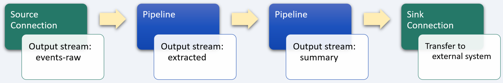
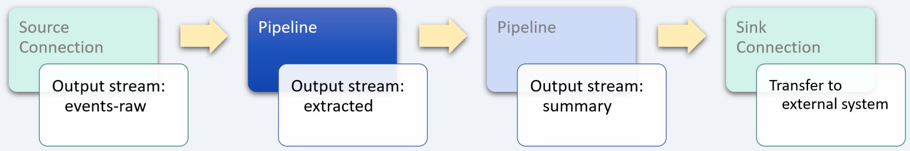
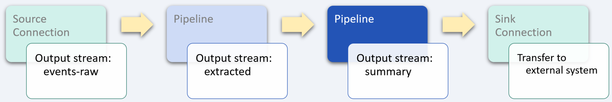

# Sporting events

_industry alignment:_ Sports
_keywords:_ `sports` `sporting events` `extract` `transform` `enrich` `aggregate` `hop`

> Note: To follow along with the examples, you will need a Decodable account. To create your account, [sign up for free](https://app.decodable.co/-/accounts/create). All code in this guide can be found in this [GitHub repo](https://github.com/decodableco/examples).

Sports mobile apps are enabling professional sports teams and event organizers to capture and enhance their audiences around the world. The internet has made it possible for fans to find team or transfer news, match highlights, and club merchandise on-demand. With 90 percent of mobile internet time spent on apps, having a sports app driven by a real-time data stream has never been so valuable. In the sporting events segment, revenue is projected to reach more than $27 billion in 2022 and the number of users is expected to be over 315 million by 2026.

In this example, we'll walk through how the Decodable data service is used to clean, transform, and enrich real-time sporting event data. The processed data could then be used to drive a mobile app or to update a website.

## Pipeline Architecture

Below we can see a sample of raw sporting event data. In its current form, it is more detailed than what is needed by our hypothetical app. By using one or more Decodable [pipelines](https://docs.decodable.co/docs/pipelines), which are streaming SQL queries that process data, we can transform the raw data into a form that is best suited for how it will be consumed.

```json
{
  "events": [
    {
      "updated_at": "2022-03-18T17:41:36.923Z",
      "player": {
        "id": 6126,
        "name": "F. Andrada"
      },
      "assist": {
        "id": null,
        "name": null
      },
      "type": "Goal",
      "detail": "Normal Goal"
    },
    {
      "updated_at": "2022-03-18T17:44:32.721Z",
      "player": {
        "id": 35695,
        "name": "D. Rodríguez"
      },
      "assist": {
        "id": 5947,
        "name": "B. Merlini"
      },
      "type": "Subst",
      "detail": "Substitution 1"
    },
    {
      "updated_at": "2022-03-18T17:52:16.193Z",
      "player": {
        "id": 5936,
        "name": "Julio González"
      },
      "assist": {
        "id": null,
        "name": null
      },
      "type": "Card",
      "detail": "Yellow Card"
    }
  ]
}
```

For this example, two separate pipelines are used in series, with the output of each one being used as the input for the next. While it is possible to perform all the desired processing in a single large, complex pipeline, it is most often desirable to split them into smaller, more manageable processing steps. This results in pipelines that are easier to test and maintain. Each stage in the sequence of pipelines is used to bring the data closer to its final desired form using SQL queries.



Decodable uses SQL to process data that should feel familiar to anyone who has used relational database systems. The primary differences you'll notice are that:

- You _activate_ a pipeline to start it, and _deactivate_ a pipeline to stop it
- All pipeline queries specify a source and a sink
- Certain operations, notably JOINs and aggregations, must include windows

Unlike relational databases, all pipelines write their results into an output data stream (or sink). As a result, all pipelines are a single statement in the form `INSERT INTO <sink> SELECT ... FROM <source>`, where sink and source are streams you've defined.

## Unnest data stream array



Each record of the sample raw event stream contains data about player actions during a sporting event. A single `events` field contains an array of event data that needs to be unnested (or demultiplexed) into multiple records. To accomplish this, a [cross join](https://www.sqltutorial.org/sql-cross-join/) is performed between the `events-raw` data stream and the results of using the `unnest` function on the `events` field.

For example, if a given input record contains an array of 25 player actions, this pipeline will transform each input record into 25 separate output records for processing by subsequent pipelines.

When the pipeline is running, the effects of unnesting the input records can be seen in the Overview tab which shows real-time data flow statistics. The input metrics will show a given number of records per second, while the output metrics will show a higher number based on how many elements are in the `events` array.

As the records are being unnested, the type of player action is also being transformed into specific fields which will be used to create summary statistics.

#### Pipeline: Extract player action events

```sql
insert into extracted
select
  -- each element of the `events` array creates a new record
  to_timestamp(`e.updated_at`, 'yyyy-MM-dd''T''HH:mm:ss.SSS''Z''') as updated_at,
  case
    when e.detail = 'Normal Goal' then 1
    else 0
  end as normal_goal,
  case
    when e.detail = 'Own Goal' then 1
    else 0
  end as own_goal,
  case
    when e.detail = 'Penalty' then 1
    else 0
  end as penalty,
  case
    when e.detail like '%Yellow%' then 1
    else 0
  end as yellow_card,
  case
    when e.detail = 'Red card' then 1
    else 0
  end as red_card,
  case
    when e.type like 'Subst' then 1
    else 0
  end as substitution,

from `events-raw`
cross join unnest(`events`) as e
```

After creating a new pipeline and entering the SQL query, clicking the `Run Preview` button will verify its syntax and then fire up a new executable environment to process the next 10 records coming in from the source stream and display the results. Decodable handles all the heavy lifting on the backend, allowing you to focus on working directly with your data streams to ensure that you are getting the results you need.

## Aggregate and filter sporting events



This final pipeline stage leverages the SQL `hop` [group window function](https://nightlies.apache.org/flink/flink-docs-release-1.16/docs/dev/table/sql/queries/window-tvf/) to create a set of records across a fixed 5-minute duration and hops (or slides) by an interval of 1 minute. Because the hop interval is smaller than the window size, the hopping windows are overlapping. Therefore, records from the data stream are assigned to multiple windows. Every minute, a new record is generated that contains a summary of the past 5 minutes. This results in a set of summary statistics that slide forward in time as the sporting event progresses.

#### Pipeline: Aggregate player action statistics

```sql
insert into summary
select
  window_start,
  window_end,
  sum(normal_goal) as normal_goals,
  sum(own_goal) as own_goals,
  sum(penalty) as penalties,
  sum(yellow_card) as yellow_cards,
  sum(red_card) as red_cards,
  sum(substitution) as substitutions
from table (
  hop(
    table extracted,
    descriptor(updated_at),
    interval '1' minute,
    interval '5' minutes
  )
)
group by
  window_start,
  window_end
```

## Conclusion

At this point, a sink [connection](https://docs.decodable.co/docs/connections) (one that writes a stream to an external system, such as AWS S3, Kafka, Kinesis, Postgres, Pulsar, or Redpanda) can be created to allow the results to be consumed by your own applications and services.

```json
{
  "window_start": "2022-03-18 17:42:00",
  "window_end": "2022-03-18 17:47:00",
  "normal_goals": 1,
  "own_goals": 0,
  "penalties": 1,
  "yellow_cards": 1,
  "red_cards": 0,
  "substitutions": 0
}
```

As we can see from this example, a sophisticated business problem can be addressed in a very straight-forward way using Decodable pipelines. It is not necessary to create docker containers, there is no SQL server infrastructure to set up or maintain, all that is needed is a working familiarity with creating the SQL queries themselves.

You can watch demonstrations of several examples on the [Decodable YouTube channel](https://www.youtube.com/channel/UChRQwfRNURBcurHSut2pm9Q).

Additional documentation for all of Decodable's services is available [here](https://docs.decodable.co/docs).

Please consider joining us on our [community Slack](https://join.slack.com/t/decodablecommunity/shared_invite/zt-uvow71bk-Uf914umgpoyIbOQSxriJkA).
