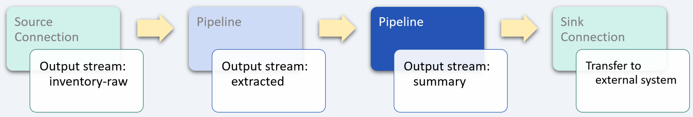

# Warehouse inventory logistics

_industry alignment:_ Logistics
_keywords:_ `logistics` `inventory` `extract` `transform` `aggregate` `tumble`

> Note: To follow along with the examples, you will need a Decodable account. To create your account, [sign up for free](https://app.decodable.co/-/accounts/create). All code in this guide can be found in this [GitHub repo](https://github.com/decodableco/examples).

For many businesses, warehouse inventory management is a critical element for their success. In addition to topline metrics like conversions, sales, and revenue, the ability to track and manage the movement of products through your warehouse is equally critical to the health and growth of your business. Inventory management is a necessary component for many functions, including inventory forecasting, demand planning, setting stock and reorder inventory levels, and developing a process to deal with back-orders.

In this example, we'll walk through how the Decodable data service is used to clean, transform, enrich, and aggregate real-time inventory data. The processed data can then be used to update inventory management systems to help inform business decisions.

## Pipeline Architecture

Below we can see a sample of raw inventory event data. For this example, we will calculate summary statistics for inventory adjustments at 5-minute intervals. The adjustments will be limited to those classified as damaged goods, and will include a count of the items that were adjusted and the total quantity that was changed for all items during the interval. By using one or more Decodable [pipelines](https://docs.decodable.co/docs/pipelines), which are streaming SQL queries that process data, we can transform the raw data into a form that is best suited for how it will be consumed.

```json
{
  "inventory_requests": [
    {
      "code": 591,
      "adjustment": {
        "id": 4815044007,
        "datetime": "2021-05-21 16:32:47",
        "reason": "Damaged goods",
        "reason_id": 2515,
        "description": "Sample adjustment description.",
        "reference_number": "REF-IA-00001",
        "type": "quantity",
        "line_items": [
          {
            "id": 48150044897,
            "item_id": 4815004410,
            "name": "laptop-gray/15.6inch/example-brand",
            "description": "Sample line item description.",
            "quantity_adjusted": 10,
            "item_total": 244,
            "warehouse_id": 4815000390
          }
        ]
      }
    }
  ]
}
```

For this example, two separate pipelines are used in series, with the output of each one being used as the input for the next. While it is possible to perform all the desired processing in a single large, complex pipeline, it is most often desirable to split them into smaller, more manageable processing steps. This results in pipelines that are easier to test and maintain. Each stage in the sequence of pipelines is used to bring the data closer to its final desired form using SQL queries.


Decodable uses SQL to process data that should feel familiar to anyone who has used relational database systems. The primary differences you'll notice are that:

- You _activate_ a pipeline to start it, and _deactivate_ a pipeline to stop it
- All pipeline queries specify a source and a sink
- Certain operations, notably JOINs and aggregations, must include windows

Unlike relational databases, all pipelines write their results into an output data stream (or sink). As a result, all pipelines are a single statement in the form `INSERT INTO <sink> SELECT ... FROM <source>`, where sink and source are streams you've defined.

## Unnest data stream arrays


For this example, each record of the data stream contains a single `inventory_requests` field, which contains an array of inventory adjustment requests that need to be unnested (or demultiplexed) into multiple records. In addition, each request contains a `line_items` array that needs to be unnested as well. To accomplish this, a [cross join](https://www.sqltutorial.org/sql-cross-join/) is performed between the `inventory-raw` data stream and the results of using the `unnest` function on the requests, and then again on the line items.

For example, if a given input record contains an array of 3 requests each with 5 inventory line item updates, this pipeline will transform each input record into 15 separate output records for processing by subsequent pipelines.

When the pipeline is running, the effects of unnesting the input records can be seen in the Overview tab which shows real-time data flow statistics. The input metrics will show a given number of records per second, while the output metrics will show a higher number based on how many elements are in the `inventory_requests` and `line_items` arrays.

#### Pipeline: Extract adjustment data

```sql
insert into extracted
select

  -- each element of the `inventory_requests` array has fields shared by every line item
  request.adjustment.id as adj_id,
  request.reference_number as adj_reference,
  to_timestamp(`request.adjustment.datetime`) as adj_timestamp,
  request.adjustment.reason_id as reason_id,
  request.adjustment.reason as reason,

  -- for each request, each element of the `line_items` array creates a new record
  line_item.id as line_item_id,
  line_item.item_id as item_id,
  line_item.quantity_adjusted as quantity_adjusted,
  line_item.warehouse_id as warehouse_id

from (
  select request.*
  from `inventory-raw`
  cross join unnest(`inventory_requests`) as request
)
where request.adjustment.reason_id = 2515
cross join unnest(`request.adjustment.line_items`) as line_item
```

After creating a new pipeline and entering the SQL query, clicking the `Run Preview` button will verify its syntax and then fire up a new executable environment to process the next 10 records coming in from the source stream and display the results. Decodable handles all the heavy lifting on the backend, allowing you to focus on working directly with your data streams to ensure that you are getting the results you need.

## Inventory adjustments summary



In this final pipeline stage, the data is aggregated into summary statistics that can then be used to inform business decisions related to the number of items that are being damaged. By leveraging the SQL `tumble` [group window function](https://nightlies.apache.org/flink/flink-docs-release-1.16/docs/dev/table/sql/queries/window-tvf/), a count of the items that were adjusted and the total quantity that was changed for all items are calculated across a non-overlapping, continuous window with a fixed duration of 5 minutes.

#### Pipeline: Summarize inventory adjustments

```sql
insert into summary
select
  window_start,
  window_end,
  reason_id,
  reason,
  count(1) as num_items, -- # of records received during tumble interval
  sum(quantity_adjusted) as total_quantity
from table (
  tumble(
    table extracted,
    descriptor(adj_timestamp),
    interval '5' minute
  )
)
group by
  window_start,
  window_end,
  reason_id,
  reason
```

## Conclusion

At this point, a sink [connection](https://docs.decodable.co/docs/connections) (one that writes a stream to an external system, such as AWS S3, Kafka, Kinesis, Postgres, Pulsar, or Redpanda) can be created to allow the results to be consumed by your own applications and services.

```json
{
  "window_start": "2022-04-07 18:25:10",
  "window_end": "2022-04-07 18:25:15",
  "reason_id": 2515,
  "reason": "Damaged goods",
  "num_items": 8,
  "total_quantity": 471
}
```

As we can see from this example, a sophisticated business problem can be addressed in a very straight-forward way using Decodable pipelines. It is not necessary to create docker containers, there is no SQL server infrastructure to set up or maintain, all that is needed is a working familiarity with creating the SQL queries themselves.

You can watch demonstrations of several examples on the [Decodable YouTube channel](https://www.youtube.com/channel/UChRQwfRNURBcurHSut2pm9Q).

Additional documentation for all of Decodable's services is available [here](https://docs.decodable.co/docs).

Please consider joining us on our [community Slack](https://join.slack.com/t/decodablecommunity/shared_invite/zt-uvow71bk-Uf914umgpoyIbOQSxriJkA).
