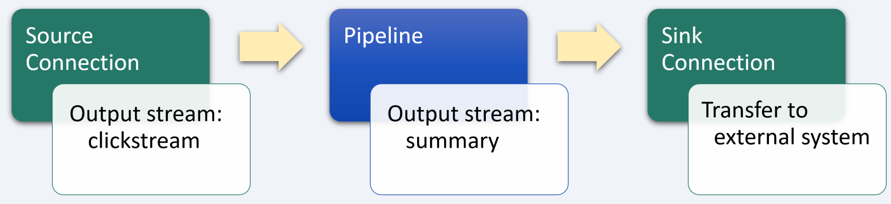
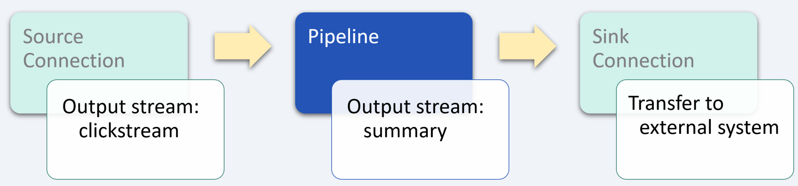

# Website clickstream analytics

_industry alignment:_ Technology
_keywords:_ `technology` `analytics` `enrich` `aggregate` `tumble` `hop`

> Note: To follow along with the examples, you will need a Decodable account. To create your account, [sign up for free](https://app.decodable.co/-/accounts/create). All code in this guide can be found in this [GitHub repo](https://github.com/decodableco/examples).

Clickstream data is collected from user activity on the web, and is used to provide insight into how visitors get to the website, what they do once there, how long they stay on any given page, the number of page visits visitors make, and the number of unique and repeat visitors. Clickstream analytics have ability to refine data by processing, cleaning, and transforming the raw data into convenient structure that make analysis of data easy and more accurate. Using web data, businesses can not only identify customer needs but can offer customized solutions to cater to the needs of an evolving customer base. The global clickstream analytics market size was valued at \$868.8 million in 2018, and is projected to reach \$2.5 billion by 2026, indicating a significant focus for businesses.

In this example, we'll walk through how the Decodable data service is used to clean, transform, and enrich real-time clickstream data. The processed data can then be used to inform business decisions.

## Pipeline Architecture

Below we can see a sample of raw clickstream data, with one record per page visit for every user of each website monitored. Currently, it is not in the best form for analyzing how well the website is performing. For this, it would be better to have statistics aggregated over time. By using one or more Decodable [pipelines](https://docs.decodable.co/docs/pipelines), which are streaming SQL queries that process data, we can transform the raw data into a form that is best suited for how it will be consumed.

```json
{
  "event_datetime": "2020-11-16 22:59:59",
  "event": "view_item",
  "user_id": "f6d4-24d4-4a29-3be1",
  "click_id": "a5cf-179b9-c9d4-83ab",
  "site_id": "wj32-gao1-4w1o-iqp4",
  "page": {
    "id": "b7b1-05fb-bf95-a85a",
    "url": "/product-67890",
    "previous_id": "2905-81e7-be8e-4814",
    "previous_url": "/category-tshirts"
  },
  "engagement": {
    "seconds_on_data": 79,
    "percent_viewed": 39.7
  }
}
```

For this example, only a single pipeline is needed to process the raw incoming data into the desired form. But it is also possible to use multiple pipelines in a series of stages, with the output of each one being used as the input for the next. Depending on the complexity of the desired processing, it can be helpful to break it down into smaller, more manageable steps. This results in pipelines that are easier to test and maintain. Each stage in the sequence of pipelines is used to bring the data closer to its final desired form using SQL queries.



Decodable uses SQL to process data that should feel familiar to anyone who has used relational database systems. The primary differences you'll notice are that:

- You _activate_ a pipeline to start it, and _deactivate_ a pipeline to stop it
- All pipeline queries specify a source and a sink
- Certain operations, notably JOINs and aggregations, must include windows

Unlike relational databases, all pipelines write their results into an output data stream (or sink). As a result, all pipelines are a single statement in the form `INSERT INTO <sink> SELECT ... FROM <source>`, where sink and source are streams you've defined.

## Aggregate and enrich data stream



For this example, the pipeline leverages the SQL `tumble` [group window function](https://nightlies.apache.org/flink/flink-docs-release-1.16/docs/dev/table/sql/queries/window-tvf/) to create a set of records across a non-overlapping, continuous window with a fixed duration of 1 hour. For each interval, the number of pages visited, the total amount of time spent reading or interacting with these pages, and an average of how much of the pages were actually viewed is calculated, grouped by website and user.

As an alternative, the `hop` window function could be used to create a set of records across a fixed duration that hops (or slides) by a given interval. If the hop interval is smaller than the window duration, the hopping windows overlap, and records from the data stream are assigned to multiple windows. Then a subsequent pipeline could be used to filter the results to one representing the highest level of engagement over a set duration for each user for each website.

#### Pipeline: Aggregate clickstream data

```sql
insert into summary
select
  window_start,
  window_end,
  site_id,
  user_id,
  count(1) as pages_visited,
  sum(engagement.seconds_on_data) as total_seconds_on_site,
  avg(engagement.percent_viewed) as avg_percent_viewed,
from table (
  tumble(
    table clickstream,
    descriptor(to_timestamp(event_datetime)),
    interval '1' hour
  )
)
group by
  window_start,
  window_end,
  site_id,
  user_id
```

After creating a new pipeline and entering the SQL query, clicking the `Run Preview` button will verify its syntax and then fire up a new executable environment to process the next 10 records coming in from the source stream and display the results. Decodable handles all the heavy lifting on the backend, allowing you to focus on working directly with your data streams to ensure that you are getting the results you need.

## Conclusion

At this point, a sink [connection](https://docs.decodable.co/docs/connections) (one that writes a stream to an external system, such as AWS S3, Kafka, Kinesis, Postgres, Pulsar, or Redpanda) can be created to allow the results to be consumed by your own applications and services.

```json
{
  "window_start": "2020-11-16 14:00:00",
  "window_end": "2020-11-16 15:00:00",
  "user_id": "f6d4-24d4-4a29-3be1",
  "site_id": "wj32-gao1-4w1o-iqp4",
  "pages_visited": 8,
  "total_seconds_on_site": 426,
  "avg_percent_viewed": 28.198543
}
```

As we can see from this example, a sophisticated business problem can be addressed in a very straight-forward way using Decodable pipelines. It is not necessary to create docker containers, there is no SQL server infrastructure to set up or maintain, all that is needed is a working familiarity with creating the SQL queries themselves.

You can watch demonstrations of several examples on the [Decodable YouTube channel](https://www.youtube.com/channel/UChRQwfRNURBcurHSut2pm9Q).

Additional documentation for all of Decodable's services is available [here](https://docs.decodable.co/docs).

Please consider joining us on our [community Slack](https://join.slack.com/t/decodablecommunity/shared_invite/zt-uvow71bk-Uf914umgpoyIbOQSxriJkA).
