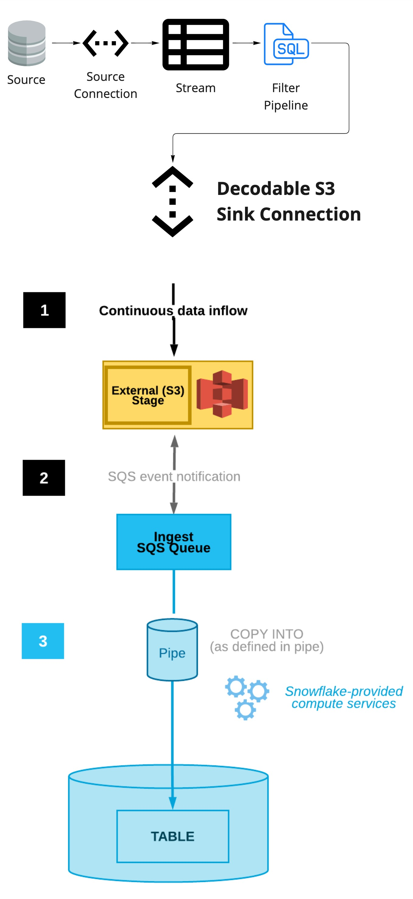
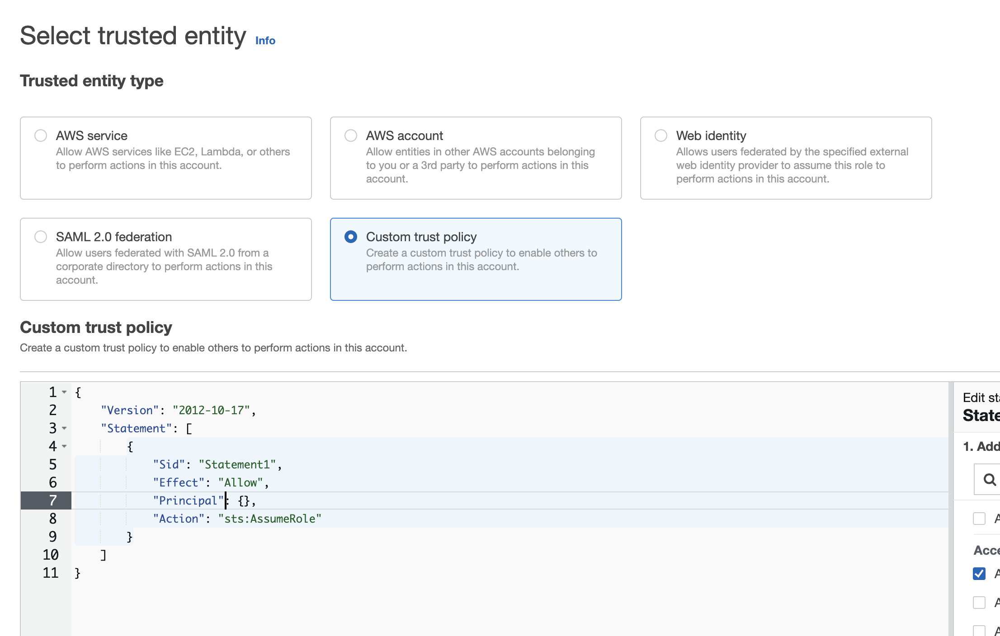
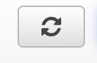
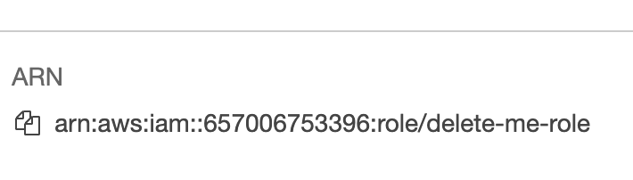

# Decodable + Snowpipe + Snowflake
This demo outlines the work needed to integrate Decodable with Snowflake using the S3 Sink and Snowpipe.



---
**CDC Mirroring to Snowflake**

Follow these [instructions](README-CDC.md) to create a mirrored Postgres table in Snowflake.

---

## Configure S3 sink
Choose an existing stream in Decodable to use to send to Snowflake. If you do not have any streams, please use the Datagen connection to generated envoy logs ( `datagen_envoy_connection` ). 

Next we will need to configure a S3 sink connection to your stream. The documentation can be found [here](https://docs.decodable.co/docs/connector-reference-s3)

- Go to the AWS S3 console and create or choose a bucket. Make sure you're in the region of choice. (In all of these steps, make sure you're in the same region)
- Create a directory to use for this example.
- Go to the AWS IAM console to create a role. Click on "Roles" on the left.
- Create a role and choose `custome-trust-policy`

- Paste the JSON policy replacing the `{DECODABLE_ACCOUNT_NAME}` with the name of your decodable account. Click next.
```json
{
    "Version": "2012-10-17",
    "Statement": [
        {
            "Effect": "Allow",
            "Principal": {
                "AWS": "arn:aws:iam::671293015970:root"
            },
            "Action": "sts:AssumeRole",
            "Condition": {
                "StringEquals": {
                    "sts:ExternalId": "{DECODABLE_ACCOUNT_NAME}"
                }
            }
        }
    ]
}
```
- Click `Create Policy` at the top of the screen. This will open a new tab.
- Click the JSON tab at the top and paste JSON permissions below. Make sure to replace the `your-bucket/some/dir/*` and `your-bucket` with your bucket and directory. **PLEASE KEEP THE `/*` AT THE END OF THE PATH**.
```json
{
  "Version": "2012-10-17",
  "Statement": [
    {
      "Effect": "Allow",
      "Action": [
        "s3:PutObject", 
        "s3:GetObject", 
        "s3:DeleteObject",
        "s3:GetObjectVersion"
      ],
      "Resource": "arn:aws:s3:::your-bucket/some/dir/*"
    },
    {
      "Effect": "Allow",
      "Action": ["s3:ListBucket"],
      "Resource": "arn:aws:s3:::your-bucket"
    },
    {
        "Effect": "Allow",
        "Action": [
            "s3:ListBucket",
            "s3:GetBucketLocation"
        ],
        "Resource": "arn:aws:s3:::<bucket>",
        "Condition": {
            "StringLike": {
                "s3:prefix": [
                    "<bucket>/*"
                ]
            }
        }
    }
  ]
}
```
- Click on `Next:Tags`.
- Click on `Next:Review`
- Provide a name to the policy like `Decodable S3 Policy`. Click on `Create Policy`
- **CLOSE THIS TAB AND RETURN TO THE PREVIOUS TAB**
- Click on the  button. Search for the newly created policy `Decodable S3 Policy` . 
- Check the box next to the policy and click on `Next` at the bottom of the screen.
- Provide a role name and scroll down to the bottom of the page and click on `Create Role`.
- Click the  and search for the role you just created and click on it.
- Grab the ARN  and save it for configuring the Decodable S3 sink connection.
- Return to the Decodable UI and create a new S3 sink connection.
- Provide the properties
  - AWS region
  - S3 bucket
  - Directory
  - IAM Role you just created
  - Partition Template (optional)
  - Format
- Click next and start the connection.
- Ensure that data is appearing in your S3 bucket/directory when the connection is at `running` status.
- Decodable side is finished.


## Create the Snowpipe (SP)
The instructions in this section follow the Snowflake (SF) documentation found [here](https://docs.snowflake.com/en/user-guide/data-load-snowpipe-auto-s3.html#option-1-creating-a-new-s3-event-notification-to-automate-snowpipe)

- Log into Snowflake and create a worksheet.
- Create an integration in SF. Replace `arn:aws:iam::123412341234:role/YOUR_ARN-ROLE` with your ARN role you just created in AWS when configuring the Decodable S3 connection. **(We will be using the same ARN for both Decodable and Snowflake)**. Replace `s3://your-bucket/some/dir/` with your bucket/directory.

```sql
CREATE STORAGE INTEGRATION decodable_clickstream_int
  TYPE = EXTERNAL_STAGE
  STORAGE_PROVIDER = 'S3'
  ENABLED = TRUE
  STORAGE_AWS_ROLE_ARN = 'arn:aws:iam::123412341234:role/YOUR_ARN-ROLE'
  STORAGE_ALLOWED_LOCATIONS = ('s3://your-bucket/some/dir/')
```
- Describe the integration you just created and grab these values and update the Role created previously:
  - STORAGE_AWS_IAM_USER_ARN
  - STORAGE_AWS_EXTERNAL_ID
```sql
DESC INTEGRATION decodable_clickstream_int
```
```json
{
    "Version": "2012-10-17",
    "Statement": [
        {
            "Effect": "Allow",
            "Principal": {
                "AWS": "arn:aws:iam::671293015970:root"
            },
            "Action": "sts:AssumeRole",
            "Condition": {
                "StringEquals": {
                    "sts:ExternalId": "{DECODABLE_ACCOUNT_NAME}"
                }
            }
        },
        {
            "Sid": "",
            "Effect": "Allow",
            "Principal": {
                "AWS": "{{STORAGE_AWS_IAM_USER_ARN}}"
            },
            "Action": "sts:AssumeRole",
            "Condition": {
                "StringEquals": {
                    "sts:ExternalId": "{{STORAGE_AWS_EXTERNAL_ID}}"
                }
            }
        }
    ]
}
```
- Execute the commands below replacing `s3://your-bucket/clickstream/` with your bucket. Make sure that it matches exactly the value when you created the storage integration above. Missing a trailing slash will cause and error. This creates a STAGING area that will load data from S3.

```sql

use schema snowpipe_db.public;

create stage clickstream_stage
  url = 's3://your-bucket/clickstream/'
  storage_integration = decodable_clickstream_int;
```
- Create a table to copy the S3 data into. Replace `MY_S3_TABLE` with your table name. The `VARIANT` data type is a generic type that will allow you to treat the incoming JSON data as a dictionary or a map.

```sql  
create or replace TABLE SNOWPIPE_DB.PUBLIC.MY_S3_TABLE (
	SRC VARIANT
);
```
- Create the PIPE or Snowpipe replacing `MY_S3_TABLE` with the table name used in the previous command.
```sql
create pipe snowpipe_db.public.clickstream_pipe auto_ingest=true as
  copy into SNOWPIPE_DB.PUBLIC.MY_S3_TABLE
  from @snowpipe_db.public.clickstream_stage
  file_format = (type = 'JSON');
```
- Execute the command below and grab the value in the column `notification_channel`. We will need this value to configure SQS which serves as the mechanism for notifying SF to read from your bucket.
```sql
show pipes;
```
- Go to the root of your S3 bucket and click on `properties`.
- Scroll down to where it says `Event notifications`.
- Click on `Create event notification`.
  - Provide a name
  - Ignore prefix and suffix
  - Under `Event types`, select `All object create events`.
  - Under `Destination` click on `SQS queue`.
  - Under `Specify Lambda Function` select `Lambda Function ARN`.
  - Paste the value from `notification_channel` from the output of `show pipes` in the `lambda function` input.
  - Click `Save Changes`.
- Create a warehouse with the statement below.
```sql
create warehouse test
```
- Select from the table that you created. The JSON fields can be referenced using `:`
```sql
select src:col1 as col1, src:cols as col2, src:col3 as col3
from MY_S3_TABLE
```

- You've successfully configured Snowpipe with Decodable.


# Create a mirrored table in Snowflake

Follow these [instructions](README-CDC.md) to create a mirrored Postgres table in Snowflake.