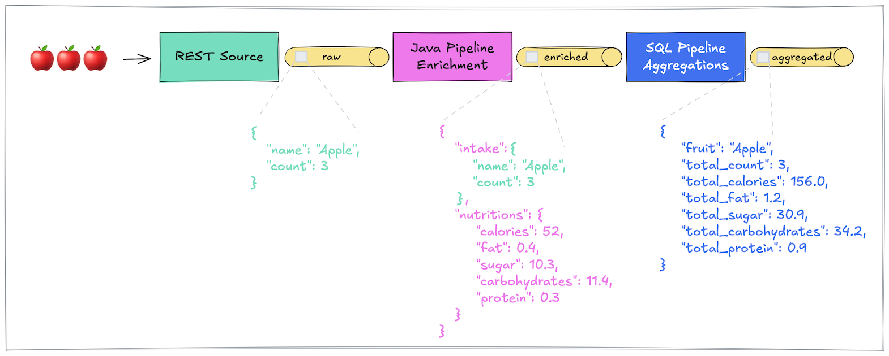

# Bridging Flink SQL and Custom Pipelines with the Decodable SDK

_This example project shows how to build a multi-stage, real-time data pipeline on Decodable by combining the flexibility of custom Apache Flink jobs written in Java with the declarative nature of Flink SQL jobs._

A detailed step by step guide how to work through the example material is discussed in this accompanying [blog post](https://decodable.co/blog/bridging-flink-sql-and-custom-java-pipelines-with-the-decodable-sdk). Find its outline below.

## Outline

* Real-Time Data Pipeline Example
    - Define Data Source and Input Stream
    - Create Custom Java Pipeline
        - FruitEnricherJob
        - HttpServiceEnricher
        - Build Project
    - Create Intermediary Stream
    - Deploy Custom Java Pipeline
    - Create SQL Pipeline
    - Bonus: Declarative Resource Management
