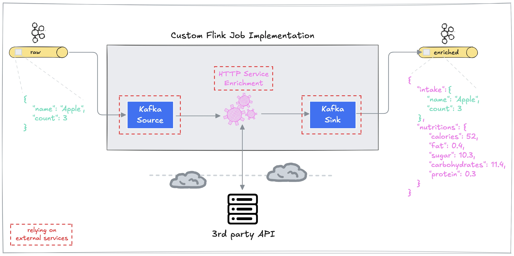

# Testing Custom Flink Jobs on Decodable

Testing Flink jobs can be challenging for a number of reasons, one of them being the fact that there are typically external data systems or services involved.

This example is the result of refactoring an [existing Flink job](https://github.com/decodableco/examples/blob/main/sql-cupi-hybrid/cupi/src/main/java/co/decodable/examples/FruitEnricherJob.java) to improve its testability. This alternative implementation is more modular by defining job-specific interfaces for the actual processing logic and by making the source and sink components which talk to external data systems pluggable. Doing so allows to not only unit test certain job components in isolation, but instead test the full processing logic of said jobs without the stringent necessity to always have access to any external services our Flink jobs almost certainly depend on.

The accompanying blog post can be found [here](https://www.decodable.co/blog/testing-custom-flink-jobs-on-decodable). Find its outline below.

## Outline

* Quick Recap of the Flink Job
* Assessing the Testability of the Existing Job
* Refactoring for Better Job Testability
  - Adapt Job Processing Logic
  - Test New Job Processing Logic
  - Adapt Job Setup
  - Test New Job Setup
  - Integration Testing the Job
