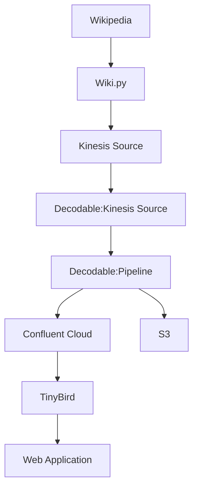

# Wikipedia Changes to TinyBird and S3

Below is the flow of Wikipedia changes captured and transformed by Decodable and sent to AWS S3 and TinyBird. We then use a simple web application to access data endpoints made available by TinyBird of the Wikipedia changes.



## Command Line Requirements

- python3
- Decodable cli - https://docs.decodable.co/docs/setup
- TinyBird CLI - optional
```bash
pip install tinybird-cli
```
- optional AWS2 CLI -  https://docs.aws.amazon.com/cli/latest/userguide/getting-started-install.html


## Getting started

Create an `.env` file and populate your values

```properties
# Decodable
ACCOUNT=

# Kinesis
ARN=
KINESIS_STREAM=
KINESIS_STREAM_SINK=
REGION=

# Confluent Cloud
BOOTSTRAP=
CONFLUENT_KEY=
CONFLUENT_SECRET=
CLUSTER_ID=
SCHEMA_REGISTRY=
CONFLUENT_SR_KEY=
CONFLUENT_SR_SECRET=
TOPIC=

# TinyBird
TINYBIRD_TOK=
TINYBIRD_ENDPOINT=

```

Create the flow
```bash
make flow
```

## Wikipedia API Actions

https://www.mediawiki.org/wiki/API:Main_page

https://en.wikipedia.org/w/api.php

https://en.wikipedia.org/w/api.php?action=help&modules=featuredfeed

## Simple Data Formatter
https://docs.oracle.com/javase/8/docs/api/java/text/SimpleDateFormat.html


## Payload

```json
{
  "title": "User talk:74.52.105.242",
  "title_detail": {
    "type": "text/plain",
    "language": null,
    "base": "https://en.wikipedia.org/w/api.php?action=feedrecentchanges&format=json",
    "value": "User talk:74.52.105.242"
  },
  "links": [
    {
      "rel": "alternate",
      "type": "text/html",
      "href": "https://en.wikipedia.org/w/index.php?title=User_talk:74.52.105.242&diff=1103147176&oldid=780606035"
    }
  ],
  "link": "https://en.wikipedia.org/w/index.php?title=User_talk:74.52.105.242&diff=1103147176&oldid=780606035",
  "id": "https://en.wikipedia.org/w/index.php?title=User_talk:74.52.105.242&diff=1103147176&oldid=780606035",
  "guidislink": false,
  "summary": "<p><span dir=\"auto\"><span class=\"autocomment\">top: </span>IP talk page template fix., replaced: {{OW}} → {{Blanked IP talk}}</span></p>\n<table style=\"background-color: #fff; color: #202122;\">\n\t\t\t\t<col class=\"diff-marker\" />\n\t\t\t\t<col class=\"diff-content\" />\n\t\t\t\t<col class=\"diff-marker\" />\n\t\t\t\t<col class=\"diff-content\" />\n\t\t\t\t<tr class=\"diff-title\" lang=\"en\">\n\t\t\t\t<td colspan=\"2\" style=\"background-color: #fff; color: #202122; text-align: center;\">← Previous revision</td>\n\t\t\t\t<td colspan=\"2\" style=\"background-color: #fff; color: #202122; text-align: center;\">Revision as of 14:13, 8 August 2022</td>\n\t\t\t\t</tr><tr>\n  <td class=\"diff-lineno\" colspan=\"2\">Line 1:</td>\n  <td class=\"diff-lineno\" colspan=\"2\">Line 1:</td>\n</tr>\n<tr>\n  <td class=\"diff-marker\"></td>\n  <td style=\"color: #202122; font-size: 88%; border-style: solid; border-width: 1px 1px 1px 4px; border-radius: 0.33em; border-color: #ffe49c; vertical-align: top; white-space: pre-wrap;\"><div></div></td>\n  <td class=\"diff-marker\"></td>\n  <td style=\"color: #202122; font-size: 88%; border-style: solid; border-width: 1px 1px 1px 4px; border-radius: 0.33em; border-color: #a3d3ff; vertical-align: top; white-space: pre-wrap;\"><div></div></td>\n</tr>\n\n<!-- diff cache key enwiki:diff:wikidiff2:1.12:old-780606035:rev-1103147176:1.13.0 -->\n</table>",
  "summary_detail": {
    "type": "text/html",
    "language": null,
    "base": "https://en.wikipedia.org/w/api.php?action=feedrecentchanges&format=json",
    "value": "<p><span dir=\"auto\"><span class=\"autocomment\">top: </span>IP talk page template fix., replaced: {{OW}} → {{Blanked IP talk}}</span></p>\n<table style=\"background-color: #fff; color: #202122;\">\n\t\t\t\t<col class=\"diff-marker\" />\n\t\t\t\t<col class=\"diff-content\" />\n\t\t\t\t<col class=\"diff-marker\" />\n\t\t\t\t<col class=\"diff-content\" />\n\t\t\t\t<tr class=\"diff-title\" lang=\"en\">\n\t\t\t\t<td colspan=\"2\" style=\"background-color: #fff; color: #202122; text-align: center;\">← Previous revision</td>\n\t\t\t\t<td colspan=\"2\" style=\"background-color: #fff; color: #202122; text-align: center;\">Revision as of 14:13, 8 August 2022</td>\n\t\t\t\t</tr><tr>\n  <td class=\"diff-lineno\" colspan=\"2\">Line 1:</td>\n  <td class=\"diff-lineno\" colspan=\"2\">Line 1:</td>\n</tr>\n<tr>\n  <td class=\"diff-marker\"></td>\n  <td style=\"color: #202122; font-size: 88%; border-style: solid; border-width: 1px 1px 1px 4px; border-radius: 0.33em; border-color: #ffe49c; vertical-align: top; white-space: pre-wrap;\"><div></div></td>\n  <td class=\"diff-marker\"></td>\n  <td style=\"color: #202122; font-size: 88%; border-style: solid; border-width: 1px 1px 1px 4px; border-radius: 0.33em; border-color: #a3d3ff; vertical-align: top; white-space: pre-wrap;\"><div></div></td>\n</tr>\n\n<!-- diff cache key enwiki:diff:wikidiff2:1.12:old-780606035:rev-1103147176:1.13.0 -->\n</table>"
  },
  "published": "Mon, 08 Aug 2022 14:13:14 GMT",
  "published_parsed": [
    2022,
    8,
    8,
    14,
    13,
    14,
    0,
    220,
    0
  ],
  "authors": [
    {
      "name": "BD2412bot"
    }
  ],
  "author": "BD2412bot",
  "author_detail": {
    "name": "BD2412bot"
  },
  "comments": "https://en.wikipedia.org/wiki/User_talk:74.52.105.242"
}
```