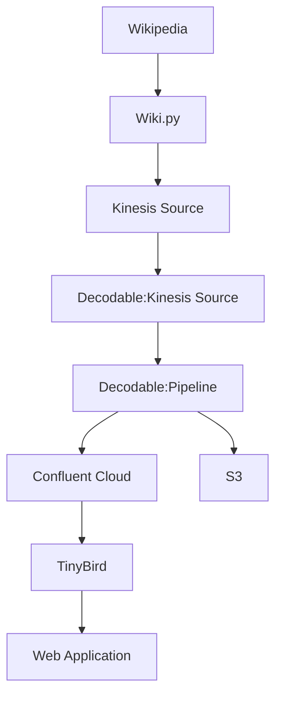

# Wikipedia Changes to TinyBird and S3

Below is the flow of Wikipedia changes captured and transformed by Decodable and sent to AWS S3 and TinyBird. We then use a simple web application to access data endpoints made available by TinyBird of the Wikipedia changes.



## Command Line Requirements

- python3
- Decodable cli - https://docs.decodable.co/docs/setup
- TinyBird CLI - optional
```bash
pip install tinybird-cli
```
- optional AWS2 CLI -  https://docs.aws.amazon.com/cli/latest/userguide/getting-started-install.html


## Getting started

Create an `.env` file and populate your values

```properties
# Decodable
ACCOUNT=

# Kinesis
ARN=
KINESIS_STREAM=
KINESIS_STREAM_SINK=
REGION=

# Confluent Cloud
BOOTSTRAP=
CONFLUENT_KEY=
CONFLUENT_SECRET=
CLUSTER_ID=
SCHEMA_REGISTRY=
CONFLUENT_SR_KEY=
CONFLUENT_SR_SECRET=
TOPIC=

# TinyBird
TINYBIRD_TOK=
TINYBIRD_ENDPOINT=

```

Create the flow
```bash
make flow
```

