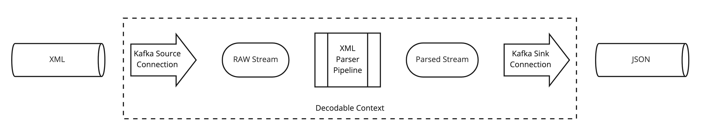

# Parsing XML
This repo shows how you can use Decodable to parse XML and output JSON. See flow diagram below.



## Environment
Create a `.env` file containing the contents below replacing the values with yours.

```properties
ACCOUNT={{ decodable account }}

BOOTSTRAP={{ confluent cloud bootstrap server }}
CLUSTER_ID={{ confluent cloud kafka cluster id }}
CONFLUENT_KEY={{ confluent key }}
CONFLUENT_SECRET={{ confluent secret }}
XML={{ xml topic }}
JSON={{ json topic }}
```

## Commands

```bash
$ make login # refreshes the OAuth token
$
$ make flow # creates the entire Decodable flow
$ make active # activates the connections and pipeline
$ make subscribe # open this command in a new terminal to print output JSON messages
$ make publish DOC=data/input.xml # publishes the xml to Kafka
```

The terminal where you executed `make subscribe` will show the contents of the JSON topic and the transformed messages.


```bash
$ make clean # deactivates connections and pipelines and deletes all the components of the flow

```